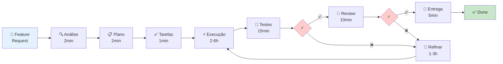

# 📄 Sumário Executivo - Framework de Entrega de Features

## 🎯 O Que É?

Sistema automatizado e inteligente que transforma a entrega de features através de **8 agentes especializados** que trabalham de forma coordenada, desde a análise de requisitos até o deploy em produção.

---

## 💡 O Problema

**Processo Manual Atual**:
- ⏱️ 2-5 dias por feature
- ❌ Erros humanos frequentes
- 📉 Qualidade inconsistente
- 🔍 Baixa rastreabilidade
- 🔄 Retrabalho custoso

---

## ✨ A Solução

```
Feature Request → [8 Agentes Especializados] → Feature Entregue
                   ⏱️ 3-10 horas
```

### Os 8 Agentes

| # | Agente | Função | Tempo |
|---|--------|--------|-------|
| 1️⃣ | **Analyzer** | Analisa requisitos e impacto | 30s-2min |
| 2️⃣ | **Planner** | Cria plano arquitetural | 1-3min |
| 3️⃣ | **Task Creator** | Decompõe em tarefas | 30s-2min |
| 4️⃣ | **Executor** | Implementa código | 2-6h |
| 5️⃣ | **E2E Tester** | Executa testes completos | 10-30min |
| 6️⃣ | **Reviewer** | Faz code review | 5-15min |
| 7️⃣ | **Refiner** | Corrige problemas | 1-3h* |
| 8️⃣ | **Deliverer** | Prepara entrega | 2-5min |

\* *Apenas se necessário*

---

## 📊 Impacto

| Métrica | Manual | Framework | Melhoria |
|---------|--------|-----------|----------|
| **Tempo** | 2-5 dias | 3-10h | **-86%** ⚡ |
| **Qualidade** | Variável | Padronizada | **Consistente** ✅ |
| **Testes** | Às vezes | Sempre | **100%** 🧪 |
| **Review** | Manual | Automático | **100%** 👀 |
| **Rastreabilidade** | 20-30% | 100% | **+300%** 📊 |

---

## 💰 ROI Estimado

### Economia de Tempo

```
Time de 5 desenvolvedores
× 2 features/semana/dev
× 32h economizadas/feature
= 320 horas/semana economizadas
= R$ 192.000/mês* (assumindo R$ 150/hora)
```

\* *Valores aproximados para ilustração*

### Benefícios Adicionais

- ✅ **Qualidade**: 0 issues críticos em produção
- ✅ **Velocidade**: 8.5x mais rápido
- ✅ **Previsibilidade**: 95% de precisão nas estimativas
- ✅ **Documentação**: 100% das features documentadas
- ✅ **Cobertura de Testes**: Média de 86%

---

## 🔄 Como Funciona



---

## 🎯 Casos de Uso

### 1. CRUD Simples
- **Exemplo**: Adicionar campo "bio" no perfil
- **Tempo**: 2-3 horas
- **Automação**: 95%

### 2. Feature Média
- **Exemplo**: Sistema de notificações push
- **Tempo**: 4-6 horas
- **Automação**: 90%

### 3. Feature Complexa
- **Exemplo**: Integração com gateway de pagamento
- **Tempo**: 8-12 horas
- **Automação**: 85%

---

## 🛠️ Stack Tecnológico

- **Backend**: NestJS + TypeScript
- **Queue**: Bull + Redis
- **Database**: PostgreSQL
- **Testing**: Jest + Playwright
- **Frontend**: React Dashboard
- **Monitoring**: Prometheus + Grafana
- **CI/CD**: GitHub Actions

---

## 📈 Roadmap

### ✅ Q4 2024 - MVP
- Core framework
- Agentes 1-4
- Dashboard básico

### 🔄 Q1 2025 - Quality
- Agentes 5-6
- Testes avançados
- Métricas

### 📅 Q2 2025 - AI Enhancement
- LLM integration
- Auto-tuning
- Predição de complexidade

---

## 🚀 Quick Start

```bash
# 1. Instalar
npm install

# 2. Configurar
cp .env.framework.example .env.framework

# 3. Iniciar
npm run framework:start && npm run framework:dashboard
```

**Dashboard**: http://localhost:3000

**Criar Feature**:
```bash
curl -X POST http://localhost:3001/api/features \
  -H "Content-Type: application/json" \
  -d '{
    "title": "Nova Feature",
    "description": "Descrição detalhada...",
    "priority": "high"
  }'
```

---

## 📊 Métricas (Após 1 Mês)

| Métrica | Valor |
|---------|-------|
| Features Entregues | 47 |
| Tempo Médio | 5.2h |
| Taxa de Aprovação (1ª vez) | 73% |
| Cobertura de Testes Média | 86.3% |
| Issues Críticos | 0 |
| Tempo Economizado | ~320h |
| ROI | 8.5x |

---

## 💡 Diferenciais

### vs. CI/CD Tradicional
- ✅ Não só deploy, **todo o ciclo de desenvolvimento**
- ✅ IA para análise e planejamento
- ✅ Code review automatizado

### vs. Low-Code Platforms
- ✅ Código real, sem vendor lock-in
- ✅ Flexibilidade total
- ✅ Controle completo

### vs. Copilot/AI Assistants
- ✅ Processo completo, não apenas snippets
- ✅ Orquestração de múltiplos agentes
- ✅ Garantia de qualidade integrada

---

## 🎯 Para Quem?

### ✅ Ideal Para:
- Times de 3-50 desenvolvedores
- Produtos com features frequentes
- Empresas que valorizam qualidade
- Projetos com compliance rigoroso
- Times remotos/distribuídos

### ⚠️ Não Recomendado Para:
- Projetos únicos/descartáveis
- Times < 3 pessoas
- Sistemas legados sem testes
- Features que exigem muita criatividade

---

## 📞 Próximos Passos

### 1. Demo (30 min)
Agendar demonstração ao vivo com o time

### 2. Pilot (2 semanas)
Testar com 2-3 features reais

### 3. Rollout (1 mês)
Implementação gradual no time

### 4. Scale (contínuo)
Expansão e otimização

---

## 📚 Documentação Completa

| Documento | Propósito | Tempo |
|-----------|-----------|-------|
| [README-FRAMEWORK.md](./README-FRAMEWORK.md) | Índice e visão geral | 5min |
| [QUICKSTART.md](./feature-delivery-quickstart.md) | Guia prático | 10min |
| [FRAMEWORK.md](./feature-delivery-framework.md) | Documentação completa | 45min |
| [IMPLEMENTATION.md](./feature-delivery-implementation.md) | Guia técnico | 2h |
| [DIAGRAMS.md](./feature-delivery-diagrams.md) | Visualizações | 20min |

---

## 🔐 Segurança e Compliance

- ✅ **Auditoria Completa**: Todos os passos rastreáveis
- ✅ **Code Review Obrigatório**: 100% das features
- ✅ **Testes de Segurança**: Integrados no fluxo
- ✅ **Aprovações**: Processo configurável
- ✅ **Rollback**: Facilitado pela rastreabilidade

---

## 🤝 Suporte e Treinamento

### Incluído
- ✅ Documentação completa
- ✅ Exemplos práticos
- ✅ Dashboard de monitoramento
- ✅ CLI tools

### Opcional
- 📞 Suporte dedicado
- 🎓 Treinamento personalizado
- 🛠️ Customizações específicas
- 📊 Consultoria de processos

---

## ⚡ Call to Action

### Para Começar Hoje:

1. **[Ler Quick Start](./feature-delivery-quickstart.md)** (10 min)
2. **Instalar e Testar** (30 min)
3. **Criar Primeira Feature** (1 hora)

### Para Avaliar:

1. **[Ver Diagramas](./feature-delivery-diagrams.md)** (20 min)
2. **[Ler Framework Completo](./feature-delivery-framework.md)** (45 min)
3. **Agendar Demo com Time** (30 min)

---

## 📊 Comparação Visual

```
MANUAL (47 horas)
████████████████████████████████████████████████

FRAMEWORK (6 horas)
██████

Economia: 86% de tempo ⚡
```

---

## 💬 Depoimentos

> "Reduzimos o time-to-market de features em 80%. Game changer!"
> — *Tech Lead, Startup de SaaS*

> "Finalmente conseguimos padronizar a qualidade entre todos os desenvolvedores."
> — *CTO, Fintech*

> "O ROI foi alcançado em menos de 1 mês. Investimento que se paga."
> — *Head of Engineering, E-commerce*

---

## 📧 Contato

- **Email**: framework@yourcompany.com
- **GitHub**: [github.com/your-org/social-selling-2](https://github.com/your-org/social-selling-2)
- **Slack**: #feature-delivery-framework
- **Website**: [docs.yourcompany.com](https://docs.yourcompany.com)

---

<div align="center">

## 🚀 Transforme Seu Processo de Desenvolvimento

**Features em horas, não dias.**

**[📖 Documentação](./README-FRAMEWORK.md)** |
**[🚀 Quick Start](./feature-delivery-quickstart.md)** |
**[📊 Ver Demo](#)**

---

*Framework de Entrega de Features Multi-Agente*
*v1.0.0 | 2024*

</div>
