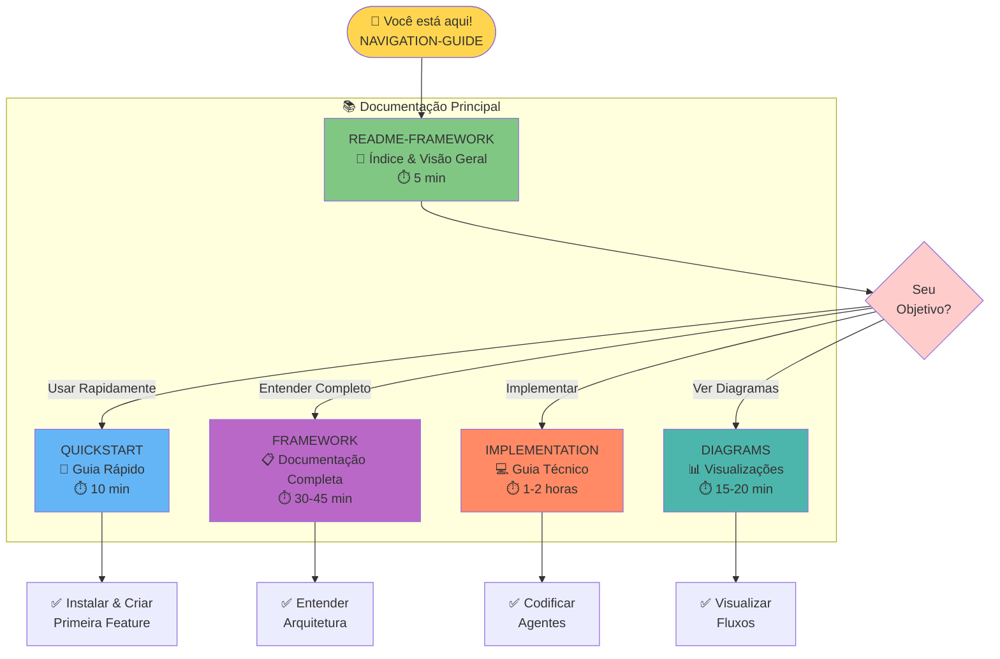
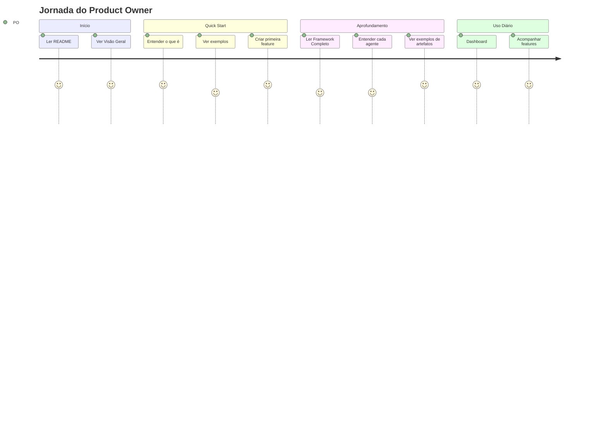
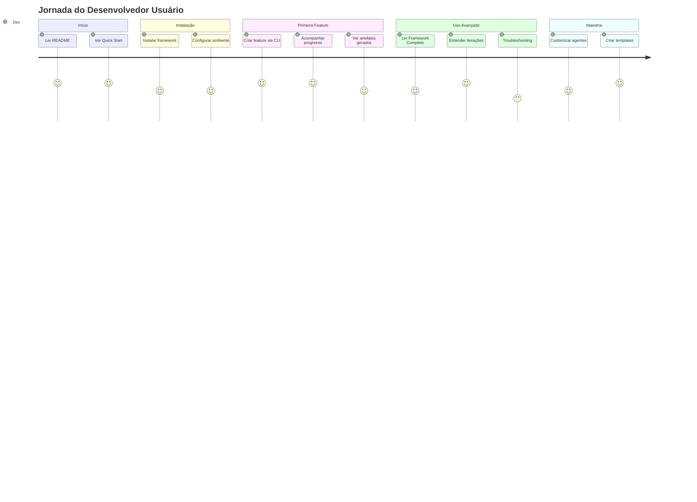
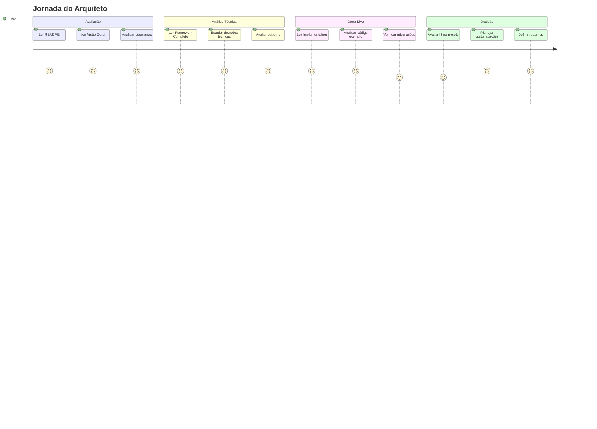
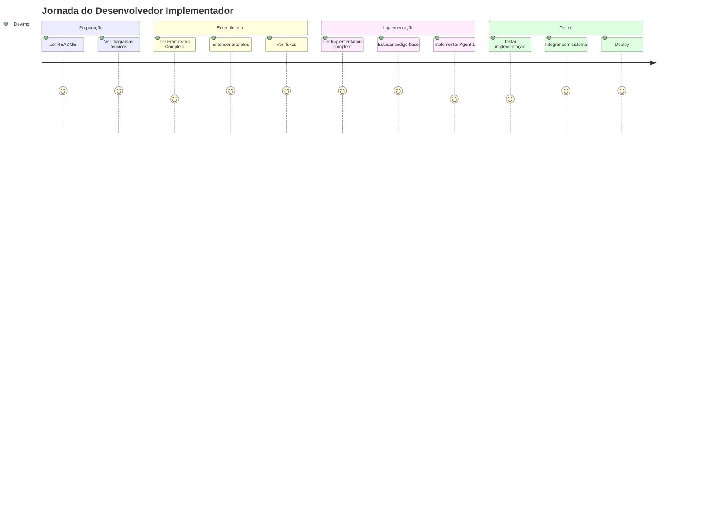
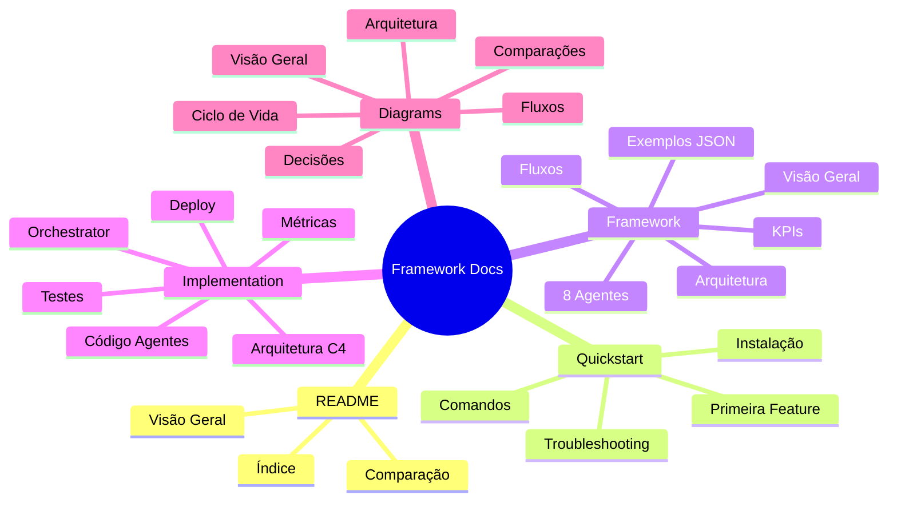

# 🧭 Guia de Navegação - Framework de Entrega de Features

## 📚 Mapa da Documentação



---

## 🗺️ Fluxo de Leitura Recomendado

### 🎯 Para Product Owners / PMs



**Ordem Recomendada**:
1. ⚡ [README-FRAMEWORK.md](./README-FRAMEWORK.md) (5 min)
2. 🚀 [Quickstart - Seções "Visão Geral" e "Criar Feature"](./feature-delivery-quickstart.md) (5 min)
3. 📖 [Framework - Seções "Visão Geral" e "Especificação dos Agentes"](./feature-delivery-framework.md) (20 min)
4. 📊 [Diagrams - Ver fluxos visuais](./feature-delivery-diagrams.md) (10 min)

**Total**: ~40 minutos

---

### 👨‍💻 Para Desenvolvedores (Usuários)



**Ordem Recomendada**:
1. ⚡ [README-FRAMEWORK.md](./README-FRAMEWORK.md) (5 min)
2. 🚀 [Quickstart completo](./feature-delivery-quickstart.md) (10 min)
3. ✅ **PRÁTICA**: Criar primeira feature (20 min)
4. 📖 [Framework - Ver artefatos JSON](./feature-delivery-framework.md) (20 min)
5. 📊 [Diagrams - Entender fluxos](./feature-delivery-diagrams.md) (10 min)
6. 🔧 [Troubleshooting no Quickstart](./feature-delivery-quickstart.md#troubleshooting) (5 min)

**Total**: ~70 minutos

---

### 🏗️ Para Arquitetos / Tech Leads



**Ordem Recomendada**:
1. ⚡ [README-FRAMEWORK.md](./README-FRAMEWORK.md) (5 min)
2. 📊 [Diagrams - Arquitetura C4](./feature-delivery-diagrams.md) (15 min)
3. 📖 [Framework - Ler completo](./feature-delivery-framework.md) (45 min)
4. 💻 [Implementation - Arquitetura e código](./feature-delivery-implementation.md) (1h)
5. 🚀 [Quickstart - Ver uso prático](./feature-delivery-quickstart.md) (10 min)

**Total**: ~2 horas

---

### 🛠️ Para Desenvolvedores (Implementadores)



**Ordem Recomendada**:
1. ⚡ [README-FRAMEWORK.md](./README-FRAMEWORK.md) (5 min)
2. 📊 [Diagrams - Arquitetura e Fluxo de Dados](./feature-delivery-diagrams.md) (20 min)
3. 📖 [Framework - Especificação dos Agentes](./feature-delivery-framework.md) (30 min)
4. 💻 [Implementation - LER TUDO!](./feature-delivery-implementation.md) (2h)
5. 🚀 [Quickstart - Setup ambiente](./feature-delivery-quickstart.md) (10 min)
6. 🔨 **PRÁTICA**: Implementar primeiro agente (4h+)

**Total**: ~3 horas de leitura + implementação

---

## 📖 Índice Detalhado dos Documentos

### 1. README-FRAMEWORK.md

**Propósito**: Índice principal e visão executiva

**Seções Principais**:
- 🎯 O Problema que Resolve
- 🏗️ Arquitetura do Sistema
- 📚 Guia de Documentação
- 📊 Comparação Rápida
- 🚀 Começar Agora

**Quando Ler**:
- ✅ Primeiro contato com o framework
- ✅ Apresentar para stakeholders
- ✅ Decisão de adoção

**Tempo**: 5 minutos

---

### 2. feature-delivery-quickstart.md

**Propósito**: Guia prático para começar rapidamente

**Seções Principais**:
- 📋 Resumo Executivo
- 🏃 Quick Start (5 minutos)
- 📝 Criar Primeira Feature
- 🔍 Acompanhar Progresso
- 🔧 Comandos Úteis
- 🐛 Troubleshooting
- 💡 Dicas e Boas Práticas

**Quando Ler**:
- ✅ Após ler o README
- ✅ Para instalação e setup
- ✅ Para resolver problemas comuns
- ✅ Como referência rápida

**Tempo**: 10-15 minutos (+ prática)

---

### 3. feature-delivery-framework.md

**Propósito**: Documentação completa e detalhada

**Seções Principais**:
- 📋 Visão Geral e Objetivos
- 🏗️ Arquitetura do Sistema
- 🔄 Fluxo Detalhado de Agentes
- 🤖 Especificação dos 8 Agentes (com exemplos JSON)
- 📊 Diagramas de Estado e Transição
- 🔧 Estrutura de Arquivos
- 🎯 Exemplo de Fluxo Completo
- 🚀 Próximos Passos de Implementação
- 📈 Métricas e KPIs

**Quando Ler**:
- ✅ Para entender profundamente o framework
- ✅ Antes de implementar agentes
- ✅ Para criar documentação interna
- ✅ Como referência durante desenvolvimento

**Tempo**: 30-45 minutos

---

### 4. feature-delivery-implementation.md

**Propósito**: Guia técnico de implementação

**Seções Principais**:
- 🏗️ Arquitetura Técnica (C4 Model)
- 🎯 Implementação dos Agentes
  - Estrutura Base
  - Agent 1 Completo (exemplo)
- 🎭 Orchestrator (código completo)
- 📁 Sistema de Artefatos
- 🔄 Fluxo de Dados Detalhado
- 🎨 Dashboard e Monitoramento
- 🧪 Testes do Framework
- 🚀 Deployment e Configuração
- 📊 Métricas e Observabilidade
- 🗺️ Roadmap de Implementação

**Quando Ler**:
- ✅ Para implementar o framework
- ✅ Para customizar agentes
- ✅ Para integrar com sistemas existentes
- ✅ Como referência de código

**Tempo**: 1-2 horas

---

### 5. feature-delivery-diagrams.md

**Propósito**: Visualizações e diagramas completos

**Seções Principais**:
- 🎯 Visão Geral em Uma Imagem
- 🔄 Ciclo de Vida Completo
- 🏢 Arquitetura de Sistema (C4)
  - Contexto
  - Container
  - Componentes
- 📊 Fluxo de Dados
- ⚙️ Padrões de Interação
  - Fluxo Linear
  - Fluxo com Refinamento
- 📈 Métricas e Observabilidade
- 🎯 Matriz de Decisão
- 🔄 Modelo de Iteração
- 🗂️ Estrutura de Artefatos
- 📊 Dashboard Layout
- 🎯 Comparação Manual vs. Framework
- 📈 ROI e Benefícios

**Quando Ler**:
- ✅ Para entender visualmente o sistema
- ✅ Para apresentações
- ✅ Para onboarding
- ✅ Como referência de fluxos

**Tempo**: 15-20 minutos

---

## 🎯 Casos de Uso e Documentação Correspondente

### Caso 1: "Quero usar o framework amanhã"

```
1. README-FRAMEWORK.md (5 min)
   ↓
2. feature-delivery-quickstart.md (10 min)
   ↓
3. PRATICAR: Criar primeira feature (30 min)
   ↓
4. feature-delivery-diagrams.md - Seção "Visão Geral" (5 min)
```

**Total**: 50 minutos até estar operacional ✅

---

### Caso 2: "Preciso apresentar para o time"

```
1. README-FRAMEWORK.md (5 min)
   ↓
2. feature-delivery-diagrams.md (20 min)
   ↓
3. feature-delivery-framework.md - Seções:
   - Visão Geral (5 min)
   - Arquitetura (5 min)
   - Fluxo de Agentes (10 min)
   - Exemplo Completo (5 min)
```

**Total**: 50 minutos de preparação 📊

**Material para apresentação**:
- ✅ Diagramas Mermaid do arquivo Diagrams
- ✅ Comparação Manual vs. Framework do README
- ✅ Exemplo real do Framework (seção "Exemplo de Fluxo Completo")

---

### Caso 3: "Vou implementar o framework"

```
1. README-FRAMEWORK.md (5 min)
   ↓
2. feature-delivery-diagrams.md (20 min)
   ↓
3. feature-delivery-framework.md (45 min)
   ↓
4. feature-delivery-implementation.md (2 horas)
   ↓
5. PRATICAR: Implementar Agent 1 (4-6 horas)
   ↓
6. feature-delivery-quickstart.md - Troubleshooting (10 min)
```

**Total**: ~3h de leitura + 4-6h de código 💻

---

### Caso 4: "Preciso entender para avaliar"

```
1. README-FRAMEWORK.md (5 min)
   ↓
2. feature-delivery-diagrams.md (20 min)
   ↓
3. feature-delivery-framework.md (45 min)
   ↓
4. feature-delivery-implementation.md - Seções:
   - Arquitetura Técnica (15 min)
   - Stack Tecnológico (5 min)
   - Roadmap (5 min)
```

**Total**: 1h 35min para avaliação técnica 🔍

---

## 📊 Matriz de Navegação

| Perfil | Objetivo | Documentos | Ordem | Tempo |
|--------|----------|-----------|-------|-------|
| **PO / PM** | Usar | README → Quickstart → Framework (parcial) | 1-2-3 | 40min |
| **Dev Usuário** | Usar | README → Quickstart → Prática → Framework | 1-2-3-4 | 1h + prática |
| **Arquiteto** | Avaliar | README → Diagrams → Framework → Implementation | 1-2-3-4 | 2h |
| **Dev Impl** | Implementar | Todos em ordem | 1-2-3-4-5 | 3h + código |
| **Apresentador** | Apresentar | README → Diagrams → Framework (exemplos) | 1-2-3 | 50min |

---

## 🔍 Busca Rápida

### Procurando por...

#### "Como instalar?"
→ [feature-delivery-quickstart.md](./feature-delivery-quickstart.md#instalação)

#### "Como criar uma feature?"
→ [feature-delivery-quickstart.md](./feature-delivery-quickstart.md#criar-sua-primeira-feature)

#### "O que cada agente faz?"
→ [feature-delivery-framework.md](./feature-delivery-framework.md#especificação-dos-agentes)

#### "Ver exemplos de JSON gerados"
→ [feature-delivery-framework.md](./feature-delivery-framework.md#agent-1-feature-analyzer)

#### "Como funciona o fluxo?"
→ [feature-delivery-diagrams.md](./feature-delivery-diagrams.md#visão-geral-em-uma-imagem)

#### "Código de exemplo"
→ [feature-delivery-implementation.md](./feature-delivery-implementation.md#implementação-dos-agentes)

#### "Como implementar um agente?"
→ [feature-delivery-implementation.md](./feature-delivery-implementation.md#agent-1-feature-analyzer-implementação)

#### "Troubleshooting"
→ [feature-delivery-quickstart.md](./feature-delivery-quickstart.md#troubleshooting)

#### "Métricas e KPIs"
→ [feature-delivery-framework.md](./feature-delivery-framework.md#métricas-e-kpis-do-framework)
→ [feature-delivery-diagrams.md](./feature-delivery-diagrams.md#métricas-e-observabilidade)

#### "Comparação com processo manual"
→ [README-FRAMEWORK.md](./README-FRAMEWORK.md#o-problema-que-resolve)
→ [feature-delivery-diagrams.md](./feature-delivery-diagrams.md#comparação-manual-vs-framework)

#### "Roadmap de implementação"
→ [feature-delivery-framework.md](./feature-delivery-framework.md#próximos-passos-de-implementação)
→ [feature-delivery-implementation.md](./feature-delivery-implementation.md#roadmap-de-implementação)

---

## 📥 Downloads Rápidos

### Markdown Files

| Arquivo | Tamanho | Download |
|---------|---------|----------|
| README-FRAMEWORK.md | ~15 KB | [Link](./README-FRAMEWORK.md) |
| feature-delivery-quickstart.md | ~25 KB | [Link](./feature-delivery-quickstart.md) |
| feature-delivery-framework.md | ~50 KB | [Link](./feature-delivery-framework.md) |
| feature-delivery-implementation.md | ~40 KB | [Link](./feature-delivery-implementation.md) |
| feature-delivery-diagrams.md | ~30 KB | [Link](./feature-delivery-diagrams.md) |

### Todos os Documentos (ZIP)

```bash
# Criar arquivo ZIP com toda documentação
cd docs/
zip -r feature-delivery-docs.zip \
  README-FRAMEWORK.md \
  feature-delivery-quickstart.md \
  feature-delivery-framework.md \
  feature-delivery-implementation.md \
  feature-delivery-diagrams.md \
  NAVIGATION-GUIDE.md
```

---

## 🎓 Trilhas de Aprendizado

### 🌱 Nível Iniciante (Nunca vi o framework)

**Objetivo**: Entender o básico e usar

```
Dia 1:
├─ Manhã (1h)
│  ├─ README-FRAMEWORK.md (5 min)
│  ├─ feature-delivery-quickstart.md (10 min)
│  └─ Instalar e configurar (45 min)
│
└─ Tarde (2h)
   ├─ Criar primeira feature (30 min)
   ├─ Explorar dashboard (30 min)
   ├─ Ver artefatos gerados (30 min)
   └─ Ler feature-delivery-diagrams.md (30 min)

Dia 2:
└─ Manhã (2h)
   └─ Ler feature-delivery-framework.md (2h)
```

**Resultado**: ✅ Capaz de usar o framework produtivamente

---

### 🌿 Nível Intermediário (Já usei o framework)

**Objetivo**: Entender profundamente e customizar

```
Semana 1:
├─ Segunda: Ler feature-delivery-framework.md completo (2h)
├─ Terça: Ler feature-delivery-implementation.md até Orchestrator (2h)
├─ Quarta: Estudar código dos agentes (2h)
├─ Quinta: Implementar Agent customizado (4h)
└─ Sexta: Testar e iterar (4h)
```

**Resultado**: ✅ Capaz de customizar agentes e fluxos

---

### 🌳 Nível Avançado (Vou manter/evoluir o framework)

**Objetivo**: Dominar arquitetura e contribuir

```
Mês 1:
├─ Semana 1: Ler toda documentação (10h)
├─ Semana 2: Estudar código completo (20h)
├─ Semana 3: Implementar feature complexa (20h)
└─ Semana 4: Contribuir com melhorias (20h)
```

**Resultado**: ✅ Expert no framework, capaz de liderar evolução

---

## 🎯 Checklist de Leitura

Use este checklist para acompanhar seu progresso:

### Para Todos
- [ ] Li README-FRAMEWORK.md
- [ ] Entendi o problema que o framework resolve
- [ ] Vi os diagramas principais
- [ ] Sei onde encontrar cada informação

### Para Usuários
- [ ] Li feature-delivery-quickstart.md
- [ ] Instalei e configurei o framework
- [ ] Criei minha primeira feature
- [ ] Explorei o dashboard
- [ ] Entendo os artefatos gerados
- [ ] Sei fazer troubleshooting básico

### Para Implementadores
- [ ] Li feature-delivery-framework.md completo
- [ ] Li feature-delivery-implementation.md completo
- [ ] Entendo a arquitetura C4
- [ ] Estudei código dos agentes
- [ ] Entendo o Orchestrator
- [ ] Sei implementar um agente customizado
- [ ] Entendo sistema de métricas

---

## 🚀 Próximos Passos

Agora que você sabe navegar pela documentação:

1. **Escolha seu perfil** acima
2. **Siga a trilha recomendada**
3. **Marque seu progresso** no checklist
4. **Comece a usar** o framework!

---

## 📞 Precisa de Ajuda?

- **Issues**: [GitHub Issues](https://github.com/your-org/social-selling-2/issues)
- **Discussões**: [GitHub Discussions](https://github.com/your-org/social-selling-2/discussions)
- **Slack**: #feature-delivery-framework

---

## 📊 Estrutura Visual Final



---

**Boa jornada de aprendizado! 🚀📚**

<div align="center">

**[⬅️ Voltar ao README](./README-FRAMEWORK.md)** |
**[🚀 Começar Agora](./feature-delivery-quickstart.md)** |
**[📊 Ver Diagramas](./feature-delivery-diagrams.md)**

</div>
