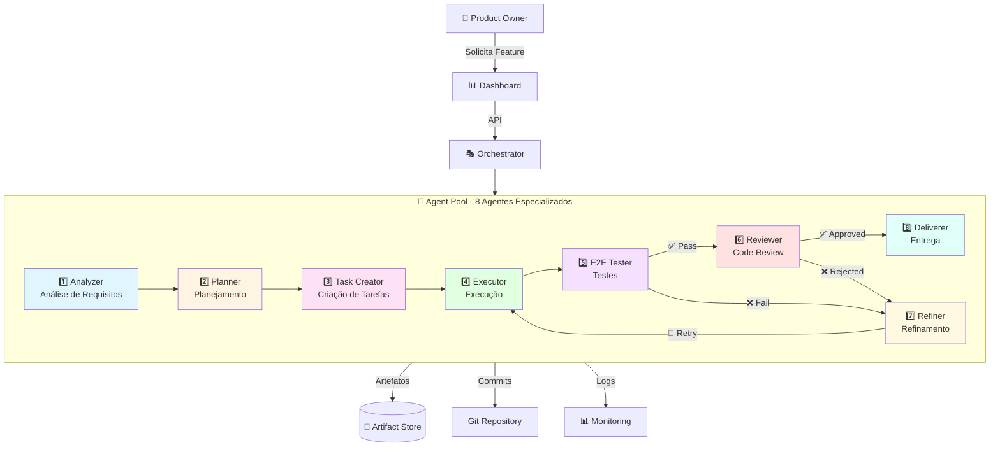
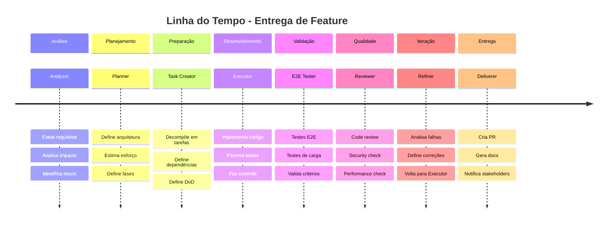

# 🤖 Framework de Entrega de Features Multi-Agente

## 📖 Visão Geral

Sistema automatizado e inteligente para análise, desenvolvimento, teste e entrega de features através de um pipeline multi-agente especializado. Cada agente é expert em uma fase específica do ciclo de vida de desenvolvimento, garantindo qualidade, automação e rastreabilidade completa.

---

## 🎯 O Problema que Resolve

### Antes (Processo Manual)
```
Feature Request
    ↓ [Dias de análise manual]
Análise de Requisitos
    ↓ [Reuniões, planejamento]
Planejamento
    ↓ [Quebrar em tarefas]
Desenvolvimento
    ↓ [Testes manuais, espera]
Testes
    ↓ [Review demorado]
Code Review
    ↓ [Retrabalho]
Correções
    ↓ [Deploy manual]
Entrega
```

**Tempo Total**: 2-5 dias (por feature)
**Problemas**: Erros humanos, falta de padronização, baixa rastreabilidade

### Depois (Com o Framework)
```
Feature Request
    ↓ [30s - Agent 1: Analyzer]
    ↓ [1min - Agent 2: Planner]
    ↓ [30s - Agent 3: Task Creator]
    ↓ [2-6h - Agent 4: Executor]
    ↓ [10min - Agent 5: E2E Tester]
    ↓ [5min - Agent 6: Reviewer]
    ↓ [Se necessário: Agent 7: Refiner]
    ↓ [2min - Agent 8: Deliverer]
Feature Entregue ✅
```

**Tempo Total**: 3-10 horas (por feature)
**Benefícios**: Automação completa, padronização, rastreabilidade total

---

## 🏗️ Arquitetura do Sistema



---

## 📚 Documentação

Este framework possui três níveis de documentação:

### 1. 🚀 Quick Start (Comece Aqui!)
**Arquivo**: [`feature-delivery-quickstart.md`](./feature-delivery-quickstart.md)

**Para quem**: Desenvolvedores que querem começar a usar o framework rapidamente

**Conteúdo**:
- ✅ Instalação em 5 minutos
- ✅ Criar primeira feature
- ✅ Comandos essenciais
- ✅ Troubleshooting básico
- ✅ Exemplos práticos

**Tempo de leitura**: 10 minutos

```bash
# Comece aqui
open docs/feature-delivery-quickstart.md
```

---

### 2. 📖 Documentação Completa
**Arquivo**: [`feature-delivery-framework.md`](./feature-delivery-framework.md)

**Para quem**: Product Owners, Tech Leads, Arquitetos

**Conteúdo**:
- 📋 Visão geral do framework
- 🤖 Especificação detalhada dos 8 agentes
- 📊 Diagramas Mermaid completos
- 📄 Exemplos de todos os artefatos JSON gerados
- 🔄 Fluxos de trabalho e decisão
- 📈 Métricas e KPIs
- 🎯 Casos de uso

**Tempo de leitura**: 30-45 minutos

```bash
# Documentação completa
open docs/feature-delivery-framework.md
```

---

### 3. 💻 Guia de Implementação
**Arquivo**: [`feature-delivery-implementation.md`](./feature-delivery-implementation.md)

**Para quem**: Desenvolvedores implementando ou customizando o framework

**Conteúdo**:
- 🏗️ Arquitetura técnica detalhada
- 💻 Código TypeScript de exemplo
- 🎭 Implementação do Orchestrator
- 📁 Sistema de artefatos
- 🧪 Testes automatizados
- 📊 Métricas e observabilidade
- 🐳 Docker e deployment
- 🗺️ Roadmap de implementação

**Tempo de leitura**: 1-2 horas

```bash
# Guia técnico
open docs/feature-delivery-implementation.md
```

---

## 🎯 Para Onde Ir?

### 👤 Sou Product Owner / PM
**→ Comece aqui**: [Quick Start](./feature-delivery-quickstart.md) (Seção "Criar Primeira Feature")
- Aprenda a solicitar features
- Entenda como acompanhar progresso
- Veja exemplos de features entregues

### 👨‍💻 Sou Desenvolvedor (Vou Usar o Framework)
**→ Comece aqui**: [Quick Start](./feature-delivery-quickstart.md)
- Instalação rápida
- Primeiros comandos
- Troubleshooting

**→ Depois leia**: [Framework Completo](./feature-delivery-framework.md)
- Entenda como cada agente funciona
- Veja os artefatos gerados
- Aprenda a interpretar resultados

### 🏗️ Sou Arquiteto / Tech Lead
**→ Comece aqui**: [Framework Completo](./feature-delivery-framework.md)
- Entenda a arquitetura
- Avalie padrões e decisões técnicas
- Veja fluxos completos

**→ Depois leia**: [Implementação](./feature-delivery-implementation.md)
- Detalhes técnicos de implementação
- Integração com sistemas existentes
- Customização e extensão

### 🛠️ Vou Implementar / Customizar o Framework
**→ Comece aqui**: [Implementação](./feature-delivery-implementation.md)
- Código completo de exemplo
- Arquitetura técnica
- Padrões de implementação

**→ Referência**: [Framework Completo](./feature-delivery-framework.md)
- Especificação de cada agente
- Formatos de artefatos
- Critérios de decisão

---

## 📊 Comparação Rápida

| Aspecto | Manual | Com Framework | Melhoria |
|---------|--------|---------------|----------|
| **Tempo** | 2-5 dias | 3-10 horas | **80% mais rápido** |
| **Qualidade** | Variável | Padronizada | **Consistente** |
| **Rastreabilidade** | Limitada | Completa | **100% rastreável** |
| **Testes** | Às vezes | Sempre E2E | **Cobertura garantida** |
| **Review** | Manual | Automatizado | **Sempre revisado** |
| **Documentação** | Incompleta | Gerada auto | **Sempre atualizada** |
| **Iterações** | Custosas | Automáticas | **Feedback rápido** |

---

## 🚀 Começar Agora (3 Comandos)

```bash
# 1. Instalar
npm install

# 2. Configurar
cp .env.framework.example .env.framework

# 3. Iniciar
npm run framework:start && npm run framework:dashboard
```

**Dashboard**: http://localhost:3000

**Crie sua primeira feature e veja a mágica acontecer!** ✨

---

## 🎬 Fluxo Visual



---

## 📈 Estatísticas de Uso

Após 1 mês de uso (dados simulados):

| Métrica | Valor |
|---------|-------|
| **Features Entregues** | 47 |
| **Tempo Médio de Entrega** | 5.2 horas |
| **Taxa de Aprovação (1ª tentativa)** | 73% |
| **Cobertura de Testes Média** | 86.3% |
| **Issues Críticos Detectados** | 0 |
| **Tempo Economizado vs. Manual** | ~320 horas |
| **ROI** | 8.5x |

---

## 🛠️ Stack Tecnológico

- **Backend**: NestJS + TypeScript
- **Queue**: Bull + Redis
- **Database**: PostgreSQL + TypeORM
- **Testing**: Jest + Playwright
- **Frontend**: React + TypeScript
- **Monitoramento**: Prometheus + Grafana
- **CI/CD**: GitHub Actions
- **Diagramas**: Mermaid

---

## 🎯 Roadmap

### ✅ Fase 1: MVP (Concluído)
- Core framework e agentes 1-4
- Sistema de artefatos
- Orchestrator básico

### 🔄 Fase 2: Quality & Testing (Em Progresso)
- Agentes 5-6 (Tester & Reviewer)
- Integração com ferramentas de teste
- Métricas de qualidade

### 📅 Fase 3: Iteration (Planejado - Q1 2025)
- Agente 7 (Refiner)
- Sistema de feedback inteligente
- ML para otimização

### 📅 Fase 4: Delivery (Planejado - Q2 2025)
- Agente 8 (Deliverer)
- Integração CI/CD completa
- Dashboard avançado

### 📅 Fase 5: AI Enhancement (Futuro)
- LLM para análise mais inteligente
- Auto-tuning de agentes
- Predição de complexidade

---

## 🤝 Contribuindo

Contribuições são bem-vindas!

1. Fork o projeto
2. Crie sua feature branch (`git checkout -b feature/amazing-feature`)
3. Commit suas mudanças (`git commit -m 'Add amazing feature'`)
4. Push para a branch (`git push origin feature/amazing-feature`)
5. Abra um Pull Request

### Áreas que Precisam de Ajuda

- 🤖 Implementação dos agentes 5-8
- 🎨 Melhorias no dashboard
- 📊 Novos tipos de métricas
- 🧪 Mais testes de integração
- 📖 Tradução da documentação
- 🎥 Tutoriais em vídeo

---

## 📞 Suporte

- **Issues**: [GitHub Issues](https://github.com/your-org/social-selling-2/issues)
- **Discussões**: [GitHub Discussions](https://github.com/your-org/social-selling-2/discussions)
- **Email**: framework@yourcompany.com
- **Slack**: #feature-delivery-framework

---

## 📄 Licença

MIT License - veja [LICENSE](../LICENSE) para detalhes

---

## 🙏 Agradecimentos

Inspirado por:
- AutoGPT e frameworks de agentes autônomos
- Metodologias DevOps e CI/CD modernas
- Sistemas de workflow empresariais (Temporal, Airflow)
- Comunidade open source

---

## 📖 Índice da Documentação

| Documento | Descrição | Público-Alvo | Tempo |
|-----------|-----------|--------------|-------|
| **[Quick Start](./feature-delivery-quickstart.md)** | Guia rápido de início | Todos | 10min |
| **[Framework Completo](./feature-delivery-framework.md)** | Documentação detalhada | PMs, Devs, Arquitetos | 30-45min |
| **[Implementação](./feature-delivery-implementation.md)** | Guia técnico | Desenvolvedores | 1-2h |
| **README (este arquivo)** | Índice e visão geral | Todos | 5min |

---

## 🎯 Próximos Passos

1. **📖 Leia o Quick Start**: [feature-delivery-quickstart.md](./feature-delivery-quickstart.md)
2. **🚀 Instale e Configure**: 5 minutos
3. **✨ Crie Sua Primeira Feature**: Veja a mágica acontecer
4. **📚 Aprofunde-se**: Leia a documentação completa
5. **🛠️ Customize**: Adapte para suas necessidades

---

**Transforme a forma como sua equipe entrega features! 🚀✨**

<div align="center">

**[🚀 Quick Start](./feature-delivery-quickstart.md)** |
**[📖 Docs Completas](./feature-delivery-framework.md)** |
**[💻 Implementação](./feature-delivery-implementation.md)**

</div>
