# 📊 Diagramas e Visualizações - Framework de Entrega de Features

## 🎯 Visão Geral em Uma Imagem

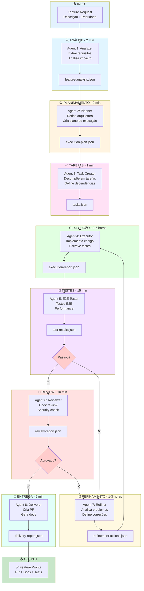

---

## 🔄 Ciclo de Vida Completo

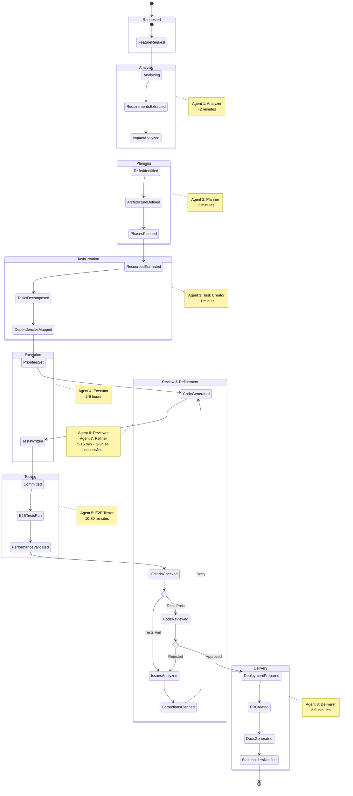

---

## 🏢 Arquitetura de Sistema (C4 Model)

### Nível 1: Contexto

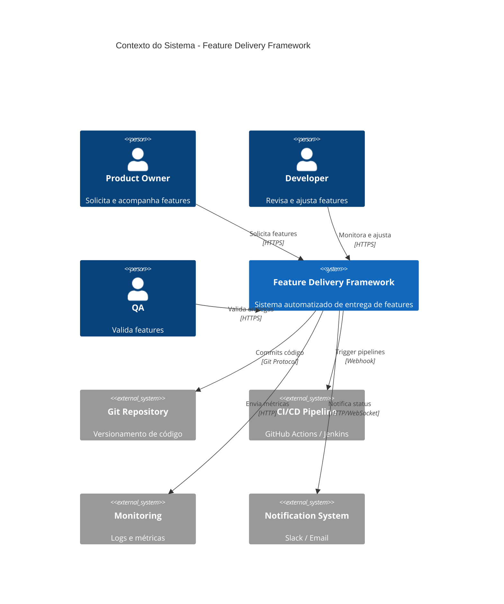

### Nível 2: Container

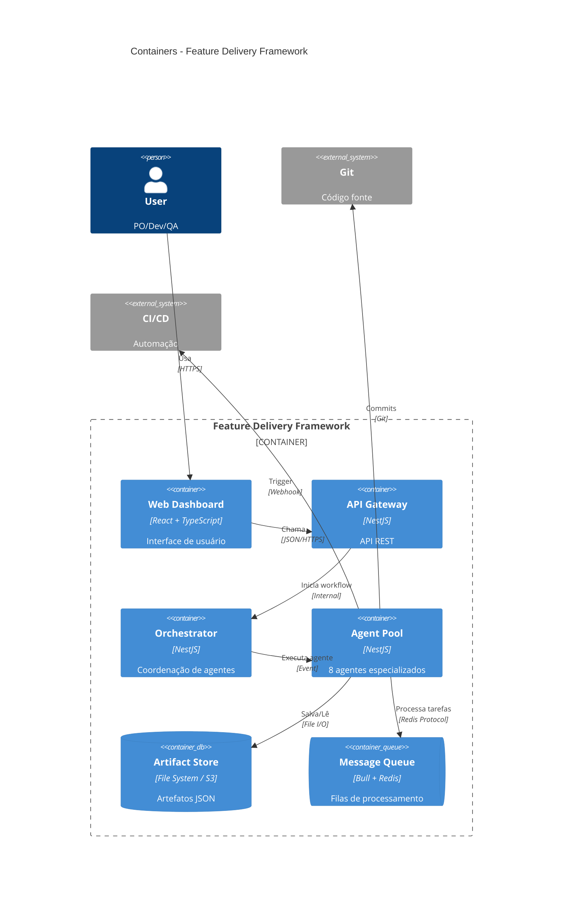

### Nível 3: Componentes (Agent Pool)

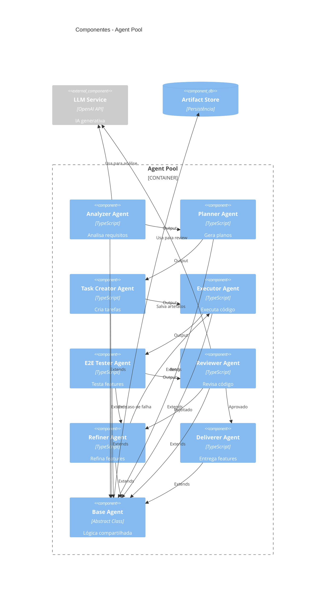

---

## 📊 Fluxo de Dados

```mermaid
flowchart LR
    subgraph Input
        FR[Feature<br/>Request]
    end

    subgraph A1[Agent 1]
        direction TB
        IN1[Input:<br/>Feature Request]
        PROC1[Processar]
        OUT1[Output:<br/>Analysis JSON]
        IN1 --> PROC1 --> OUT1
    end

    subgraph A2[Agent 2]
        direction TB
        IN2[Input:<br/>Analysis JSON]
        PROC2[Processar]
        OUT2[Output:<br/>Plan JSON]
        IN2 --> PROC2 --> OUT2
    end

    subgraph A3[Agent 3]
        direction TB
        IN3[Input:<br/>Plan JSON]
        PROC3[Processar]
        OUT3[Output:<br/>Tasks JSON]
        IN3 --> PROC3 --> OUT3
    end

    subgraph A4[Agent 4]
        direction TB
        IN4[Input:<br/>Tasks JSON +<br/>Refinement JSON]
        PROC4[Processar]
        OUT4[Output:<br/>Execution JSON]
        IN4 --> PROC4 --> OUT4
    end

    subgraph A5[Agent 5]
        direction TB
        IN5[Input:<br/>Execution JSON]
        PROC5[Processar]
        OUT5[Output:<br/>Test Results JSON]
        IN5 --> PROC5 --> OUT5
    end

    subgraph A6[Agent 6]
        direction TB
        IN6[Input:<br/>Test Results JSON]
        PROC6[Processar]
        OUT6[Output:<br/>Review JSON]
        IN6 --> PROC6 --> OUT6
    end

    subgraph A7[Agent 7]
        direction TB
        IN7[Input:<br/>Test/Review JSON]
        PROC7[Processar]
        OUT7[Output:<br/>Refinement JSON]
        IN7 --> PROC7 --> OUT7
    end

    subgraph A8[Agent 8]
        direction TB
        IN8[Input:<br/>Review JSON]
        PROC8[Processar]
        OUT8[Output:<br/>Delivery JSON]
        IN8 --> PROC8 --> OUT8
    end

    subgraph Output
        DONE[Feature<br/>Delivered]
    end

    FR --> IN1
    OUT1 --> IN2
    OUT2 --> IN3
    OUT3 --> IN4
    OUT4 --> IN5
    OUT5 --> IN6
    OUT5 -.Fail.-> IN7
    OUT6 --> IN8
    OUT6 -.Reject.-> IN7
    OUT7 --> IN4
    OUT8 --> DONE

    style A1 fill:#e1f5ff
    style A2 fill:#fff4e1
    style A3 fill:#ffe1f5
    style A4 fill:#e1ffe1
    style A5 fill:#f5e1ff
    style A6 fill:#ffe1e1
    style A7 fill:#fff9e1
    style A8 fill:#e1fff9
```

---

## ⚙️ Padrões de Interação

### Padrão 1: Fluxo Linear (Sem Problemas)

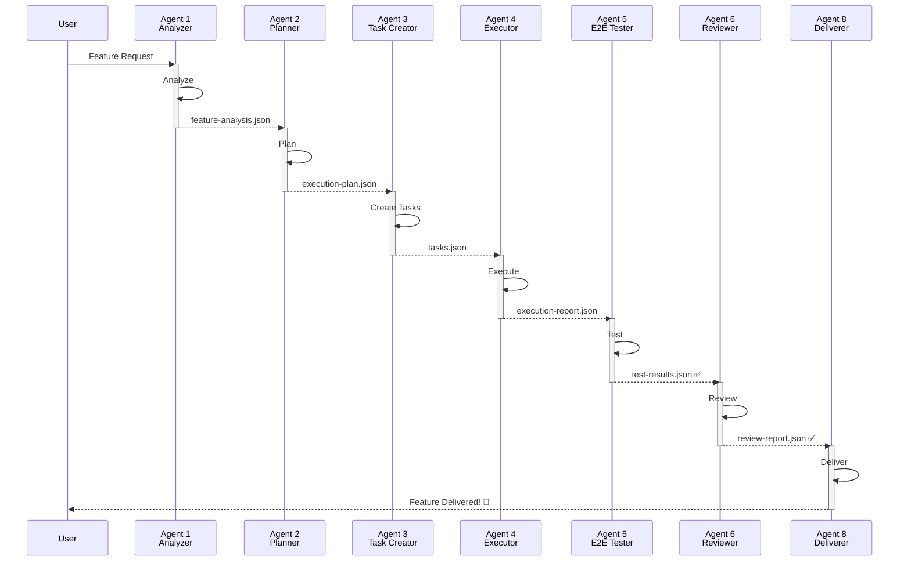

### Padrão 2: Fluxo com Refinamento (Iterativo)

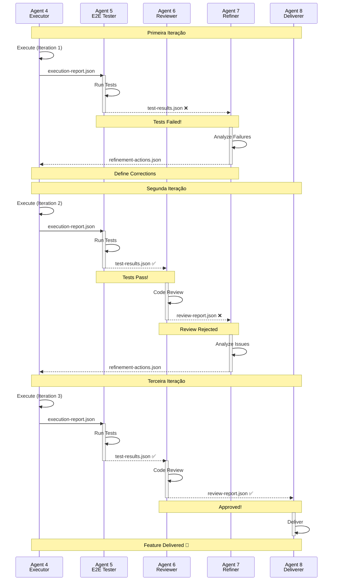

---

## 📈 Métricas e Observabilidade

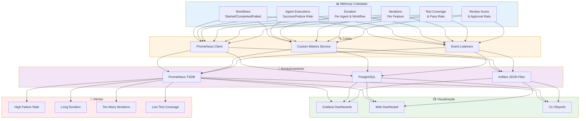

---

## 🎯 Matriz de Decisão

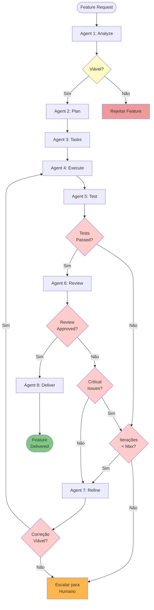

---

## 🔄 Modelo de Iteração

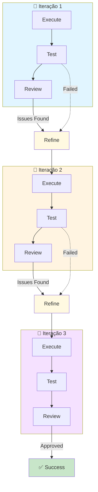

---

## 🗂️ Estrutura de Artefatos

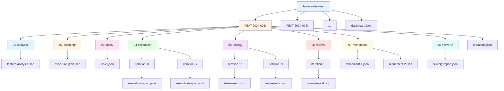

---

## 📊 Dashboard Layout

```mermaid
graph TB
    subgraph Dashboard["🖥️ Web Dashboard"]
        NAV[Navigation Bar]

        subgraph Overview["📊 Overview Section"]
            STATS[Statistics Cards<br/>Active | Completed | Failed]
            CHART[Timeline Chart<br/>Features over time]
        end

        subgraph Active["🔄 Active Workflows"]
            WF1[Workflow Card 1<br/>FEAT-001 | Agent 4 | Iter 2]
            WF2[Workflow Card 2<br/>FEAT-002 | Agent 5 | Iter 1]
            WF3[Workflow Card 3<br/>FEAT-003 | Agent 2 | Iter 1]
        end

        subgraph Detail["📝 Feature Detail Panel"]
            INFO[Feature Info]
            TIMELINE[Agent Timeline]
            ARTIFACTS[Artifacts List]
            LOGS[Real-time Logs]
        end

        subgraph Actions["⚡ Quick Actions"]
            BTN1[+ New Feature]
            BTN2[Pause All]
            BTN3[View Metrics]
            BTN4[Export Report]
        end
    end

    NAV --> Overview
    NAV --> Active
    NAV --> Actions

    WF1 -.Click.-> Detail
    WF2 -.Click.-> Detail
    WF3 -.Click.-> Detail

    style Dashboard fill:#f5f5f5
    style Overview fill:#e3f2fd
    style Active fill:#fff4e1
    style Detail fill:#f3e5f5
    style Actions fill:#e8f5e9
```

---

## 🎯 Comparação: Manual vs. Framework

```mermaid
gantt
    title Tempo de Entrega: Manual vs. Framework
    dateFormat HH:mm
    axisFormat %Hh%M

    section Manual
    Análise Manual           :manual1, 00:00, 8h
    Planejamento Manual      :manual2, after manual1, 4h
    Desenvolvimento          :manual3, after manual2, 16h
    Testes Manuais          :manual4, after manual3, 6h
    Code Review             :manual5, after manual4, 3h
    Correções               :manual6, after manual5, 8h
    Deploy Manual           :manual7, after manual6, 2h

    section Framework
    Agent 1: Analyzer        :auto1, 00:00, 2m
    Agent 2: Planner         :auto2, after auto1, 2m
    Agent 3: Task Creator    :auto3, after auto2, 1m
    Agent 4: Executor        :auto4, after auto3, 4h
    Agent 5: E2E Tester      :auto5, after auto4, 15m
    Agent 6: Reviewer        :auto6, after auto5, 5m
    Agent 7: Refiner         :auto7, after auto6, 1h
    Agent 4: Executor (Iter2):auto8, after auto7, 1h
    Agent 5: Tester (Iter2)  :auto9, after auto8, 10m
    Agent 6: Reviewer (OK)   :auto10, after auto9, 5m
    Agent 8: Deliverer       :auto11, after auto10, 2m
```

**Manual**: ~47 horas (quase 6 dias úteis)
**Framework**: ~6.5 horas (mesmo dia)

**Economia**: **86% mais rápido!** ⚡

---

## 📈 ROI e Benefícios

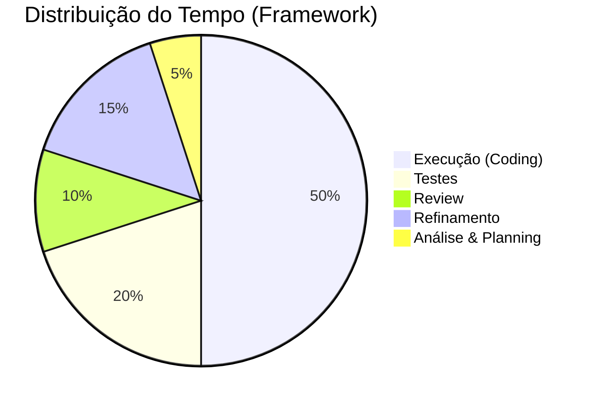

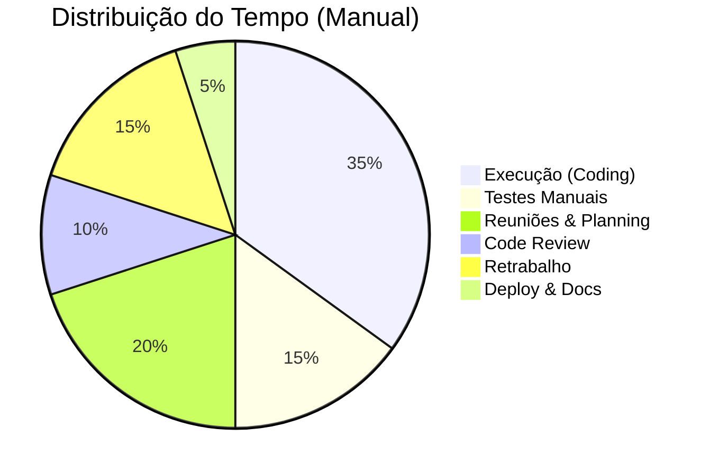

---

## 🎓 Conclusão

Estes diagramas fornecem uma visão completa e visual de:

✅ Fluxo de trabalho end-to-end
✅ Arquitetura do sistema em múltiplos níveis
✅ Interação entre agentes
✅ Padrões de decisão e iteração
✅ Estrutura de dados e artefatos
✅ Métricas e observabilidade
✅ Comparação com processo manual

**Use estes diagramas para:**
- 📊 Apresentações para stakeholders
- 🎓 Onboarding de novos membros
- 📖 Documentação técnica
- 🔍 Troubleshooting e debugging
- 📈 Análise de performance

---

**Quer ver estes diagramas em ação?**

```bash
# Inicie o framework
npm run framework:start

# Abra o dashboard
npm run framework:dashboard

# Crie uma feature e veja os diagramas ganharem vida! 🚀
```
