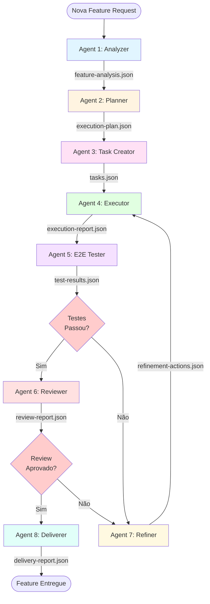
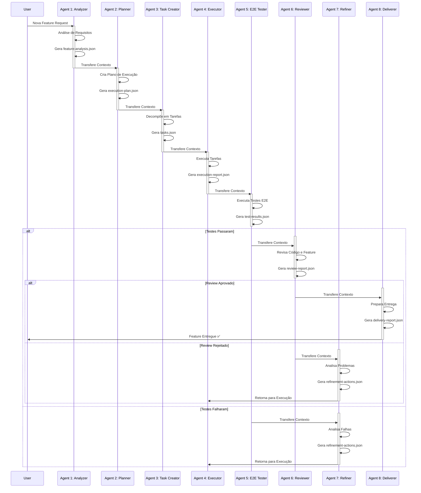
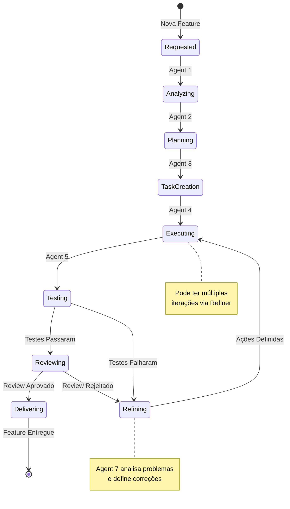
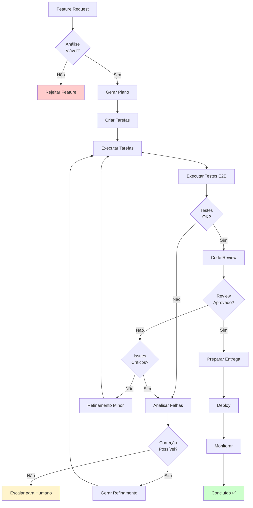

# Framework de Entrega de Features - Sistema Multi-Agente

## 📋 Visão Geral

Este framework implementa um processo automatizado e iterativo para análise, planejamento, desenvolvimento, teste e entrega de novas features. Cada etapa é gerenciada por um agente especializado que gera artefatos específicos e coordena a transição para o próximo agente.

## 🎯 Objetivos

- **Automação**: Processo end-to-end automatizado de entrega de features
- **Especialização**: Cada agente é expert em sua tarefa específica
- **Rastreabilidade**: Todos os artefatos são documentados e versionados
- **Qualidade**: Testes e revisões integrados no fluxo
- **Iteração**: Sistema de feedback e refinamento contínuo

---

## 🏗️ Arquitetura do Sistema



---

## 🔄 Fluxo Detalhado de Agentes



---

## 🤖 Especificação dos Agentes

### Agent 1: Feature Analyzer

**Responsabilidade**: Analisar a solicitação de feature e extrair requisitos funcionais e não-funcionais.

**Input**:
- Feature request (texto livre ou estruturado)

**Processamento**:
1. Extrai requisitos funcionais
2. Identifica requisitos não-funcionais
3. Analisa impacto no sistema
4. Identifica dependências
5. Avalia complexidade e riscos

**Output**: `feature-analysis.json`

```json
{
  "featureId": "FEAT-2024-001",
  "timestamp": "2024-01-15T10:30:00Z",
  "analyzer": {
    "agentVersion": "1.0.0",
    "analysisDate": "2024-01-15"
  },
  "feature": {
    "title": "Sistema de Notificações Push",
    "description": "Implementar notificações push para alertas de vendas",
    "category": "notifications",
    "priority": "high",
    "businessValue": "Aumentar engajamento em 30%"
  },
  "requirements": {
    "functional": [
      {
        "id": "FR-001",
        "description": "Enviar notificações push para dispositivos móveis",
        "priority": "must-have"
      },
      {
        "id": "FR-002",
        "description": "Permitir configuração de preferências de notificação",
        "priority": "must-have"
      }
    ],
    "nonFunctional": [
      {
        "id": "NFR-001",
        "type": "performance",
        "description": "Notificações devem ser entregues em menos de 5 segundos"
      },
      {
        "id": "NFR-002",
        "type": "scalability",
        "description": "Suportar 10.000 notificações simultâneas"
      }
    ]
  },
  "impact": {
    "modules": ["notifications", "user-preferences", "api"],
    "databases": ["postgres-users", "redis-cache"],
    "externalServices": ["firebase-cloud-messaging"],
    "estimatedComplexity": "medium-high"
  },
  "dependencies": [
    {
      "type": "service",
      "name": "Firebase Cloud Messaging",
      "action": "integrate"
    },
    {
      "type": "feature",
      "name": "User Preferences API",
      "action": "extend"
    }
  ],
  "risks": [
    {
      "description": "Integração com Firebase pode ter latência",
      "severity": "medium",
      "mitigation": "Implementar retry mechanism e circuit breaker"
    }
  ],
  "nextAgent": "planner"
}
```

---

### Agent 2: Execution Planner

**Responsabilidade**: Criar plano detalhado de execução baseado na análise.

**Input**:
- `feature-analysis.json`

**Processamento**:
1. Define arquitetura da solução
2. Identifica componentes a serem criados/modificados
3. Define ordem de implementação
4. Estima esforço e recursos
5. Define critérios de aceitação

**Output**: `execution-plan.json`

```json
{
  "planId": "PLAN-2024-001",
  "featureId": "FEAT-2024-001",
  "timestamp": "2024-01-15T11:00:00Z",
  "planner": {
    "agentVersion": "1.0.0",
    "planningDate": "2024-01-15"
  },
  "architecture": {
    "approach": "event-driven",
    "patterns": ["observer", "circuit-breaker", "retry-pattern"],
    "components": [
      {
        "name": "NotificationService",
        "type": "backend-service",
        "action": "create",
        "technology": "NestJS"
      },
      {
        "name": "NotificationQueue",
        "type": "message-queue",
        "action": "create",
        "technology": "Bull/Redis"
      },
      {
        "name": "FCMClient",
        "type": "external-client",
        "action": "create",
        "technology": "Firebase Admin SDK"
      },
      {
        "name": "UserPreferencesService",
        "type": "backend-service",
        "action": "modify",
        "technology": "NestJS"
      }
    ]
  },
  "phases": [
    {
      "phaseId": "P1",
      "name": "Setup & Infrastructure",
      "order": 1,
      "estimatedHours": 8,
      "components": ["FCMClient", "NotificationQueue"]
    },
    {
      "phaseId": "P2",
      "name": "Core Service Implementation",
      "order": 2,
      "estimatedHours": 16,
      "components": ["NotificationService", "UserPreferencesService"],
      "dependencies": ["P1"]
    },
    {
      "phaseId": "P3",
      "name": "Integration & API",
      "order": 3,
      "estimatedHours": 12,
      "dependencies": ["P2"]
    },
    {
      "phaseId": "P4",
      "name": "Testing & Documentation",
      "order": 4,
      "estimatedHours": 8,
      "dependencies": ["P3"]
    }
  ],
  "acceptanceCriteria": [
    {
      "id": "AC-001",
      "description": "Notificações são entregues em menos de 5 segundos",
      "type": "performance",
      "testable": true
    },
    {
      "id": "AC-002",
      "description": "Usuário pode configurar preferências de notificação",
      "type": "functional",
      "testable": true
    }
  ],
  "technicalDecisions": [
    {
      "decision": "Usar Bull/Redis para fila de notificações",
      "rationale": "Já está integrado no projeto, suporta retry e jobs agendados"
    },
    {
      "decision": "Firebase Cloud Messaging como provedor",
      "rationale": "Suporte nativo para iOS e Android, escalável"
    }
  ],
  "estimatedTotalHours": 44,
  "nextAgent": "task-creator"
}
```

---

### Agent 3: Task Creator

**Responsabilidade**: Decompor o plano em tarefas executáveis e atômicas.

**Input**:
- `execution-plan.json`

**Processamento**:
1. Decompõe fases em tarefas específicas
2. Define dependências entre tarefas
3. Prioriza tarefas
4. Atribui categorias (backend, frontend, infra, test)
5. Define DoD (Definition of Done) para cada tarefa

**Output**: `tasks.json`

```json
{
  "taskSetId": "TASKS-2024-001",
  "featureId": "FEAT-2024-001",
  "planId": "PLAN-2024-001",
  "timestamp": "2024-01-15T12:00:00Z",
  "creator": {
    "agentVersion": "1.0.0",
    "creationDate": "2024-01-15"
  },
  "summary": {
    "totalTasks": 18,
    "byCategory": {
      "backend": 8,
      "frontend": 4,
      "infrastructure": 3,
      "testing": 3
    },
    "byPriority": {
      "critical": 5,
      "high": 8,
      "medium": 5
    }
  },
  "tasks": [
    {
      "taskId": "TASK-001",
      "phaseId": "P1",
      "title": "Configurar Firebase Admin SDK",
      "description": "Instalar e configurar Firebase Admin SDK para integração com FCM",
      "category": "infrastructure",
      "priority": "critical",
      "estimatedHours": 2,
      "dependencies": [],
      "files": [
        "src/config/firebase.config.ts",
        "package.json",
        ".env.example"
      ],
      "dod": [
        "Firebase Admin SDK instalado",
        "Variáveis de ambiente configuradas",
        "Teste de conexão funcionando"
      ],
      "technicalDetails": {
        "packages": ["firebase-admin"],
        "envVars": ["FIREBASE_PROJECT_ID", "FIREBASE_PRIVATE_KEY", "FIREBASE_CLIENT_EMAIL"],
        "testCommand": "npm run test:firebase-connection"
      }
    },
    {
      "taskId": "TASK-002",
      "phaseId": "P1",
      "title": "Configurar Bull Queue para notificações",
      "description": "Criar fila dedicada para processamento de notificações push",
      "category": "infrastructure",
      "priority": "critical",
      "estimatedHours": 3,
      "dependencies": [],
      "files": [
        "src/notifications/queues/notification.queue.ts",
        "src/notifications/processors/notification.processor.ts",
        "src/app.module.ts"
      ],
      "dod": [
        "Fila 'notifications' criada e registrada",
        "Processor básico implementado",
        "Testes unitários da fila passando"
      ]
    },
    {
      "taskId": "TASK-003",
      "phaseId": "P2",
      "title": "Criar NotificationService",
      "description": "Implementar serviço core de notificações com lógica de negócio",
      "category": "backend",
      "priority": "critical",
      "estimatedHours": 4,
      "dependencies": ["TASK-001", "TASK-002"],
      "files": [
        "src/notifications/services/notification.service.ts",
        "src/notifications/services/notification.service.spec.ts",
        "src/notifications/notifications.module.ts"
      ],
      "dod": [
        "Métodos sendPushNotification, scheduleNotification implementados",
        "Integração com Bull Queue funcionando",
        "Cobertura de testes >= 80%"
      ]
    },
    {
      "taskId": "TASK-004",
      "phaseId": "P2",
      "title": "Implementar FCMClient",
      "description": "Criar cliente wrapper para Firebase Cloud Messaging",
      "category": "backend",
      "priority": "high",
      "estimatedHours": 3,
      "dependencies": ["TASK-001"],
      "files": [
        "src/notifications/clients/fcm.client.ts",
        "src/notifications/clients/fcm.client.spec.ts"
      ],
      "dod": [
        "Método send() implementado com retry logic",
        "Circuit breaker configurado",
        "Logs e métricas implementados",
        "Testes com mocks do Firebase"
      ]
    },
    {
      "taskId": "TASK-005",
      "phaseId": "P2",
      "title": "Criar entidade NotificationPreference",
      "description": "Modelar preferências de notificação do usuário",
      "category": "backend",
      "priority": "high",
      "estimatedHours": 2,
      "dependencies": [],
      "files": [
        "src/users/entities/notification-preference.entity.ts",
        "src/users/dto/update-notification-preference.dto.ts",
        "src/database/migrations/xxxx-create-notification-preferences.ts"
      ],
      "dod": [
        "Entidade TypeORM criada",
        "DTOs de validação criados",
        "Migration executada com sucesso"
      ]
    },
    {
      "taskId": "TASK-006",
      "phaseId": "P2",
      "title": "Estender UserPreferencesService",
      "description": "Adicionar métodos para gerenciar preferências de notificação",
      "category": "backend",
      "priority": "high",
      "estimatedHours": 3,
      "dependencies": ["TASK-005"],
      "files": [
        "src/users/services/user-preferences.service.ts",
        "src/users/services/user-preferences.service.spec.ts"
      ],
      "dod": [
        "Métodos CRUD para NotificationPreference",
        "Validações implementadas",
        "Testes unitários completos"
      ]
    },
    {
      "taskId": "TASK-007",
      "phaseId": "P3",
      "title": "Criar NotificationController",
      "description": "Implementar endpoints REST para notificações",
      "category": "backend",
      "priority": "high",
      "estimatedHours": 3,
      "dependencies": ["TASK-003"],
      "files": [
        "src/notifications/controllers/notification.controller.ts",
        "src/notifications/controllers/notification.controller.spec.ts"
      ],
      "dod": [
        "Endpoints POST /notifications, GET /notifications/:id",
        "Autenticação JWT implementada",
        "Swagger documentation completa",
        "Testes de integração passando"
      ]
    },
    {
      "taskId": "TASK-008",
      "phaseId": "P3",
      "title": "Criar UserPreferencesController endpoints",
      "description": "Adicionar endpoints para preferências de notificação",
      "category": "backend",
      "priority": "medium",
      "estimatedHours": 2,
      "dependencies": ["TASK-006"],
      "files": [
        "src/users/controllers/user-preferences.controller.ts"
      ],
      "dod": [
        "Endpoints GET/PUT /users/:id/notification-preferences",
        "Validação de permissões (usuário só edita suas próprias preferências)",
        "Swagger documentation"
      ]
    },
    {
      "taskId": "TASK-009",
      "phaseId": "P3",
      "title": "Implementar Notification Webhook Handler",
      "description": "Criar handler para webhooks de eventos de notificação",
      "category": "backend",
      "priority": "medium",
      "estimatedHours": 4,
      "dependencies": ["TASK-003"],
      "files": [
        "src/notifications/controllers/webhook.controller.ts",
        "src/notifications/services/webhook-handler.service.ts"
      ],
      "dod": [
        "Endpoint POST /webhooks/notifications",
        "Validação de assinatura do webhook",
        "Processamento de eventos (delivered, failed, opened)"
      ]
    },
    {
      "taskId": "TASK-010",
      "phaseId": "P4",
      "title": "Criar testes E2E de notificações",
      "description": "Implementar suite de testes E2E para fluxo completo",
      "category": "testing",
      "priority": "critical",
      "estimatedHours": 4,
      "dependencies": ["TASK-007", "TASK-008", "TASK-009"],
      "files": [
        "test/e2e/notifications.e2e-spec.ts"
      ],
      "dod": [
        "Testes de envio de notificação",
        "Testes de configuração de preferências",
        "Testes de webhooks",
        "Todos os testes passando"
      ]
    },
    {
      "taskId": "TASK-011",
      "phaseId": "P4",
      "title": "Criar testes de carga",
      "description": "Validar performance com 10k notificações simultâneas",
      "category": "testing",
      "priority": "high",
      "estimatedHours": 3,
      "dependencies": ["TASK-010"],
      "files": [
        "test/load/notifications.load.test.ts"
      ],
      "dod": [
        "Teste com 10.000 notificações simultâneas",
        "Latência p95 < 5 segundos",
        "Sem erros de timeout"
      ]
    },
    {
      "taskId": "TASK-012",
      "phaseId": "P4",
      "title": "Documentar API de notificações",
      "description": "Criar documentação completa da API",
      "category": "documentation",
      "priority": "medium",
      "estimatedHours": 2,
      "dependencies": ["TASK-007", "TASK-008"],
      "files": [
        "docs/api/notifications.md",
        "docs/architecture/notifications-flow.md"
      ],
      "dod": [
        "Exemplos de request/response",
        "Diagramas de sequência",
        "Guia de troubleshooting"
      ]
    }
  ],
  "executionOrder": [
    "TASK-001",
    "TASK-002",
    "TASK-005",
    "TASK-004",
    "TASK-003",
    "TASK-006",
    "TASK-007",
    "TASK-008",
    "TASK-009",
    "TASK-010",
    "TASK-011",
    "TASK-012"
  ],
  "nextAgent": "executor"
}
```

---

### Agent 4: Task Executor

**Responsabilidade**: Executar as tarefas definidas, gerando código e implementações.

**Input**:
- `tasks.json`
- `refinement-actions.json` (em caso de iteração)

**Processamento**:
1. Processa tarefas na ordem de execução
2. Verifica dependências antes de cada tarefa
3. Gera/modifica código conforme especificação
4. Executa testes unitários
5. Documenta alterações realizadas
6. Trata refinamentos de iterações anteriores

**Output**: `execution-report.json`

```json
{
  "executionId": "EXEC-2024-001",
  "taskSetId": "TASKS-2024-001",
  "timestamp": "2024-01-15T18:30:00Z",
  "executor": {
    "agentVersion": "1.0.0",
    "executionDate": "2024-01-15",
    "iteration": 1
  },
  "refinementContext": {
    "isRefinement": false,
    "previousExecutionId": null,
    "refinementActionsApplied": []
  },
  "summary": {
    "totalTasks": 12,
    "completed": 12,
    "failed": 0,
    "skipped": 0,
    "totalDuration": "4h 23m"
  },
  "taskExecutions": [
    {
      "taskId": "TASK-001",
      "status": "completed",
      "startTime": "2024-01-15T14:00:00Z",
      "endTime": "2024-01-15T16:15:00Z",
      "duration": "2h 15m",
      "changes": [
        {
          "file": "src/config/firebase.config.ts",
          "action": "created",
          "linesAdded": 45,
          "description": "Configuração do Firebase Admin SDK"
        },
        {
          "file": "package.json",
          "action": "modified",
          "linesAdded": 1,
          "description": "Adicionado firebase-admin@^12.0.0"
        },
        {
          "file": ".env.example",
          "action": "modified",
          "linesAdded": 3,
          "description": "Adicionadas variáveis Firebase"
        }
      ],
      "testsRun": {
        "unit": {
          "total": 3,
          "passed": 3,
          "failed": 0
        }
      },
      "dodCompliance": {
        "total": 3,
        "completed": 3,
        "items": [
          { "description": "Firebase Admin SDK instalado", "status": "completed" },
          { "description": "Variáveis de ambiente configuradas", "status": "completed" },
          { "description": "Teste de conexão funcionando", "status": "completed" }
        ]
      },
      "commits": [
        {
          "hash": "abc123",
          "message": "feat(notifications): configure Firebase Admin SDK"
        }
      ]
    },
    {
      "taskId": "TASK-002",
      "status": "completed",
      "startTime": "2024-01-15T16:15:00Z",
      "endTime": "2024-01-15T18:30:00Z",
      "duration": "2h 15m",
      "changes": [
        {
          "file": "src/notifications/queues/notification.queue.ts",
          "action": "created",
          "linesAdded": 67,
          "description": "Configuração da fila de notificações"
        },
        {
          "file": "src/notifications/processors/notification.processor.ts",
          "action": "created",
          "linesAdded": 123,
          "description": "Processor para processar jobs de notificação"
        },
        {
          "file": "src/app.module.ts",
          "action": "modified",
          "linesAdded": 8,
          "description": "Registrado NotificationsModule"
        }
      ],
      "testsRun": {
        "unit": {
          "total": 5,
          "passed": 5,
          "failed": 0
        }
      },
      "dodCompliance": {
        "total": 3,
        "completed": 3,
        "items": [
          { "description": "Fila 'notifications' criada e registrada", "status": "completed" },
          { "description": "Processor básico implementado", "status": "completed" },
          { "description": "Testes unitários da fila passando", "status": "completed" }
        ]
      },
      "commits": [
        {
          "hash": "def456",
          "message": "feat(notifications): setup Bull queue for notifications"
        }
      ]
    }
  ],
  "codeMetrics": {
    "filesCreated": 15,
    "filesModified": 8,
    "totalLinesAdded": 1243,
    "totalLinesDeleted": 34,
    "testCoverage": {
      "overall": 84.5,
      "statements": 86.2,
      "branches": 78.9,
      "functions": 88.1,
      "lines": 85.7
    }
  },
  "issues": [],
  "warnings": [
    {
      "taskId": "TASK-004",
      "type": "dependency",
      "message": "Firebase SDK possui vulnerabilidade CVE-2024-XXXX (low severity)",
      "action": "Monitorar atualizações"
    }
  ],
  "nextAgent": "e2e-tester"
}
```

---

### Agent 5: E2E Tester

**Responsabilidade**: Executar testes end-to-end e validar a feature completa.

**Input**:
- `execution-report.json`

**Processamento**:
1. Prepara ambiente de testes
2. Executa testes E2E
3. Executa testes de carga/performance
4. Valida critérios de aceitação
5. Gera relatório de testes
6. Determina se feature passou ou falhou

**Output**: `test-results.json`

```json
{
  "testResultsId": "TEST-2024-001",
  "executionId": "EXEC-2024-001",
  "timestamp": "2024-01-15T20:00:00Z",
  "tester": {
    "agentVersion": "1.0.0",
    "testDate": "2024-01-15"
  },
  "environment": {
    "type": "staging",
    "database": "test-db-notifications",
    "services": ["api", "redis", "postgres"]
  },
  "testSuites": [
    {
      "suiteId": "E2E-001",
      "name": "Notification Flow E2E Tests",
      "type": "e2e",
      "status": "passed",
      "duration": "3m 45s",
      "tests": [
        {
          "testId": "E2E-001-001",
          "name": "Should send push notification successfully",
          "status": "passed",
          "duration": "1.2s",
          "assertions": 8,
          "passed": 8,
          "failed": 0
        },
        {
          "testId": "E2E-001-002",
          "name": "Should respect user notification preferences",
          "status": "passed",
          "duration": "0.9s",
          "assertions": 6,
          "passed": 6,
          "failed": 0
        },
        {
          "testId": "E2E-001-003",
          "name": "Should handle FCM failures with retry",
          "status": "passed",
          "duration": "2.3s",
          "assertions": 5,
          "passed": 5,
          "failed": 0
        },
        {
          "testId": "E2E-001-004",
          "name": "Should process webhook events correctly",
          "status": "passed",
          "duration": "1.1s",
          "assertions": 7,
          "passed": 7,
          "failed": 0
        }
      ],
      "summary": {
        "total": 4,
        "passed": 4,
        "failed": 0,
        "skipped": 0
      }
    },
    {
      "suiteId": "PERF-001",
      "name": "Performance Tests",
      "type": "performance",
      "status": "passed",
      "duration": "5m 12s",
      "tests": [
        {
          "testId": "PERF-001-001",
          "name": "Should handle 10k concurrent notifications",
          "status": "passed",
          "duration": "5m 12s",
          "metrics": {
            "totalRequests": 10000,
            "successRate": 99.87,
            "failedRequests": 13,
            "avgLatency": "3.2s",
            "p50Latency": "2.8s",
            "p95Latency": "4.7s",
            "p99Latency": "5.1s",
            "maxLatency": "5.8s"
          },
          "threshold": {
            "successRate": ">= 99%",
            "p95Latency": "< 5s"
          },
          "result": "passed"
        }
      ],
      "summary": {
        "total": 1,
        "passed": 1,
        "failed": 0
      }
    },
    {
      "suiteId": "INTEGRATION-001",
      "name": "Integration Tests",
      "type": "integration",
      "status": "passed",
      "duration": "2m 30s",
      "tests": [
        {
          "testId": "INT-001-001",
          "name": "Firebase integration works correctly",
          "status": "passed",
          "duration": "1.2s"
        },
        {
          "testId": "INT-001-002",
          "name": "Bull queue processes jobs correctly",
          "status": "passed",
          "duration": "0.8s"
        },
        {
          "testId": "INT-001-003",
          "name": "Database transactions are atomic",
          "status": "passed",
          "duration": "0.5s"
        }
      ],
      "summary": {
        "total": 3,
        "passed": 3,
        "failed": 0
      }
    }
  ],
  "acceptanceCriteriaValidation": [
    {
      "criteriaId": "AC-001",
      "description": "Notificações são entregues em menos de 5 segundos",
      "status": "passed",
      "evidence": {
        "testId": "PERF-001-001",
        "metric": "p95Latency",
        "expected": "< 5s",
        "actual": "4.7s"
      }
    },
    {
      "criteriaId": "AC-002",
      "description": "Usuário pode configurar preferências de notificação",
      "status": "passed",
      "evidence": {
        "testId": "E2E-001-002",
        "assertions": "6 passed"
      }
    }
  ],
  "summary": {
    "overallStatus": "passed",
    "totalSuites": 3,
    "passedSuites": 3,
    "failedSuites": 0,
    "totalTests": 8,
    "passedTests": 8,
    "failedTests": 0,
    "skippedTests": 0,
    "totalDuration": "11m 27s",
    "acceptanceCriteriaMet": 2,
    "acceptanceCriteriaTotal": 2
  },
  "failures": [],
  "screenshots": [],
  "logs": {
    "error": 0,
    "warning": 3,
    "info": 245
  },
  "decision": "proceed-to-review",
  "nextAgent": "reviewer"
}
```

**Test Results com Falhas** (exemplo para iteração):

```json
{
  "testResultsId": "TEST-2024-001-ITER2",
  "executionId": "EXEC-2024-001-ITER2",
  "summary": {
    "overallStatus": "failed",
    "totalTests": 8,
    "passedTests": 6,
    "failedTests": 2
  },
  "failures": [
    {
      "testId": "E2E-001-003",
      "name": "Should handle FCM failures with retry",
      "error": "Timeout: Retry mechanism did not work as expected",
      "stackTrace": "...",
      "failedAssertion": "Expected retry after 3s, but no retry occurred"
    },
    {
      "testId": "PERF-001-001",
      "name": "Should handle 10k concurrent notifications",
      "error": "Performance threshold exceeded",
      "metrics": {
        "p95Latency": "7.2s",
        "threshold": "< 5s"
      }
    }
  ],
  "decision": "send-to-refinement",
  "nextAgent": "refiner"
}
```

---

### Agent 6: Code Reviewer

**Responsabilidade**: Revisar código, arquitetura e qualidade da implementação.

**Input**:
- `test-results.json` (com status "passed")
- `execution-report.json`

**Processamento**:
1. Analisa código implementado
2. Verifica padrões e boas práticas
3. Revisa arquitetura e design
4. Valida documentação
5. Verifica segurança
6. Determina se aprova ou requer ajustes

**Output**: `review-report.json`

```json
{
  "reviewId": "REVIEW-2024-001",
  "testResultsId": "TEST-2024-001",
  "timestamp": "2024-01-15T21:30:00Z",
  "reviewer": {
    "agentVersion": "1.0.0",
    "reviewDate": "2024-01-15"
  },
  "reviewCriteria": {
    "codeQuality": {
      "score": 9.2,
      "maxScore": 10,
      "status": "approved",
      "findings": [
        {
          "type": "positive",
          "severity": "info",
          "category": "code-quality",
          "description": "Código segue padrões NestJS consistentemente",
          "files": ["src/notifications/services/notification.service.ts"]
        },
        {
          "type": "positive",
          "severity": "info",
          "category": "testing",
          "description": "Cobertura de testes excelente (84.5%)",
          "evidence": "execution-report.json:codeMetrics.testCoverage"
        },
        {
          "type": "suggestion",
          "severity": "low",
          "category": "naming",
          "description": "Método 'handleNotif' poderia ser renomeado para 'handleNotification'",
          "files": ["src/notifications/processors/notification.processor.ts:45"],
          "suggestion": "Usar nomes completos para melhor legibilidade"
        }
      ]
    },
    "architecture": {
      "score": 9.5,
      "maxScore": 10,
      "status": "approved",
      "findings": [
        {
          "type": "positive",
          "severity": "info",
          "category": "architecture",
          "description": "Separação de responsabilidades bem definida",
          "files": ["src/notifications/"]
        },
        {
          "type": "positive",
          "severity": "info",
          "category": "patterns",
          "description": "Circuit breaker e retry pattern implementados corretamente",
          "files": ["src/notifications/clients/fcm.client.ts"]
        }
      ]
    },
    "security": {
      "score": 8.5,
      "maxScore": 10,
      "status": "approved-with-notes",
      "findings": [
        {
          "type": "issue",
          "severity": "medium",
          "category": "security",
          "description": "Validação de webhook signature poderia ser mais robusta",
          "files": ["src/notifications/controllers/webhook.controller.ts:23"],
          "recommendation": "Implementar validação HMAC com secret rotation"
        },
        {
          "type": "positive",
          "severity": "info",
          "category": "security",
          "description": "JWT authentication corretamente implementado",
          "files": ["src/notifications/controllers/notification.controller.ts"]
        }
      ]
    },
    "documentation": {
      "score": 8.0,
      "maxScore": 10,
      "status": "approved-with-notes",
      "findings": [
        {
          "type": "issue",
          "severity": "low",
          "category": "documentation",
          "description": "Falta documentação JSDoc em alguns métodos públicos",
          "files": [
            "src/notifications/services/notification.service.ts:78",
            "src/notifications/services/notification.service.ts:102"
          ],
          "recommendation": "Adicionar JSDoc para métodos públicos"
        },
        {
          "type": "positive",
          "severity": "info",
          "category": "documentation",
          "description": "Swagger documentation completa e clara",
          "files": ["src/notifications/controllers/"]
        }
      ]
    },
    "performance": {
      "score": 9.0,
      "maxScore": 10,
      "status": "approved",
      "findings": [
        {
          "type": "positive",
          "severity": "info",
          "category": "performance",
          "description": "Implementação assíncrona eficiente com queues",
          "evidence": "test-results.json:PERF-001-001"
        }
      ]
    },
    "maintainability": {
      "score": 8.8,
      "maxScore": 10,
      "status": "approved",
      "findings": [
        {
          "type": "positive",
          "severity": "info",
          "category": "maintainability",
          "description": "Código modular e fácil de estender",
          "files": ["src/notifications/"]
        },
        {
          "type": "suggestion",
          "severity": "low",
          "category": "refactoring",
          "description": "Considerar extrair lógica de retry para um serviço reutilizável",
          "files": ["src/notifications/clients/fcm.client.ts:89-134"],
          "suggestion": "Criar RetryService genérico para uso em outros módulos"
        }
      ]
    }
  },
  "overallScore": 8.83,
  "decision": "approved",
  "criticalIssues": 0,
  "highIssues": 0,
  "mediumIssues": 1,
  "lowIssues": 2,
  "suggestions": 2,
  "positiveFindings": 8,
  "summary": {
    "strengths": [
      "Excelente cobertura de testes (84.5%)",
      "Arquitetura bem estruturada com separação de responsabilidades",
      "Implementação de resilience patterns (circuit breaker, retry)",
      "Performance atende aos requisitos (p95 < 5s)",
      "Código segue padrões do projeto consistentemente"
    ],
    "improvements": [
      "Melhorar validação de webhook signature (medium priority)",
      "Adicionar JSDoc em métodos públicos (low priority)",
      "Considerar extrair lógica de retry para serviço reutilizável (suggestion)"
    ]
  },
  "recommendation": "Feature aprovada para entrega. Issues identificados são não-bloqueantes e podem ser endereçados em iterações futuras ou através de tech debt backlog.",
  "nextAgent": "deliverer"
}
```

**Review Report Rejeitado** (exemplo para iteração):

```json
{
  "reviewId": "REVIEW-2024-001-REJECTED",
  "decision": "rejected",
  "criticalIssues": 2,
  "highIssues": 3,
  "reviewCriteria": {
    "security": {
      "score": 4.5,
      "status": "rejected",
      "findings": [
        {
          "type": "issue",
          "severity": "critical",
          "category": "security",
          "description": "Webhook endpoint não valida assinatura, vulnerável a ataques",
          "files": ["src/notifications/controllers/webhook.controller.ts:23"],
          "requiredAction": "Implementar validação HMAC obrigatória"
        },
        {
          "type": "issue",
          "severity": "high",
          "category": "security",
          "description": "Credenciais Firebase expostas em logs",
          "files": ["src/config/firebase.config.ts:15"],
          "requiredAction": "Remover logging de credenciais sensíveis"
        }
      ]
    },
    "codeQuality": {
      "score": 6.0,
      "status": "rejected",
      "findings": [
        {
          "type": "issue",
          "severity": "high",
          "category": "error-handling",
          "description": "Falta tratamento de erros em chamadas assíncronas críticas",
          "files": ["src/notifications/services/notification.service.ts:67-89"],
          "requiredAction": "Adicionar try-catch e error logging apropriados"
        }
      ]
    }
  },
  "summary": {
    "blockers": [
      "Vulnerabilidade crítica de segurança em webhook",
      "Credenciais expostas em logs",
      "Tratamento de erros inadequado em fluxos críticos"
    ]
  },
  "recommendation": "Feature rejeitada. Requer correções críticas antes de prosseguir para entrega.",
  "nextAgent": "refiner"
}
```

---

### Agent 7: Refiner

**Responsabilidade**: Analisar falhas/rejeições e definir ações de refinamento.

**Input**:
- `test-results.json` (com status "failed") OU
- `review-report.json` (com decision "rejected")

**Processamento**:
1. Analisa falhas de testes ou problemas de review
2. Identifica causa raiz dos problemas
3. Define ações corretivas específicas
4. Prioriza correções
5. Gera instruções para re-execução

**Output**: `refinement-actions.json`

```json
{
  "refinementId": "REFINE-2024-001",
  "iteration": 2,
  "timestamp": "2024-01-15T22:00:00Z",
  "refiner": {
    "agentVersion": "1.0.0",
    "refinementDate": "2024-01-15"
  },
  "triggerSource": {
    "type": "review-rejection",
    "sourceId": "REVIEW-2024-001-REJECTED",
    "reason": "Critical security issues and code quality problems"
  },
  "rootCauseAnalysis": [
    {
      "issueId": "RCA-001",
      "originalIssue": "Webhook endpoint não valida assinatura",
      "rootCause": "Implementação inicial não considerou security requirements para webhooks externos",
      "impact": "critical",
      "affectedComponents": ["webhook.controller.ts", "webhook-handler.service.ts"]
    },
    {
      "issueId": "RCA-002",
      "originalIssue": "Credenciais Firebase expostas em logs",
      "rootCause": "Logger configurado para log level DEBUG em produção",
      "impact": "high",
      "affectedComponents": ["firebase.config.ts", "logger.config.ts"]
    },
    {
      "issueId": "RCA-003",
      "originalIssue": "Falta tratamento de erros em chamadas assíncronas",
      "rootCause": "Promises não tratadas adequadamente com try-catch",
      "impact": "high",
      "affectedComponents": ["notification.service.ts"]
    }
  ],
  "refinementActions": [
    {
      "actionId": "RA-001",
      "priority": "critical",
      "type": "fix",
      "relatedIssue": "RCA-001",
      "targetTaskId": "TASK-009",
      "title": "Implementar validação HMAC em webhook",
      "description": "Adicionar validação de assinatura HMAC para webhooks do Firebase",
      "specificInstructions": [
        "Criar método validateWebhookSignature() em WebhookHandlerService",
        "Adicionar header 'X-Firebase-Signature' na validação",
        "Comparar signature usando crypto.createHmac com secret do .env",
        "Retornar 401 Unauthorized se assinatura inválida",
        "Adicionar testes unitários para validação"
      ],
      "files": [
        {
          "path": "src/notifications/services/webhook-handler.service.ts",
          "action": "modify",
          "specificChanges": "Adicionar método validateWebhookSignature antes de processar evento"
        },
        {
          "path": "src/notifications/controllers/webhook.controller.ts",
          "action": "modify",
          "specificChanges": "Chamar validação antes de processar request"
        },
        {
          "path": ".env.example",
          "action": "modify",
          "specificChanges": "Adicionar WEBHOOK_SECRET"
        }
      ],
      "acceptanceCriteria": [
        "Webhooks sem assinatura são rejeitados com 401",
        "Webhooks com assinatura inválida são rejeitados",
        "Webhooks válidos são processados normalmente",
        "Testes unitários cobrem todos os cenários"
      ],
      "estimatedHours": 3
    },
    {
      "actionId": "RA-002",
      "priority": "high",
      "type": "fix",
      "relatedIssue": "RCA-002",
      "targetTaskId": "TASK-001",
      "title": "Remover credenciais de logs",
      "description": "Sanitizar logs para não expor informações sensíveis",
      "specificInstructions": [
        "Revisar todos os pontos de log em firebase.config.ts",
        "Remover ou mascarar FIREBASE_PRIVATE_KEY dos logs",
        "Configurar logger para production mode sem DEBUG",
        "Adicionar validação de LOG_LEVEL no bootstrap"
      ],
      "files": [
        {
          "path": "src/config/firebase.config.ts",
          "action": "modify",
          "specificChanges": "Remover logging de credenciais, adicionar apenas logs de status de conexão"
        },
        {
          "path": "src/main.ts",
          "action": "modify",
          "specificChanges": "Configurar LOG_LEVEL baseado em NODE_ENV"
        }
      ],
      "acceptanceCriteria": [
        "Nenhuma credencial aparece em logs",
        "LOG_LEVEL é INFO em produção",
        "Logs de erro não expõem dados sensíveis"
      ],
      "estimatedHours": 2
    },
    {
      "actionId": "RA-003",
      "priority": "high",
      "type": "fix",
      "relatedIssue": "RCA-003",
      "targetTaskId": "TASK-003",
      "title": "Adicionar tratamento de erros robusto",
      "description": "Implementar error handling adequado em operações assíncronas",
      "specificInstructions": [
        "Adicionar try-catch em todos os métodos async do NotificationService",
        "Logar erros com contexto apropriado",
        "Lançar custom exceptions (NotificationException) com mensagens claras",
        "Adicionar retry logic onde apropriado",
        "Atualizar testes para cobrir cenários de erro"
      ],
      "files": [
        {
          "path": "src/notifications/services/notification.service.ts",
          "action": "modify",
          "specificChanges": "Envolver todas operações async com try-catch, adicionar error logging"
        },
        {
          "path": "src/notifications/exceptions/notification.exception.ts",
          "action": "create",
          "specificChanges": "Criar custom exception para erros de notificação"
        },
        {
          "path": "src/notifications/services/notification.service.spec.ts",
          "action": "modify",
          "specificChanges": "Adicionar testes para cenários de erro"
        }
      ],
      "acceptanceCriteria": [
        "Todos métodos async têm try-catch",
        "Erros são logados com contexto suficiente para debug",
        "Exceptions customizadas são lançadas apropriadamente",
        "Cobertura de testes de cenários de erro >= 80%"
      ],
      "estimatedHours": 4
    },
    {
      "actionId": "RA-004",
      "priority": "medium",
      "type": "test",
      "relatedIssue": null,
      "targetTaskId": "TASK-010",
      "title": "Adicionar testes E2E para cenários de erro",
      "description": "Expandir suite E2E para cobrir error handling",
      "specificInstructions": [
        "Criar testes para webhook com assinatura inválida",
        "Criar testes para falhas de conexão com Firebase",
        "Criar testes para retry mechanism"
      ],
      "files": [
        {
          "path": "test/e2e/notifications.e2e-spec.ts",
          "action": "modify",
          "specificChanges": "Adicionar testes de cenários de erro"
        }
      ],
      "acceptanceCriteria": [
        "Todos testes E2E de erro passam",
        "Cobertura de cenários negativos aumenta"
      ],
      "estimatedHours": 2
    }
  ],
  "executionStrategy": {
    "approach": "sequential",
    "order": ["RA-001", "RA-002", "RA-003", "RA-004"],
    "reasoning": "Issues críticos de segurança devem ser resolvidos primeiro, seguidos por qualidade de código e então testes"
  },
  "estimatedTotalHours": 11,
  "additionalNotes": [
    "Após correções, executar novamente testes E2E completos",
    "Re-executar security scan antes de submeter para review novamente",
    "Considerar adicionar security checks no CI/CD pipeline"
  ],
  "nextAgent": "executor",
  "nextAgentContext": {
    "mode": "refinement",
    "focusAreas": ["security", "error-handling", "logging"],
    "previousExecutionId": "EXEC-2024-001"
  }
}
```

---

### Agent 8: Feature Deliverer

**Responsabilidade**: Preparar e entregar a feature para produção.

**Input**:
- `review-report.json` (com decision "approved")

**Processamento**:
1. Valida que todos os critérios foram atendidos
2. Gera release notes
3. Prepara deployment checklist
4. Cria PR ou merge para produção
5. Documenta feature completa
6. Notifica stakeholders

**Output**: `delivery-report.json`

```json
{
  "deliveryId": "DELIVERY-2024-001",
  "featureId": "FEAT-2024-001",
  "reviewId": "REVIEW-2024-001",
  "timestamp": "2024-01-15T23:00:00Z",
  "deliverer": {
    "agentVersion": "1.0.0",
    "deliveryDate": "2024-01-15"
  },
  "feature": {
    "name": "Sistema de Notificações Push",
    "version": "1.0.0",
    "status": "delivered"
  },
  "deliveryArtifacts": {
    "pullRequest": {
      "number": 456,
      "title": "feat: Sistema de Notificações Push",
      "url": "https://github.com/org/repo/pull/456",
      "status": "merged",
      "mergedAt": "2024-01-15T22:45:00Z",
      "branch": "feature/notifications-push",
      "baseBranch": "main"
    },
    "releaseNotes": {
      "version": "1.0.0",
      "file": "docs/releases/v1.0.0-notifications.md",
      "sections": {
        "features": [
          "Sistema completo de notificações push via Firebase Cloud Messaging",
          "Configuração de preferências de notificação por usuário",
          "Fila assíncrona para processamento em alta escala",
          "Webhooks para rastreamento de eventos de notificação",
          "Circuit breaker e retry mechanism para resiliência"
        ],
        "technicalDetails": [
          "Novo módulo NotificationsModule com serviços, controllers e processors",
          "Integração com Firebase Admin SDK",
          "Bull Queue para processamento assíncrono",
          "Suporte para 10.000 notificações simultâneas com p95 < 5s"
        ],
        "breaking": [],
        "migrations": [
          "Nova tabela notification_preferences",
          "Novas variáveis de ambiente: FIREBASE_PROJECT_ID, FIREBASE_PRIVATE_KEY, FIREBASE_CLIENT_EMAIL, WEBHOOK_SECRET"
        ],
        "dependencies": [
          "firebase-admin@^12.0.0"
        ]
      }
    },
    "documentation": [
      {
        "file": "docs/api/notifications.md",
        "description": "Documentação completa da API de notificações",
        "url": "https://docs.example.com/api/notifications"
      },
      {
        "file": "docs/architecture/notifications-flow.md",
        "description": "Diagrama de arquitetura e fluxos",
        "url": "https://docs.example.com/architecture/notifications"
      },
      {
        "file": "README.md",
        "description": "Atualizado com setup de notificações",
        "section": "Features > Notifications"
      }
    ]
  },
  "deploymentChecklist": {
    "preDeployment": [
      {
        "item": "Criar projeto Firebase e obter credenciais",
        "status": "completed",
        "assignee": "DevOps",
        "completedAt": "2024-01-15T20:00:00Z"
      },
      {
        "item": "Configurar variáveis de ambiente em staging",
        "status": "completed",
        "assignee": "DevOps",
        "completedAt": "2024-01-15T20:30:00Z"
      },
      {
        "item": "Executar migrations em staging",
        "status": "completed",
        "assignee": "Backend",
        "completedAt": "2024-01-15T21:00:00Z"
      },
      {
        "item": "Validar testes E2E em staging",
        "status": "completed",
        "assignee": "QA",
        "completedAt": "2024-01-15T21:30:00Z"
      }
    ],
    "deployment": [
      {
        "item": "Merge PR para main",
        "status": "completed",
        "assignee": "Tech Lead",
        "completedAt": "2024-01-15T22:45:00Z"
      },
      {
        "item": "Deploy para produção",
        "status": "pending",
        "assignee": "DevOps",
        "scheduledFor": "2024-01-16T10:00:00Z"
      }
    ],
    "postDeployment": [
      {
        "item": "Monitorar logs por 24h",
        "status": "pending",
        "assignee": "SRE"
      },
      {
        "item": "Validar métricas de performance",
        "status": "pending",
        "assignee": "Backend"
      },
      {
        "item": "Treinar equipe de suporte",
        "status": "pending",
        "assignee": "Product"
      }
    ]
  },
  "metrics": {
    "development": {
      "totalTime": "44h",
      "iterations": 1,
      "tasksCompleted": 12,
      "linesOfCode": 1243,
      "testCoverage": 84.5
    },
    "quality": {
      "codeReviewScore": 8.83,
      "criticalIssues": 0,
      "securityIssues": 0,
      "performanceScore": 9.0
    }
  },
  "stakeholderNotifications": [
    {
      "recipient": "product-team@example.com",
      "type": "email",
      "subject": "Feature Delivered: Sistema de Notificações Push",
      "sentAt": "2024-01-15T23:00:00Z",
      "content": "Feature notifications-push foi entregue com sucesso. Deploy agendado para 2024-01-16 10:00 UTC."
    },
    {
      "recipient": "#engineering-updates",
      "type": "slack",
      "sentAt": "2024-01-15T23:00:00Z",
      "content": "🚀 Feature Delivered: Sistema de Notificações Push v1.0.0\n\nPR #456 merged | Deploy: Tomorrow 10:00 UTC\nDocs: https://docs.example.com/api/notifications"
    }
  ],
  "summary": {
    "status": "successfully-delivered",
    "completionRate": 100,
    "quality": "excellent",
    "onTime": true,
    "budgetCompliance": true
  },
  "postDeliveryActions": [
    {
      "action": "Monitor feature usage and performance metrics",
      "assignee": "Analytics Team",
      "dueDate": "2024-01-22"
    },
    {
      "action": "Collect user feedback",
      "assignee": "Product Team",
      "dueDate": "2024-01-29"
    },
    {
      "action": "Address tech debt items from review",
      "assignee": "Backend Team",
      "dueDate": "2024-02-05",
      "items": [
        "Extract retry logic to reusable service",
        "Add JSDoc to public methods"
      ]
    }
  ],
  "completionMessage": "Feature 'Sistema de Notificações Push' foi entregue com sucesso! ✅\n\nPróximos passos:\n1. Deploy para produção: 2024-01-16 10:00 UTC\n2. Monitoramento ativo por 24h\n3. Coleta de feedback de usuários\n\nDocs: https://docs.example.com/api/notifications\nPR: https://github.com/org/repo/pull/456"
}
```

---

## 📊 Diagramas de Estado e Transição

### Diagrama de Estados da Feature



### Diagrama de Decisão



---

## 🔧 Estrutura de Arquivos Gerados

Todos os artefatos são salvos em uma estrutura organizada:

```
.feature-delivery/
├── FEAT-2024-001/                          # Pasta da feature
│   ├── 01-analysis/
│   │   └── feature-analysis.json           # Agent 1 output
│   ├── 02-planning/
│   │   └── execution-plan.json             # Agent 2 output
│   ├── 03-tasks/
│   │   └── tasks.json                      # Agent 3 output
│   ├── 04-execution/
│   │   ├── iteration-1/
│   │   │   └── execution-report.json       # Agent 4 output (iter 1)
│   │   └── iteration-2/
│   │       └── execution-report.json       # Agent 4 output (iter 2)
│   ├── 05-testing/
│   │   ├── iteration-1/
│   │   │   └── test-results.json           # Agent 5 output (iter 1)
│   │   └── iteration-2/
│   │       └── test-results.json           # Agent 5 output (iter 2)
│   ├── 06-review/
│   │   ├── iteration-1/
│   │   │   └── review-report.json          # Agent 6 output (iter 1)
│   │   └── iteration-2/
│   │       └── review-report.json          # Agent 6 output (iter 2)
│   ├── 07-refinement/
│   │   ├── refinement-1.json               # Agent 7 output (1ª correção)
│   │   └── refinement-2.json               # Agent 7 output (2ª correção)
│   ├── 08-delivery/
│   │   └── delivery-report.json            # Agent 8 output
│   └── metadata.json                        # Metadata geral da feature
├── FEAT-2024-002/
│   └── ...
└── dashboard.json                           # Dashboard consolidado
```

---

## 🎯 Exemplo de Fluxo Completo

### Cenário: Nova Feature "Dark Mode"

#### 1️⃣ Input Inicial
```json
{
  "featureRequest": {
    "title": "Implementar Dark Mode",
    "description": "Adicionar tema escuro para toda aplicação",
    "requestedBy": "product-team",
    "priority": "high"
  }
}
```

#### 2️⃣ Fluxo de Execução

```mermaid
gantt
    title Timeline de Entrega - Dark Mode Feature
    dateFormat  HH:mm
    axisFormat %H:%M

    section Agent 1
    Análise de Requisitos           :a1, 10:00, 1h

    section Agent 2
    Planejamento                    :a2, after a1, 1h

    section Agent 3
    Criação de Tarefas              :a3, after a2, 45m

    section Agent 4
    Execução - Iteração 1           :a4, after a3, 4h

    section Agent 5
    Testes E2E - Iteração 1         :a5, after a4, 45m

    section Agent 7
    Refinamento                      :a7, after a5, 30m

    section Agent 4
    Execução - Iteração 2           :a4b, after a7, 2h

    section Agent 5
    Testes E2E - Iteração 2         :a5b, after a4b, 30m

    section Agent 6
    Code Review                      :a6, after a5b, 1h

    section Agent 8
    Delivery                         :a8, after a6, 30m
```



**Tempo Total**: ~12 horas (com 1 iteração de refinamento)

---

## 🚀 Próximos Passos de Implementação

### Fase 1: Core Framework (MVP)
1. Implementar estrutura de dados (JSON schemas)
2. Criar sistema de orquestração de agentes
3. Implementar Agents 1, 2, 3, 4 (análise até execução)
4. Criar sistema de persistência de artefatos

### Fase 2: Testing & Quality
1. Implementar Agent 5 (E2E Tester)
2. Implementar Agent 6 (Reviewer)
3. Integrar com ferramentas de teste existentes

### Fase 3: Iteration & Refinement
1. Implementar Agent 7 (Refiner)
2. Criar lógica de feedback loop
3. Implementar sistema de retry inteligente

### Fase 4: Delivery & Monitoring
1. Implementar Agent 8 (Deliverer)
2. Integrar com CI/CD pipeline
3. Criar dashboard de monitoramento
4. Implementar notificações de stakeholders

### Fase 5: Optimization
1. Adicionar analytics e métricas
2. Implementar aprendizado de padrões
3. Otimizar performance dos agentes
4. Adicionar suporte a paralelização de tarefas

---

## 📈 Métricas e KPIs do Framework

O framework deve coletar e reportar:

- **Velocidade**: Tempo médio de entrega por feature
- **Qualidade**: Taxa de aprovação no primeiro review
- **Iterações**: Número médio de refinamentos necessários
- **Cobertura**: % de features com testes E2E completos
- **Automação**: % de tarefas executadas sem intervenção manual
- **Sucesso**: Taxa de features entregues vs. iniciadas

---

## 🎓 Conclusão

Este framework cria um pipeline automatizado e iterativo para entrega de features com:

✅ **Processo estruturado** com agentes especializados
✅ **Rastreabilidade completa** através de artefatos JSON
✅ **Qualidade garantida** via testes e reviews automatizados
✅ **Feedback loops** para correção contínua
✅ **Escalabilidade** para múltiplas features simultâneas

Cada agente tem responsabilidade clara e gera artefatos específicos que alimentam o próximo agente, criando um fluxo coeso e automatizado do conceito à entrega em produção.
