# Guia de Implementação - Framework de Entrega de Features

## 🏗️ Arquitetura Técnica

### Visão Geral de Componentes

```mermaid
C4Context
    title Arquitetura do Framework Multi-Agente

    Person(user, "Product Owner", "Solicita features")

    System_Boundary(framework, "Feature Delivery Framework") {
        Container(orchestrator, "Orchestrator", "Node.js", "Coordena execução dos agentes")
        Container(agent_pool, "Agent Pool", "NestJS", "Pool de agentes especializados")
        Container(artifact_store, "Artifact Store", "File System/DB", "Armazena artefatos JSON")
        Container(dashboard, "Dashboard", "React", "Visualização e controle")
    }

    System_Ext(code_repo, "Git Repository", "Código fonte")
    System_Ext(ci_cd, "CI/CD Pipeline", "GitHub Actions")
    System_Ext(monitoring, "Monitoring", "Logs e métricas")

    Rel(user, dashboard, "Solicita feature", "HTTPS")
    Rel(dashboard, orchestrator, "Inicia workflow", "API")
    Rel(orchestrator, agent_pool, "Executa agente", "Event Bus")
    Rel(agent_pool, artifact_store, "Salva/Lê artefatos", "File I/O")
    Rel(agent_pool, code_repo, "Commits código", "Git")
    Rel(agent_pool, ci_cd, "Trigger builds", "Webhook")
    Rel(agent_pool, monitoring, "Envia logs", "HTTP")
```



---

## 🎯 Implementação dos Agentes

### Estrutura Base de um Agente

```typescript
// src/framework/agents/base-agent.ts
export abstract class BaseAgent<TInput, TOutput> {
  protected readonly agentId: string;
  protected readonly agentVersion: string;

  constructor(
    protected readonly logger: Logger,
    protected readonly artifactStore: ArtifactStore,
  ) {
    this.agentId = this.constructor.name;
    this.agentVersion = '1.0.0';
  }

  /**
   * Executa a lógica principal do agente
   */
  abstract process(input: TInput): Promise<TOutput>;

  /**
   * Valida o input antes de processar
   */
  abstract validateInput(input: TInput): Promise<void>;

  /**
   * Determina o próximo agente no fluxo
   */
  abstract getNextAgent(): string | null;

  /**
   * Execução completa com orquestração
   */
  async execute(input: TInput): Promise<AgentResult<TOutput>> {
    const startTime = Date.now();

    try {
      // Validação
      await this.validateInput(input);

      // Log início
      this.logger.log(`[${this.agentId}] Iniciando processamento...`);

      // Processamento
      const output = await this.process(input);

      // Salvar artefato
      await this.saveArtifact(output);

      // Log sucesso
      const duration = Date.now() - startTime;
      this.logger.log(`[${this.agentId}] Concluído em ${duration}ms`);

      return {
        success: true,
        output,
        nextAgent: this.getNextAgent(),
        metadata: {
          agentId: this.agentId,
          version: this.agentVersion,
          duration,
          timestamp: new Date().toISOString(),
        },
      };
    } catch (error) {
      this.logger.error(`[${this.agentId}] Erro: ${error.message}`, error.stack);

      return {
        success: false,
        error: error.message,
        nextAgent: null,
        metadata: {
          agentId: this.agentId,
          version: this.agentVersion,
          duration: Date.now() - startTime,
          timestamp: new Date().toISOString(),
        },
      };
    }
  }

  private async saveArtifact(output: TOutput): Promise<void> {
    const artifactPath = this.getArtifactPath();
    await this.artifactStore.save(artifactPath, output);
  }

  protected abstract getArtifactPath(): string;
}

export interface AgentResult<T> {
  success: boolean;
  output?: T;
  error?: string;
  nextAgent: string | null;
  metadata: {
    agentId: string;
    version: string;
    duration: number;
    timestamp: string;
  };
}
```

---

### Agent 1: Feature Analyzer (Implementação)

```typescript
// src/framework/agents/feature-analyzer.agent.ts
import { Injectable } from '@nestjs/common';
import { BaseAgent } from './base-agent';

interface FeatureRequest {
  title: string;
  description: string;
  requestedBy: string;
  priority: 'low' | 'medium' | 'high' | 'critical';
}

interface FeatureAnalysis {
  featureId: string;
  timestamp: string;
  analyzer: {
    agentVersion: string;
    analysisDate: string;
  };
  feature: {
    title: string;
    description: string;
    category: string;
    priority: string;
    businessValue: string;
  };
  requirements: {
    functional: Array<{
      id: string;
      description: string;
      priority: string;
    }>;
    nonFunctional: Array<{
      id: string;
      type: string;
      description: string;
    }>;
  };
  impact: {
    modules: string[];
    databases: string[];
    externalServices: string[];
    estimatedComplexity: string;
  };
  dependencies: Array<{
    type: string;
    name: string;
    action: string;
  }>;
  risks: Array<{
    description: string;
    severity: string;
    mitigation: string;
  }>;
  nextAgent: string;
}

@Injectable()
export class FeatureAnalyzerAgent extends BaseAgent<
  FeatureRequest,
  FeatureAnalysis
> {
  async validateInput(input: FeatureRequest): Promise<void> {
    if (!input.title || !input.description) {
      throw new Error('Feature request must have title and description');
    }
  }

  async process(input: FeatureRequest): Promise<FeatureAnalysis> {
    const featureId = this.generateFeatureId();

    // Análise de requisitos usando LLM ou regras
    const functionalReqs = await this.extractFunctionalRequirements(
      input.description,
    );
    const nonFunctionalReqs = await this.extractNonFunctionalRequirements(
      input.description,
    );

    // Análise de impacto
    const impact = await this.analyzeImpact(input);

    // Identificação de dependências
    const dependencies = await this.identifyDependencies(input);

    // Avaliação de riscos
    const risks = await this.assessRisks(input, impact);

    return {
      featureId,
      timestamp: new Date().toISOString(),
      analyzer: {
        agentVersion: this.agentVersion,
        analysisDate: new Date().toISOString().split('T')[0],
      },
      feature: {
        title: input.title,
        description: input.description,
        category: this.categorizeFeature(input),
        priority: input.priority,
        businessValue: await this.estimateBusinessValue(input),
      },
      requirements: {
        functional: functionalReqs,
        nonFunctional: nonFunctionalReqs,
      },
      impact,
      dependencies,
      risks,
      nextAgent: 'planner',
    };
  }

  getNextAgent(): string {
    return 'planner';
  }

  protected getArtifactPath(): string {
    return 'feature-analysis.json';
  }

  private generateFeatureId(): string {
    const year = new Date().getFullYear();
    const seq = Math.floor(Math.random() * 1000)
      .toString()
      .padStart(3, '0');
    return `FEAT-${year}-${seq}`;
  }

  private async extractFunctionalRequirements(
    description: string,
  ): Promise<Array<{ id: string; description: string; priority: string }>> {
    // Implementar lógica de extração (pode usar LLM)
    // Por ora, exemplo simplificado
    return [
      {
        id: 'FR-001',
        description: 'Extracted from description',
        priority: 'must-have',
      },
    ];
  }

  private async extractNonFunctionalRequirements(
    description: string,
  ): Promise<Array<{ id: string; type: string; description: string }>> {
    // Implementar lógica de extração
    return [
      {
        id: 'NFR-001',
        type: 'performance',
        description: 'Performance requirement',
      },
    ];
  }

  private async analyzeImpact(input: FeatureRequest): Promise<{
    modules: string[];
    databases: string[];
    externalServices: string[];
    estimatedComplexity: string;
  }> {
    // Analisar impacto no sistema
    // Pode usar análise estática do código existente
    return {
      modules: ['core'],
      databases: ['postgres'],
      externalServices: [],
      estimatedComplexity: 'medium',
    };
  }

  private async identifyDependencies(
    input: FeatureRequest,
  ): Promise<Array<{ type: string; name: string; action: string }>> {
    return [];
  }

  private async assessRisks(
    input: FeatureRequest,
    impact: any,
  ): Promise<Array<{ description: string; severity: string; mitigation: string }>> {
    return [];
  }

  private categorizeFeature(input: FeatureRequest): string {
    // Lógica de categorização
    return 'enhancement';
  }

  private async estimateBusinessValue(input: FeatureRequest): Promise<string> {
    return 'To be defined with product team';
  }
}
```

---

### Orchestrator (Coordenador de Fluxo)

```typescript
// src/framework/orchestrator/workflow-orchestrator.ts
import { Injectable, Logger } from '@nestjs/common';
import { EventEmitter2 } from '@nestjs/event-emitter';

interface WorkflowConfig {
  featureId: string;
  startAgent: string;
  maxIterations?: number;
}

@Injectable()
export class WorkflowOrchestrator {
  private readonly logger = new Logger(WorkflowOrchestrator.name);
  private workflows = new Map<string, WorkflowState>();

  constructor(
    private readonly eventEmitter: EventEmitter2,
    private readonly agentRegistry: AgentRegistry,
    private readonly artifactStore: ArtifactStore,
  ) {}

  async startWorkflow(config: WorkflowConfig): Promise<string> {
    const workflowId = this.generateWorkflowId();

    const state: WorkflowState = {
      id: workflowId,
      featureId: config.featureId,
      currentAgent: config.startAgent,
      status: 'running',
      iteration: 1,
      maxIterations: config.maxIterations || 5,
      history: [],
      startedAt: new Date(),
    };

    this.workflows.set(workflowId, state);

    // Iniciar execução assíncrona
    this.executeWorkflow(workflowId).catch((error) => {
      this.logger.error(`Workflow ${workflowId} failed:`, error);
      this.updateWorkflowStatus(workflowId, 'failed', error.message);
    });

    return workflowId;
  }

  private async executeWorkflow(workflowId: string): Promise<void> {
    const state = this.workflows.get(workflowId);
    if (!state) throw new Error(`Workflow ${workflowId} not found`);

    while (state.currentAgent && state.status === 'running') {
      // Verificar limite de iterações
      if (state.iteration > state.maxIterations) {
        throw new Error(
          `Max iterations (${state.maxIterations}) exceeded for workflow ${workflowId}`,
        );
      }

      // Obter agente
      const agent = this.agentRegistry.getAgent(state.currentAgent);
      if (!agent) {
        throw new Error(`Agent ${state.currentAgent} not found in registry`);
      }

      this.logger.log(
        `[Workflow ${workflowId}] Executing ${state.currentAgent} (iteration ${state.iteration})`,
      );

      // Preparar input do agente
      const input = await this.prepareAgentInput(state);

      // Executar agente
      const result = await agent.execute(input);

      // Registrar no histórico
      state.history.push({
        agentId: state.currentAgent,
        iteration: state.iteration,
        success: result.success,
        duration: result.metadata.duration,
        timestamp: result.metadata.timestamp,
      });

      // Emitir evento
      this.eventEmitter.emit('agent.completed', {
        workflowId,
        agentId: state.currentAgent,
        result,
      });

      // Tratar resultado
      if (!result.success) {
        state.status = 'failed';
        state.error = result.error;
        break;
      }

      // Determinar próximo agente
      const nextAgent = this.determineNextAgent(result, state);

      if (nextAgent === 'executor' && state.currentAgent !== 'refiner') {
        // Incrementar iteração apenas ao voltar para executor
        state.iteration++;
      }

      state.currentAgent = nextAgent;

      // Se não há próximo agente, workflow completou
      if (!nextAgent) {
        state.status = 'completed';
        state.completedAt = new Date();
        this.logger.log(`[Workflow ${workflowId}] Completed successfully`);
      }
    }

    // Emitir evento de conclusão
    this.eventEmitter.emit('workflow.finished', {
      workflowId,
      status: state.status,
      featureId: state.featureId,
    });
  }

  private async prepareAgentInput(state: WorkflowState): Promise<any> {
    const previousArtifact = await this.getPreviousArtifact(state);
    return previousArtifact;
  }

  private async getPreviousArtifact(state: WorkflowState): Promise<any> {
    // Buscar artefato do agente anterior
    const agentMap = {
      planner: 'feature-analysis.json',
      'task-creator': 'execution-plan.json',
      executor: 'tasks.json',
      'e2e-tester': 'execution-report.json',
      reviewer: 'test-results.json',
      refiner: 'test-results.json', // ou review-report.json
      deliverer: 'review-report.json',
    };

    const artifactPath = agentMap[state.currentAgent];
    if (!artifactPath) return null;

    return this.artifactStore.load(
      `${state.featureId}/latest/${artifactPath}`,
    );
  }

  private determineNextAgent(result: any, state: WorkflowState): string | null {
    // Lógica de decisão baseada no resultado

    // Se agente retornou nextAgent explicitamente
    if (result.nextAgent) {
      return result.nextAgent;
    }

    // Lógica de decisão para tester e reviewer
    if (state.currentAgent === 'e2e-tester') {
      if (result.output.summary.overallStatus === 'passed') {
        return 'reviewer';
      } else {
        return 'refiner';
      }
    }

    if (state.currentAgent === 'reviewer') {
      if (result.output.decision === 'approved') {
        return 'deliverer';
      } else {
        return 'refiner';
      }
    }

    if (state.currentAgent === 'refiner') {
      return 'executor'; // Volta para execução
    }

    if (state.currentAgent === 'deliverer') {
      return null; // Fim do workflow
    }

    return null;
  }

  private updateWorkflowStatus(
    workflowId: string,
    status: string,
    error?: string,
  ): void {
    const state = this.workflows.get(workflowId);
    if (state) {
      state.status = status;
      if (error) state.error = error;
    }
  }

  getWorkflowStatus(workflowId: string): WorkflowState | undefined {
    return this.workflows.get(workflowId);
  }

  private generateWorkflowId(): string {
    return `WF-${Date.now()}-${Math.random().toString(36).substr(2, 9)}`;
  }
}

interface WorkflowState {
  id: string;
  featureId: string;
  currentAgent: string | null;
  status: 'running' | 'completed' | 'failed';
  iteration: number;
  maxIterations: number;
  history: Array<{
    agentId: string;
    iteration: number;
    success: boolean;
    duration: number;
    timestamp: string;
  }>;
  startedAt: Date;
  completedAt?: Date;
  error?: string;
}
```

---

## 📁 Sistema de Artefatos

```typescript
// src/framework/storage/artifact-store.ts
import { Injectable } from '@nestjs/common';
import { promises as fs } from 'fs';
import * as path from 'path';

@Injectable()
export class ArtifactStore {
  private readonly baseDir = '.feature-delivery';

  async save(artifactPath: string, data: any): Promise<void> {
    const fullPath = path.join(this.baseDir, artifactPath);
    const dir = path.dirname(fullPath);

    // Criar diretórios se não existirem
    await fs.mkdir(dir, { recursive: true });

    // Salvar com pretty print
    await fs.writeFile(fullPath, JSON.stringify(data, null, 2), 'utf-8');
  }

  async load<T>(artifactPath: string): Promise<T> {
    const fullPath = path.join(this.baseDir, artifactPath);
    const content = await fs.readFile(fullPath, 'utf-8');
    return JSON.parse(content);
  }

  async exists(artifactPath: string): Promise<boolean> {
    const fullPath = path.join(this.baseDir, artifactPath);
    try {
      await fs.access(fullPath);
      return true;
    } catch {
      return false;
    }
  }

  async listArtifacts(featureId: string): Promise<string[]> {
    const featureDir = path.join(this.baseDir, featureId);

    try {
      const files: string[] = [];
      await this.walkDir(featureDir, files);
      return files.map(f => path.relative(this.baseDir, f));
    } catch {
      return [];
    }
  }

  private async walkDir(dir: string, fileList: string[]): Promise<void> {
    const entries = await fs.readdir(dir, { withFileTypes: true });

    for (const entry of entries) {
      const fullPath = path.join(dir, entry.name);
      if (entry.isDirectory()) {
        await this.walkDir(fullPath, fileList);
      } else if (entry.name.endsWith('.json')) {
        fileList.push(fullPath);
      }
    }
  }

  async getLatestIteration(
    featureId: string,
    phase: string,
  ): Promise<number> {
    const phaseDir = path.join(this.baseDir, featureId, phase);

    try {
      const entries = await fs.readdir(phaseDir, { withFileTypes: true });
      const iterations = entries
        .filter((e) => e.isDirectory() && e.name.startsWith('iteration-'))
        .map((e) => parseInt(e.name.replace('iteration-', '')))
        .filter((n) => !isNaN(n));

      return iterations.length > 0 ? Math.max(...iterations) : 0;
    } catch {
      return 0;
    }
  }

  async saveIterationArtifact(
    featureId: string,
    phase: string,
    iteration: number,
    filename: string,
    data: any,
  ): Promise<void> {
    const artifactPath = path.join(
      featureId,
      phase,
      `iteration-${iteration}`,
      filename,
    );
    await this.save(artifactPath, data);
  }
}
```

---

## 🔄 Fluxo de Dados Detalhado


---

## 🎨 Dashboard e Monitoramento

### Dashboard UI (Conceito)

```typescript
// src/dashboard/feature-dashboard.component.tsx
import React, { useEffect, useState } from 'react';
import { WorkflowStatus } from './types';

export const FeatureDashboard: React.FC = () => {
  const [workflows, setWorkflows] = useState<WorkflowStatus[]>([]);

  useEffect(() => {
    // Carregar workflows ativos
    fetchWorkflows();
  }, []);

  return (
    <div className="dashboard">
      <h1>Feature Delivery Dashboard</h1>

      <div className="workflows-grid">
        {workflows.map((workflow) => (
          <WorkflowCard key={workflow.id} workflow={workflow} />
        ))}
      </div>

      <button onClick={handleNewFeature}>
        + Nova Feature
      </button>
    </div>
  );
};

const WorkflowCard: React.FC<{ workflow: WorkflowStatus }> = ({ workflow }) => {
  return (
    <div className={`workflow-card status-${workflow.status}`}>
      <h3>{workflow.featureId}</h3>
      <div className="progress">
        <AgentProgress agents={workflow.history} />
      </div>
      <div className="current">
        Current: {workflow.currentAgent} (Iteration {workflow.iteration})
      </div>
      <div className="time">
        Started: {new Date(workflow.startedAt).toLocaleString()}
      </div>
    </div>
  );
};
```

---

## 🧪 Testes do Framework

```typescript
// test/framework/orchestrator.spec.ts
import { Test } from '@nestjs/testing';
import { WorkflowOrchestrator } from '@/framework/orchestrator/workflow-orchestrator';

describe('WorkflowOrchestrator', () => {
  let orchestrator: WorkflowOrchestrator;

  beforeEach(async () => {
    const module = await Test.createTestingModule({
      providers: [
        WorkflowOrchestrator,
        // ... outros providers
      ],
    }).compile();

    orchestrator = module.get(WorkflowOrchestrator);
  });

  describe('startWorkflow', () => {
    it('should start a new workflow', async () => {
      const workflowId = await orchestrator.startWorkflow({
        featureId: 'FEAT-TEST-001',
        startAgent: 'analyzer',
      });

      expect(workflowId).toMatch(/^WF-/);

      const status = orchestrator.getWorkflowStatus(workflowId);
      expect(status).toBeDefined();
      expect(status?.status).toBe('running');
    });

    it('should execute agents in sequence', async () => {
      const workflowId = await orchestrator.startWorkflow({
        featureId: 'FEAT-TEST-002',
        startAgent: 'analyzer',
      });

      // Aguardar conclusão
      await waitForWorkflowCompletion(workflowId, orchestrator);

      const status = orchestrator.getWorkflowStatus(workflowId);
      expect(status?.status).toBe('completed');
      expect(status?.history.length).toBeGreaterThan(5);
    });
  });
});
```

---

## 🚀 Deployment e Configuração

### Docker Compose

```yaml
# docker-compose.framework.yml
version: '3.8'

services:
  orchestrator:
    build:
      context: .
      dockerfile: Dockerfile.framework
    environment:
      - NODE_ENV=production
      - REDIS_HOST=redis
      - POSTGRES_HOST=postgres
    volumes:
      - ./feature-delivery:/app/.feature-delivery
    ports:
      - "3001:3001"
    depends_on:
      - redis
      - postgres

  dashboard:
    build:
      context: ./dashboard
      dockerfile: Dockerfile
    environment:
      - REACT_APP_API_URL=http://orchestrator:3001
    ports:
      - "3000:3000"

  redis:
    image: redis:7-alpine
    ports:
      - "6379:6379"

  postgres:
    image: postgres:15-alpine
    environment:
      - POSTGRES_DB=feature_delivery
      - POSTGRES_USER=framework
      - POSTGRES_PASSWORD=framework123
    ports:
      - "5432:5432"
    volumes:
      - postgres_data:/var/lib/postgresql/data

volumes:
  postgres_data:
```

### Variáveis de Ambiente

```bash
# .env.framework
# Framework Configuration
FRAMEWORK_BASE_DIR=.feature-delivery
MAX_ITERATIONS=5
AGENT_TIMEOUT=300000

# Agent Configurations
ENABLE_ANALYZER=true
ENABLE_PLANNER=true
ENABLE_EXECUTOR=true
ENABLE_TESTER=true
ENABLE_REVIEWER=true
ENABLE_REFINER=true
ENABLE_DELIVERER=true

# LLM Configuration (para agentes que usam IA)
OPENAI_API_KEY=sk-...
OPENAI_MODEL=gpt-4
OPENAI_TEMPERATURE=0.3

# Git Configuration
GIT_USERNAME=framework-bot
GIT_EMAIL=bot@framework.com
GIT_DEFAULT_BRANCH=main

# CI/CD Integration
GITHUB_TOKEN=ghp_...
GITHUB_REPO=org/repo

# Monitoring
SENTRY_DSN=https://...
LOG_LEVEL=info
```

---

## 📊 Métricas e Observabilidade

### Prometheus Metrics

```typescript
// src/framework/metrics/metrics.service.ts
import { Injectable } from '@nestjs/common';
import { Counter, Histogram, Gauge, Registry } from 'prom-client';

@Injectable()
export class MetricsService {
  private readonly registry: Registry;

  // Counters
  private readonly workflowsStarted: Counter;
  private readonly workflowsCompleted: Counter;
  private readonly workflowsFailed: Counter;
  private readonly agentExecutions: Counter;

  // Histograms
  private readonly workflowDuration: Histogram;
  private readonly agentDuration: Histogram;

  // Gauges
  private readonly activeWorkflows: Gauge;
  private readonly currentIterations: Gauge;

  constructor() {
    this.registry = new Registry();

    this.workflowsStarted = new Counter({
      name: 'framework_workflows_started_total',
      help: 'Total number of workflows started',
      registers: [this.registry],
    });

    this.workflowsCompleted = new Counter({
      name: 'framework_workflows_completed_total',
      help: 'Total number of workflows completed',
      labelNames: ['status'],
      registers: [this.registry],
    });

    this.workflowsFailed = new Counter({
      name: 'framework_workflows_failed_total',
      help: 'Total number of workflows failed',
      labelNames: ['reason'],
      registers: [this.registry],
    });

    this.agentExecutions = new Counter({
      name: 'framework_agent_executions_total',
      help: 'Total number of agent executions',
      labelNames: ['agent', 'status'],
      registers: [this.registry],
    });

    this.workflowDuration = new Histogram({
      name: 'framework_workflow_duration_seconds',
      help: 'Workflow execution duration in seconds',
      buckets: [60, 300, 600, 1800, 3600, 7200],
      registers: [this.registry],
    });

    this.agentDuration = new Histogram({
      name: 'framework_agent_duration_seconds',
      help: 'Agent execution duration in seconds',
      labelNames: ['agent'],
      buckets: [1, 5, 10, 30, 60, 120, 300],
      registers: [this.registry],
    });

    this.activeWorkflows = new Gauge({
      name: 'framework_active_workflows',
      help: 'Number of currently active workflows',
      registers: [this.registry],
    });

    this.currentIterations = new Gauge({
      name: 'framework_current_iterations',
      help: 'Current iteration numbers of active workflows',
      labelNames: ['workflow_id'],
      registers: [this.registry],
    });
  }

  // Methods to record metrics
  recordWorkflowStarted(): void {
    this.workflowsStarted.inc();
    this.activeWorkflows.inc();
  }

  recordWorkflowCompleted(status: 'success' | 'failed'): void {
    this.workflowsCompleted.inc({ status });
    this.activeWorkflows.dec();
  }

  recordWorkflowDuration(durationSeconds: number): void {
    this.workflowDuration.observe(durationSeconds);
  }

  recordAgentExecution(agent: string, status: 'success' | 'failed'): void {
    this.agentExecutions.inc({ agent, status });
  }

  recordAgentDuration(agent: string, durationSeconds: number): void {
    this.agentDuration.observe({ agent }, durationSeconds);
  }

  async getMetrics(): Promise<string> {
    return this.registry.metrics();
  }
}
```

---

## 🎯 Roadmap de Implementação

### Fase 1: MVP (2-3 semanas)
- ✅ Estrutura base do framework
- ✅ Implementar Agent 1 (Analyzer)
- ✅ Implementar Agent 2 (Planner)
- ✅ Implementar Agent 3 (Task Creator)
- ✅ Implementar Agent 4 (Executor) - versão básica
- ✅ Implementar Orchestrator
- ✅ Sistema de artefatos
- ✅ Testes unitários

### Fase 2: Testing & Quality (2 semanas)
- ⬜ Implementar Agent 5 (E2E Tester)
- ⬜ Implementar Agent 6 (Reviewer)
- ⬜ Integração com ferramentas de teste
- ⬜ Testes de integração

### Fase 3: Iteration System (1-2 semanas)
- ⬜ Implementar Agent 7 (Refiner)
- ⬜ Sistema de feedback loop
- ⬜ Retry logic inteligente
- ⬜ Limitador de iterações

### Fase 4: Delivery & CI/CD (1-2 semanas)
- ⬜ Implementar Agent 8 (Deliverer)
- ⬜ Integração com Git
- ⬜ Integração com CI/CD
- ⬜ Sistema de notificações

### Fase 5: Dashboard & Monitoring (2 semanas)
- ⬜ Dashboard React
- ⬜ Real-time updates (WebSockets)
- ⬜ Métricas Prometheus
- ⬜ Logs centralizados

### Fase 6: Optimization (contínuo)
- ⬜ Cache de análises
- ⬜ Paralelização de tarefas
- ⬜ Machine learning para estimativas
- ⬜ Auto-tuning de agentes

---

## 📚 Referências e Recursos

### Ferramentas e Bibliotecas
- **NestJS**: Framework base
- **Bull**: Filas de tarefas
- **TypeORM**: Persistência
- **Jest**: Testes
- **Prometheus**: Métricas
- **Mermaid**: Diagramas

### Padrões e Conceitos
- **Agent-Based Architecture**
- **Event-Driven Architecture**
- **Saga Pattern** (para orquestração)
- **CQRS** (Command Query Responsibility Segregation)
- **Circuit Breaker Pattern**

### Documentação Adicional
- `/docs/framework/agents/` - Documentação de cada agente
- `/docs/framework/workflows/` - Exemplos de workflows
- `/docs/framework/api/` - API Reference
- `/docs/framework/troubleshooting/` - Guia de troubleshooting

---

## 🎓 Conclusão

Este guia de implementação fornece:

✅ Arquitetura técnica completa
✅ Código exemplo de agentes e orchestrator
✅ Sistema de artefatos e persistência
✅ Métricas e observabilidade
✅ Testes automatizados
✅ Roadmap de desenvolvimento

O framework está pronto para ser implementado de forma incremental, começando com o MVP e evoluindo conforme necessário!
