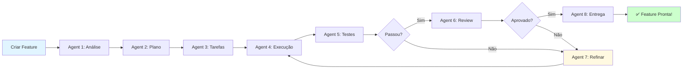

# 🚀 Quick Start - Framework de Entrega de Features

## 📖 Resumo Executivo

Este framework automatiza completamente o processo de análise, desenvolvimento, teste e entrega de novas features através de um sistema multi-agente especializado. Cada agente é responsável por uma etapa específica do processo, garantindo qualidade, rastreabilidade e iteração contínua.

### 🎯 Benefícios

- ⚡ **Automação Completa**: Do conceito à produção sem intervenção manual
- 🎨 **Especialização**: 8 agentes, cada um expert em sua tarefa
- 📊 **Rastreabilidade**: Todos os artefatos documentados e versionados
- 🔄 **Iteração Inteligente**: Sistema automático de feedback e refinamento
- ✅ **Qualidade Garantida**: Testes E2E e code review integrados
- 📈 **Métricas**: Visibilidade total do processo e performance

### 📊 Os 8 Agentes

```
1. Analyzer    → Analisa requisitos e impacto
2. Planner     → Gera plano de execução
3. Task Creator → Decompõe em tarefas executáveis
4. Executor    → Implementa as tarefas
5. E2E Tester  → Executa testes end-to-end
6. Reviewer    → Faz code review
7. Refiner     → Analisa falhas e define correções
8. Deliverer   → Prepara e entrega a feature
```

---

## 🏃 Quick Start (5 minutos)

### Pré-requisitos

```bash
# Node.js 18+
node --version

# Docker (opcional, para ambiente completo)
docker --version

# Git
git --version
```

### Instalação

```bash
# 1. Clone ou navegue até o projeto
cd social-selling-2

# 2. Instale as dependências do framework
npm install

# 3. Configure as variáveis de ambiente
cp .env.framework.example .env.framework

# 4. Edite .env.framework com suas configurações
nano .env.framework
```

### Configuração Mínima (.env.framework)

```bash
# Framework Base
FRAMEWORK_BASE_DIR=.feature-delivery
MAX_ITERATIONS=5

# Git (para commits automáticos)
GIT_USERNAME=framework-bot
GIT_EMAIL=bot@framework.com

# Opcional: OpenAI para análise inteligente
OPENAI_API_KEY=sk-your-key-here
OPENAI_MODEL=gpt-4
```

### Primeira Execução

```bash
# Iniciar o framework
npm run framework:start

# Em outro terminal, iniciar o dashboard
npm run framework:dashboard
```

Acesse: http://localhost:3000

---

## 📝 Criar Sua Primeira Feature

### Opção 1: Via Dashboard (Recomendado)

1. Acesse http://localhost:3000
2. Clique em "+ Nova Feature"
3. Preencha:
   ```
   Título: Sistema de Comentários
   Descrição: Permitir que usuários comentem em posts
   Prioridade: High
   ```
4. Clique em "Iniciar Workflow"
5. Acompanhe o progresso em tempo real!

### Opção 2: Via API

```bash
curl -X POST http://localhost:3001/api/features \
  -H "Content-Type: application/json" \
  -d '{
    "title": "Sistema de Comentários",
    "description": "Permitir que usuários comentem em posts com suporte a replies, likes e menções",
    "priority": "high",
    "requestedBy": "product-team"
  }'
```

Resposta:
```json
{
  "workflowId": "WF-1234567890-abc123",
  "featureId": "FEAT-2024-001",
  "status": "running",
  "message": "Workflow iniciado com sucesso"
}
```

### Opção 3: Via CLI

```bash
npm run framework:create-feature -- \
  --title "Sistema de Comentários" \
  --description "Permitir que usuários comentem em posts" \
  --priority high
```

---

## 📂 Estrutura de Arquivos Gerada

Após criar uma feature, você verá:

```
.feature-delivery/
└── FEAT-2024-001/
    ├── 01-analysis/
    │   └── feature-analysis.json
    ├── 02-planning/
    │   └── execution-plan.json
    ├── 03-tasks/
    │   └── tasks.json
    ├── 04-execution/
    │   └── iteration-1/
    │       └── execution-report.json
    ├── 05-testing/
    │   └── iteration-1/
    │       └── test-results.json
    ├── 06-review/
    │   └── iteration-1/
    │       └── review-report.json
    └── 08-delivery/
        └── delivery-report.json
```

---

## 🔍 Acompanhar Progresso

### Via Dashboard

Acesse http://localhost:3000 e veja:
- Status do workflow em tempo real
- Qual agente está executando
- Iteração atual
- Tempo decorrido
- Histórico de execuções

### Via API

```bash
# Verificar status
curl http://localhost:3001/api/workflows/WF-1234567890-abc123

# Listar todas as features
curl http://localhost:3001/api/features

# Ver artefatos de uma feature
curl http://localhost:3001/api/features/FEAT-2024-001/artifacts
```

### Via CLI

```bash
# Status do workflow
npm run framework:status -- --workflow WF-1234567890-abc123

# Listar features
npm run framework:list

# Ver logs
npm run framework:logs -- --feature FEAT-2024-001
```

---

## 🎬 Fluxo Típico



**Tempo médio**: 4-8 horas (dependendo da complexidade)

---

## 📊 Exemplo Real - Timeline

Veja quanto tempo cada etapa tipicamente leva:

| Agente | Fase | Tempo Típico | Ação |
|--------|------|--------------|------|
| 1️⃣ Analyzer | Análise | 30s - 2min | Extrai requisitos |
| 2️⃣ Planner | Planejamento | 1 - 3min | Cria plano arquitetural |
| 3️⃣ Task Creator | Decomposição | 30s - 2min | Gera lista de tarefas |
| 4️⃣ Executor | Implementação | 2 - 6h | Escreve código |
| 5️⃣ E2E Tester | Testes | 10 - 30min | Executa testes E2E |
| 6️⃣ Reviewer | Review | 5 - 15min | Analisa qualidade |
| 7️⃣ Refiner | Correções | 1 - 3h | Se necessário |
| 8️⃣ Deliverer | Entrega | 2 - 5min | Prepara deploy |

**Total**: 3-10 horas (vs. 2-5 dias manual)

---

## 🎯 Casos de Uso

### 1. Feature Simples (CRUD)
```bash
# Exemplo: Adicionar campo "bio" no perfil do usuário
npm run framework:create-feature -- \
  --title "Adicionar campo bio no perfil" \
  --complexity low
```
⏱️ **Tempo estimado**: 2-3 horas

### 2. Feature Média (Nova Funcionalidade)
```bash
# Exemplo: Sistema de notificações push
npm run framework:create-feature -- \
  --title "Sistema de Notificações Push" \
  --complexity medium
```
⏱️ **Tempo estimado**: 4-6 horas

### 3. Feature Complexa (Integração)
```bash
# Exemplo: Integração com provedor de pagamento
npm run framework:create-feature -- \
  --title "Integração Stripe Payment" \
  --complexity high
```
⏱️ **Tempo estimado**: 8-12 horas

---

## 🔧 Comandos Úteis

### Gerenciamento de Workflows

```bash
# Listar workflows ativos
npm run framework:list -- --status running

# Pausar workflow
npm run framework:pause -- --workflow WF-xxx

# Retomar workflow
npm run framework:resume -- --workflow WF-xxx

# Cancelar workflow
npm run framework:cancel -- --workflow WF-xxx

# Ver logs detalhados
npm run framework:logs -- --workflow WF-xxx --follow
```

### Análise de Artefatos

```bash
# Ver análise de uma feature
cat .feature-delivery/FEAT-2024-001/01-analysis/feature-analysis.json | jq

# Ver plano de execução
cat .feature-delivery/FEAT-2024-001/02-planning/execution-plan.json | jq

# Ver resultado de testes
cat .feature-delivery/FEAT-2024-001/05-testing/iteration-1/test-results.json | jq '.summary'
```

### Métricas

```bash
# Dashboard de métricas
npm run framework:metrics

# Exportar métricas Prometheus
curl http://localhost:3001/metrics
```

---

## 🐛 Troubleshooting

### Workflow Travou?

```bash
# 1. Verificar status
npm run framework:status -- --workflow WF-xxx

# 2. Ver logs do agente atual
npm run framework:logs -- --workflow WF-xxx --tail 100

# 3. Forçar retry do agente atual
npm run framework:retry-agent -- --workflow WF-xxx
```

### Testes Falhando Repetidamente?

```bash
# 1. Ver detalhes dos testes
cat .feature-delivery/FEAT-xxx/05-testing/iteration-X/test-results.json

# 2. Executar testes manualmente
npm run test:e2e -- --grep "feature-name"

# 3. Forçar pular para review (apenas desenvolvimento)
npm run framework:skip-to -- --workflow WF-xxx --agent reviewer
```

### Agente Não Responde?

```bash
# 1. Verificar saúde do sistema
npm run framework:health

# 2. Reiniciar agente específico
npm run framework:restart-agent -- --agent executor

# 3. Reiniciar framework completo
npm run framework:restart
```

---

## 📈 Métricas em Tempo Real

### Prometheus + Grafana (Opcional)

```bash
# Iniciar stack completo com monitoramento
docker-compose -f docker-compose.framework.yml up -d

# Acessar dashboards
# Grafana: http://localhost:3001 (admin/admin)
# Prometheus: http://localhost:9090
```

### Métricas Disponíveis

- `framework_workflows_started_total` - Total de workflows iniciados
- `framework_workflows_completed_total` - Workflows completados (success/failed)
- `framework_agent_executions_total` - Execuções de agentes
- `framework_workflow_duration_seconds` - Duração dos workflows
- `framework_agent_duration_seconds` - Duração por agente
- `framework_active_workflows` - Workflows ativos no momento

---

## 🎓 Próximos Passos

### 1. Explore a Documentação Completa
- 📖 [Framework Completo](./feature-delivery-framework.md)
- 💻 [Guia de Implementação](./feature-delivery-implementation.md)
- 📚 [API Reference](./feature-delivery-api-reference.md)

### 2. Configure Integrações
```bash
# GitHub
npm run framework:integrate -- --provider github

# Slack Notifications
npm run framework:integrate -- --provider slack

# Jira (opcional)
npm run framework:integrate -- --provider jira
```

### 3. Customize Agentes
```typescript
// src/framework/agents/custom/my-analyzer.agent.ts
export class MyCustomAnalyzerAgent extends FeatureAnalyzerAgent {
  // Sobrescreva métodos conforme necessário
  async extractFunctionalRequirements(desc: string) {
    // Sua lógica customizada
  }
}
```

### 4. Crie Templates de Features
```bash
# Criar template para tipo de feature comum
npm run framework:create-template -- \
  --name "CRUD Feature" \
  --tasks "[...]"
```

---

## 💡 Dicas e Boas Práticas

### ✅ DO

- **Seja descritivo**: Quanto mais detalhada a descrição da feature, melhor a análise
- **Use prioridades**: Ajuda o framework a otimizar execução
- **Monitore iterações**: Se passar de 3 iterações, pode ter algo errado
- **Revise artefatos**: Verifique os JSONs gerados para entender as decisões
- **Configure CI/CD**: Integre com seu pipeline existente

### ❌ DON'T

- **Não crie features gigantes**: Quebre em features menores
- **Não ignore warnings**: Warnings de agentes são importantes
- **Não force skip de fases**: Cada fase tem propósito
- **Não execute features em produção sem revisar**: Sempre revise antes de deploy
- **Não modifique artefatos manualmente**: Use comandos do framework

---

## 🎯 Exemplo Completo - Do Início ao Fim

### 1. Criar Feature (1 min)
```bash
curl -X POST http://localhost:3001/api/features \
  -H "Content-Type: application/json" \
  -d '{
    "title": "Sistema de Tags para Posts",
    "description": "Permitir adicionar tags aos posts para melhor organização e busca. Usuários podem adicionar até 5 tags por post. Tags são sugeridas automaticamente baseadas no conteúdo.",
    "priority": "medium"
  }'
```

### 2. Acompanhar Progresso (automático)

O framework executa automaticamente:
- ✅ Análise (30s): Extrai requisitos, identifica módulos afetados
- ✅ Planejamento (1min): Cria plano de 4 fases, 12 tarefas
- ✅ Tarefas (30s): Decompõe em tarefas específicas
- ✅ Execução (3h): Implementa backend + frontend
- ✅ Testes (15min): Executa 25 testes E2E
- ⚠️ Review (5min): Identifica 2 issues não-críticos
- ✅ Refinamento (30min): Corrige issues
- ✅ Re-teste (10min): Testes passam
- ✅ Review Final (5min): Aprovado
- ✅ Entrega (2min): PR criado, docs atualizadas

### 3. Resultado Final (4h 20min total)

```json
{
  "featureId": "FEAT-2024-042",
  "status": "delivered",
  "pullRequest": "#789",
  "filesChanged": 18,
  "linesAdded": 892,
  "testCoverage": 87.3,
  "iterations": 1,
  "totalDuration": "4h 20m"
}
```

**Pull Request Criado**: ✅ Pronto para merge!

---

## 📞 Suporte e Comunidade

### Encontrou um Bug?
1. Verifique os logs: `npm run framework:logs`
2. Abra issue: [GitHub Issues](https://github.com/your-org/social-selling-2/issues)
3. Inclua: workflow ID, logs, artefatos relevantes

### Tem uma Ideia?
- Abra discussão: [GitHub Discussions](https://github.com/your-org/social-selling-2/discussions)
- Contribua: Pull Requests são bem-vindos!

### Documentação
- 📖 [Docs Completos](./feature-delivery-framework.md)
- 💻 [Implementação](./feature-delivery-implementation.md)
- 🎥 [Video Tutorial](https://youtube.com/...)

---

## 🎉 Pronto para Começar!

Você agora tem tudo que precisa para:

✅ Criar sua primeira feature automatizada
✅ Acompanhar o progresso em tempo real
✅ Entender o fluxo de cada agente
✅ Troubleshoot problemas comuns
✅ Customizar o framework para suas necessidades

**Comando para começar agora:**

```bash
npm run framework:start && npm run framework:dashboard
```

Acesse http://localhost:3000 e crie sua primeira feature! 🚀

---

## 📊 Quick Reference

| Comando | Descrição |
|---------|-----------|
| `npm run framework:start` | Inicia o framework |
| `npm run framework:dashboard` | Abre dashboard web |
| `npm run framework:create-feature` | Cria nova feature via CLI |
| `npm run framework:list` | Lista features/workflows |
| `npm run framework:status -- --workflow WF-xxx` | Status de workflow |
| `npm run framework:logs -- --workflow WF-xxx` | Logs de workflow |
| `npm run framework:cancel -- --workflow WF-xxx` | Cancela workflow |
| `npm run framework:metrics` | Dashboard de métricas |

---

**Happy Coding! 🚀✨**
