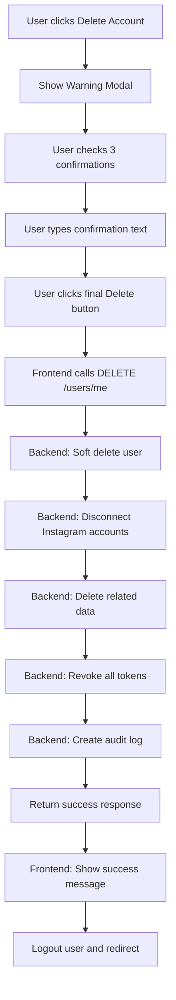

# Feature: User Settings & Complete Data Deletion System

## 📋 Contexto

Atualmente, o sistema possui páginas de **Privacy Policy** e **Data Deletion Instructions** que prometem funcionalidades que não estão totalmente implementadas. Além disso, para estar em total **compliance com Meta/Instagram Platform Terms**, precisamos implementar um sistema completo de gerenciamento de dados do usuário.

### Status Atual

**✅ Implementado:**
- Disconnect Instagram Account (frontend + backend)
- Soft delete de usuário (backend parcial)
- Páginas estáticas de Privacy Policy e Data Deletion

**❌ Faltando:**
- Página de Settings completa
- Delete Account via UI
- Data Deletion Callback para Meta
- Exclusão completa de dados relacionados
- Sistema de processamento de email requests

---

## 🎯 Objetivos

1. Criar página de Settings completa e funcional
2. Implementar Delete Account via UI
3. Criar Data Deletion Callback endpoint para Meta compliance
4. Completar lógica de exclusão de dados no backend
5. Garantir 100% de compliance com Meta/Instagram Platform Terms

---

## 🚀 Funcionalidades a Implementar

### 1. Página de Settings (`/settings`)

#### Frontend: `/frontend/src/app/(dashboard)/settings/page.tsx`

**Seções da página:**

1. **Profile Settings**
   - Nome completo (edição)
   - Email (visualização + opção de alterar)
   - Avatar/foto de perfil (upload)
   - Botão: "Save Changes"

2. **Password & Security**
   - Alterar senha
   - Campos: Current Password, New Password, Confirm New Password
   - Botão: "Update Password"

3. **Instagram Accounts**
   - Lista de contas conectadas
   - Link para página `/instagram` (já existente)
   - Texto: "Manage your Instagram accounts"

4. **Privacy & Data**
   - Link para `/privacy-policy`
   - Link para `/data-deletion`
   - Botão: "Export My Data" (opcional para v1)

5. **Danger Zone** (seção destacada em vermelho)
   - **Delete Account**
   - Warning: "This action cannot be undone. All your data will be permanently deleted within 30 days."
   - Checklist de confirmação:
     - [ ] I understand that this action is irreversible
     - [ ] I have downloaded any data I want to keep
     - [ ] I want to permanently delete my account
   - Botão vermelho: "Delete My Account"
   - Modal de confirmação adicional:
     - Pedir para digitar email ou "DELETE" para confirmar
     - Explicação do que será deletado
     - Botão final: "Yes, Delete My Account"

#### API Endpoints Frontend

Adicionar em `/frontend/src/lib/api/endpoints.ts`:
```typescript
// User Management (adicionar)
USER_DELETE: '/users/me',
USER_EXPORT_DATA: '/users/me/export', // opcional para v1
```

Criar service em `/frontend/src/lib/services/user.service.ts`:
```typescript
- updateProfile(data)
- changePassword(data)
- deleteAccount()
- exportData() // opcional
```

---

### 2. Backend - Complete Data Deletion System

#### 2.1 User Controller - Delete Account

**Arquivo**: `/backend/src/modules/user/user.controller.ts`

Melhorar endpoint existente:
- ✅ Já existe `@Delete('me')`
- Melhorar resposta e logs

#### 2.2 User Service - Complete Deletion Logic

**Arquivo**: `/backend/src/modules/user/user.service.ts`

**Método**: `deleteAccount(userId: string)`

Implementar exclusão completa:

1. **Buscar todas as contas Instagram do usuário**
   - Revogar tokens de acesso
   - Marcar como disconnected
   - Soft delete

2. **Deletar dados relacionados:**
   - Conversas e mensagens
   - Posts agendados
   - Media uploads
   - Analytics/insights
   - Notificações
   - Message templates
   - Qualquer outro dado relacionado ao userId

3. **Soft delete do usuário**
   - Marcar deletedAt
   - Anonimizar dados sensíveis (opcional para v1)

4. **Revogar tokens**
   - Todos os refresh tokens
   - Invalidar sessões ativas

5. **Agendar exclusão definitiva** (opcional para v1)
   - Job que roda após 30 dias
   - Hard delete do banco

6. **Log de auditoria**
   - Registrar data/hora da solicitação
   - Registrar conclusão da exclusão

**Retorno:**
```json
{
  "message": "Account deletion initiated",
  "deletionScheduledFor": "2025-12-03T00:00:00Z",
  "confirmationId": "uuid"
}
```

---

### 3. Meta Data Deletion Callback (OBRIGATÓRIO)

#### 3.1 Criar Controller

**Arquivo**: `/backend/src/modules/meta/meta-callback.controller.ts`

**Endpoint**: `POST /meta/data-deletion-callback`

**Funcionalidade:**
- Receber requisições de exclusão de dados do Meta
- Validar assinatura da requisição (signed_request)
- Processar exclusão
- Retornar status code e confirmation code

**Request do Meta:**
```json
{
  "signed_request": "encoded_signature.base64_payload"
}
```

**Payload decodificado:**
```json
{
  "algorithm": "HMAC-SHA256",
  "issued_at": 1234567890,
  "user_id": "instagram_user_id"
}
```

**Response esperada:**
```json
{
  "url": "https://app-socialselling.willianbvsanches.com/data-deletion/status?id=<unique_id>",
  "confirmation_code": "<unique_id>"
}
```

#### 3.2 Data Deletion Status Endpoint

**Endpoint**: `GET /meta/data-deletion-status/:confirmationId`

Retornar status da exclusão:
```json
{
  "status": "pending" | "in_progress" | "completed",
  "requestedAt": "2025-11-03T12:00:00Z",
  "completedAt": "2025-12-03T12:00:00Z" // se completed
}
```

#### 3.3 Validação de Signed Request

Criar helper para validar assinatura:
- Decodificar base64
- Validar HMAC com App Secret
- Verificar timestamp (não aceitar muito antigas)

**Referência**: https://developers.facebook.com/docs/graph-api/webhooks/getting-started#verification-requests

---

### 4. Database Changes (se necessário)

#### 4.1 Tabela de Data Deletion Requests

```sql
CREATE TABLE data_deletion_requests (
  id UUID PRIMARY KEY,
  user_id UUID REFERENCES users(id),
  instagram_user_id VARCHAR(255),
  confirmation_code VARCHAR(255) UNIQUE,
  status VARCHAR(50), -- pending, in_progress, completed
  requested_at TIMESTAMP DEFAULT NOW(),
  completed_at TIMESTAMP,
  source VARCHAR(50), -- 'user_app', 'meta_callback', 'email'
  metadata JSONB
);
```

---

### 5. Email Processing System (Opcional para v1)

**Para implementação futura:**
- Endpoint para receber webhooks de email
- Parser para identificar data deletion requests
- Validação de identidade do usuário
- Processar e responder

---

## 📐 Estrutura de Arquivos

### Frontend
```
frontend/src/
├── app/(dashboard)/settings/
│   └── page.tsx                          # NEW: Settings page
├── components/settings/
│   ├── ProfileSettings.tsx               # NEW: Profile section
│   ├── PasswordSettings.tsx              # NEW: Password section
│   ├── PrivacySettings.tsx               # NEW: Privacy section
│   └── DangerZone.tsx                    # NEW: Delete account section
├── lib/
│   ├── api/endpoints.ts                  # UPDATE: Add USER_DELETE
│   └── services/
│       └── user.service.ts               # NEW: User service
└── types/user.ts                         # UPDATE: Add types
```

### Backend
```
backend/src/
├── modules/
│   ├── user/
│   │   ├── user.controller.ts            # UPDATE: Improve delete endpoint
│   │   └── user.service.ts               # UPDATE: Complete deletion logic
│   └── meta/
│       ├── meta-callback.controller.ts   # NEW: Meta callback controller
│       ├── meta-callback.service.ts      # NEW: Meta callback service
│       └── meta-callback.module.ts       # NEW: Module
├── infrastructure/
│   ├── database/
│   │   ├── repositories/
│   │   │   └── data-deletion.repository.ts  # NEW: Repository
│   │   └── entities/
│   │       └── data-deletion-request.entity.ts  # NEW: Entity
│   └── jobs/                             # OPTIONAL: Scheduled jobs
│       └── data-deletion.job.ts
└── common/
    └── utils/
        └── meta-signed-request.util.ts   # NEW: Validation helper
```

---

## ✅ Critérios de Aceitação

### Frontend - Settings Page
- [ ] Página `/settings` renderiza corretamente
- [ ] Todas as seções são visíveis e funcionais
- [ ] Formulário de profile update funciona
- [ ] Change password funciona
- [ ] Delete account mostra confirmação
- [ ] Delete account com checklist e confirmação dupla
- [ ] UI/UX consistente com o resto da aplicação
- [ ] Responsivo (mobile + desktop)

### Backend - Data Deletion
- [ ] Endpoint DELETE `/users/me` funciona
- [ ] Soft delete do usuário é executado
- [ ] Todas as contas Instagram são desconectadas
- [ ] Todos os dados relacionados são deletados:
  - [ ] Conversas
  - [ ] Mensagens
  - [ ] Posts agendados
  - [ ] Media
  - [ ] Analytics
  - [ ] Templates
- [ ] Tokens são revogados
- [ ] Logs de auditoria são criados
- [ ] Response apropriada é retornada

### Meta Callback
- [ ] Endpoint POST `/meta/data-deletion-callback` funciona
- [ ] Validação de signed_request implementada
- [ ] Processa exclusão corretamente
- [ ] Retorna URL de status e confirmation code
- [ ] Endpoint GET `/meta/data-deletion-status/:id` funciona
- [ ] Retorna status correto (pending/in_progress/completed)

### Compliance
- [ ] Página data-deletion.tsx reflete funcionalidades reais
- [ ] Privacy policy está atualizada
- [ ] Meta App Dashboard pode ser configurado com as URLs:
  - Privacy Policy: https://app-socialselling.willianbvsanches.com/privacy-policy
  - Data Deletion: https://app-socialselling.willianbvsanches.com/data-deletion
  - Data Deletion Callback: https://app-socialselling.willianbvsanches.com/meta/data-deletion-callback

### Testing
- [ ] Testes unitários para user.service deleteAccount
- [ ] Testes unitários para meta-callback.service
- [ ] Teste E2E: Delete account via UI
- [ ] Teste E2E: Meta callback flow
- [ ] Teste manual: Verificar todos os dados são deletados

---

## 🔒 Requisitos de Segurança

1. **Autenticação**
   - Todos os endpoints devem exigir autenticação
   - Delete account requer re-autenticação (confirmar senha)

2. **Validação**
   - Validar signed_request do Meta (HMAC-SHA256)
   - Validar ownership do usuário sobre os dados

3. **Logs de Auditoria**
   - Registrar todas as solicitações de exclusão
   - Manter logs por período legal obrigatório

4. **Rate Limiting**
   - Limitar tentativas de delete account (prevenir abuse)

---

## 📚 Referências Técnicas

### Meta/Instagram Documentation
- [Meta Platform Terms](https://developers.facebook.com/terms)
- [Data Deletion Requirements](https://developers.facebook.com/docs/graph-api/overview/data-deletion)
- [Signed Request Validation](https://developers.facebook.com/docs/graph-api/webhooks/getting-started#verification-requests)

### Compliance
- GDPR Article 17 (Right to Erasure)
- CCPA (Right to Deletion)
- LGPD (Lei Geral de Proteção de Dados - Brasil)

---

## 🎨 UI/UX Guidelines

### Settings Page Design
- Use Tailwind CSS (consistente com o resto da aplicação)
- Use componentes Radix UI quando apropriado
- Seguir o design system existente
- Danger Zone deve ter cor de alerta (red-50 background, red-600 border)

### Delete Account Flow
1. Botão "Delete Account" na Danger Zone
2. Modal de aviso abre
3. Checklist de confirmação (3 items)
4. Input para confirmar (digitar email ou "DELETE")
5. Botão final "Yes, Delete My Account" (só ativa após checklist completo)
6. Loading state durante processamento
7. Redirect para página de confirmação ou logout

### Feedback Visual
- Toast de sucesso após update profile
- Toast de sucesso após change password
- Toast de confirmação após delete account iniciado
- Loading states em todos os botões de ação

---

## 🔄 Fluxo de Delete Account



---

## 📝 Notas Adicionais

### Meta App Dashboard Configuration
Após implementação, configurar no Meta for Developers:
- App Dashboard → Settings → Basic
- Privacy Policy URL: `https://app-socialselling.willianbvsanches.com/privacy-policy`
- User Data Deletion URL: `https://app-socialselling.willianbvsanches.com/data-deletion`

Adicionar webhook no Meta App Dashboard:
- Callback URL: `https://app-socialselling.willianbvsanches.com/meta/data-deletion-callback`
- Verificar que a URL é acessível publicamente e não está geo-bloqueada

### Variáveis de Ambiente
Adicionar ao `.env`:
```env
META_APP_SECRET=your_meta_app_secret_here
DATA_DELETION_RETENTION_DAYS=30
```

### Future Enhancements (Out of Scope for v1)
- Job agendado para hard delete após 30 dias
- Export data functionality
- Email processing system
- Data anonymization (vs complete deletion)
- Admin dashboard para gerenciar deletion requests

---

## 🚦 Priority

**Critical (Must Have):**
- Settings page with Delete Account
- Complete backend deletion logic
- Meta Data Deletion Callback endpoint

**Important (Should Have):**
- Profile update
- Change password
- Data deletion status endpoint

**Nice to Have (Could Have):**
- Export data
- Scheduled hard delete job
- Email processing

---

## ✨ Success Criteria

A feature será considerada completa quando:

1. ✅ Um usuário consegue acessar `/settings` e ver todas as opções
2. ✅ Um usuário consegue deletar sua conta via UI com confirmação
3. ✅ O backend deleta todos os dados relacionados ao usuário
4. ✅ O Meta consegue enviar data deletion callbacks e receber confirmação
5. ✅ A página `/data-deletion` reflete as funcionalidades reais
6. ✅ Todos os testes passam
7. ✅ Meta App Dashboard pode ser configurado com as URLs corretas
8. ✅ Sistema está em 100% compliance com Meta Platform Terms

---

**Estimativa de Esforço**: 2-3 dias de desenvolvimento + 1 dia de testes

**Prioridade**: 🔴 **ALTA** (Necessário para compliance com Meta/Instagram)
