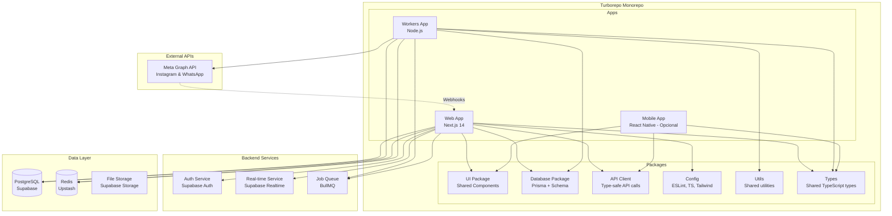
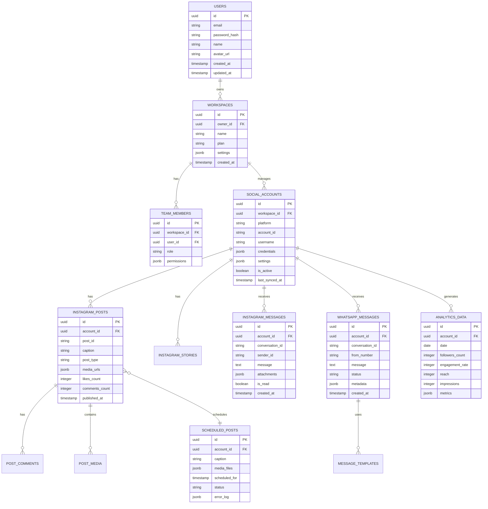
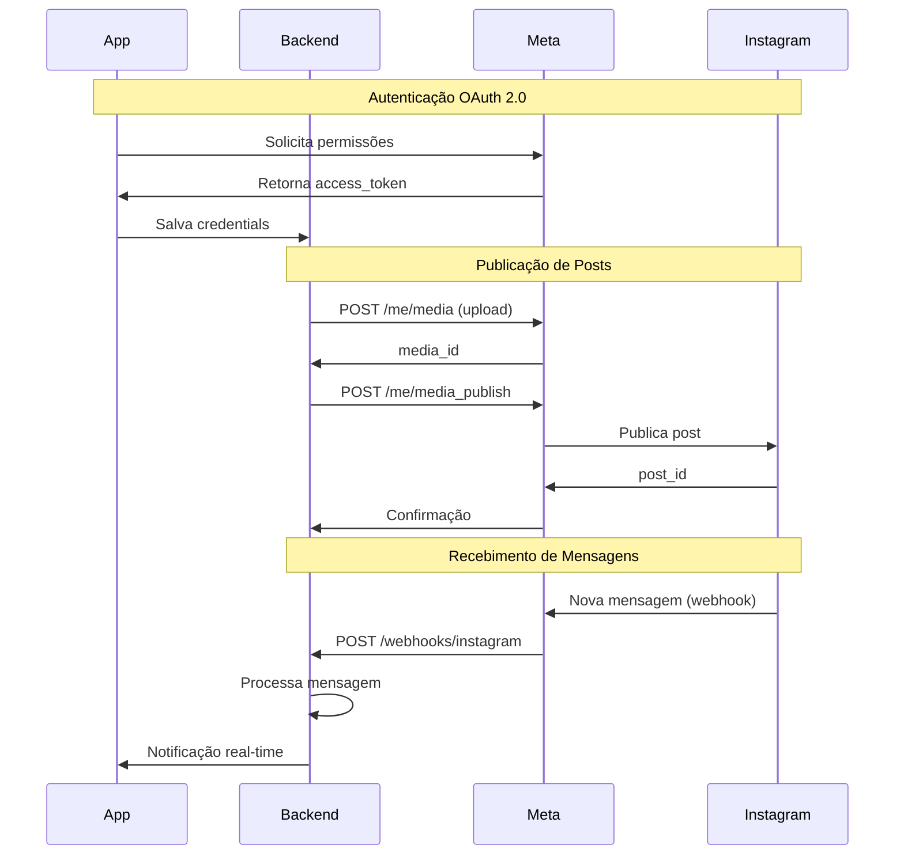
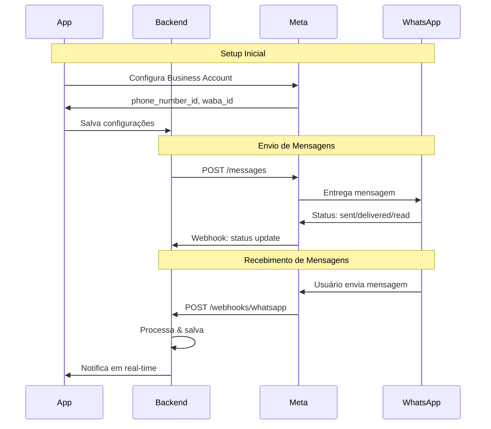
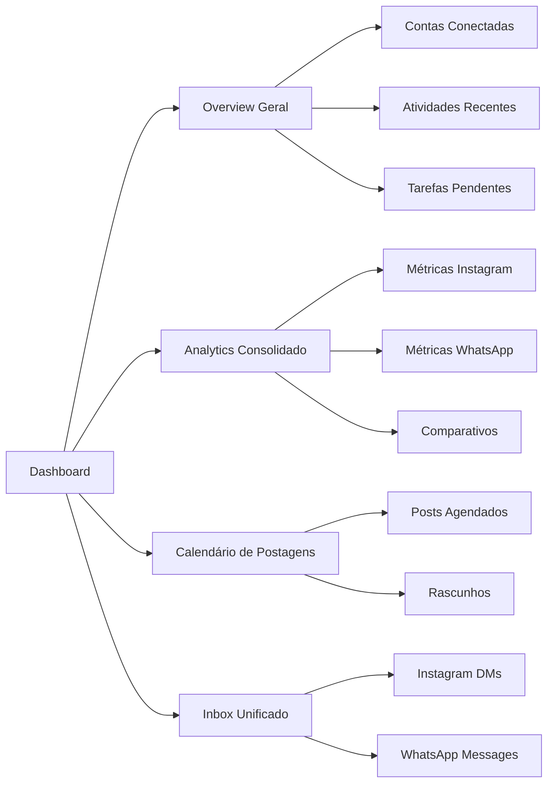
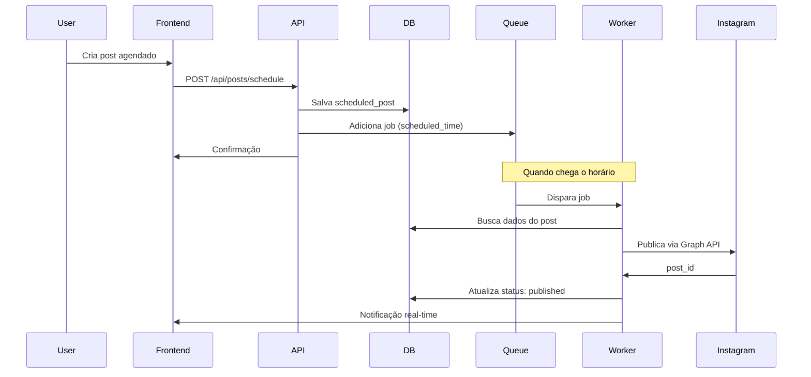
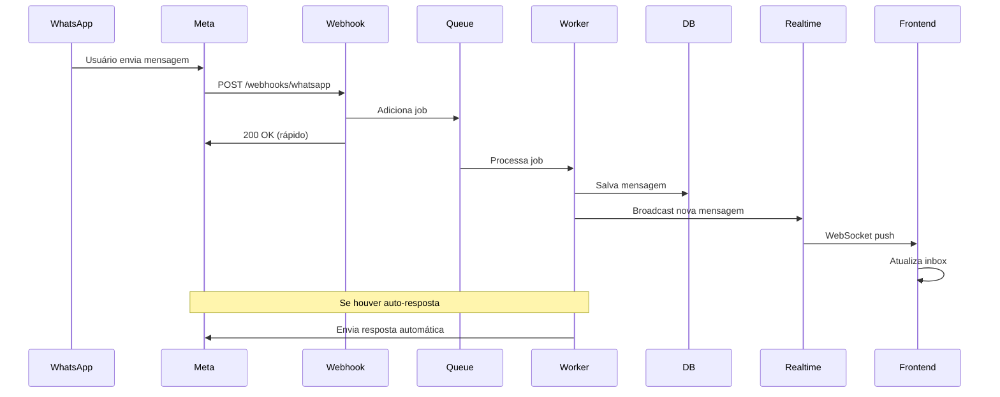
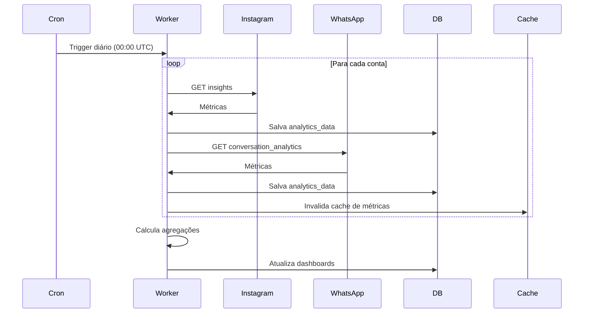
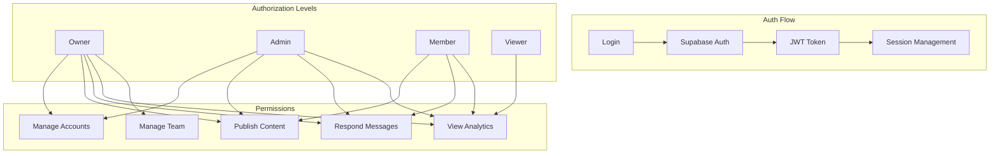
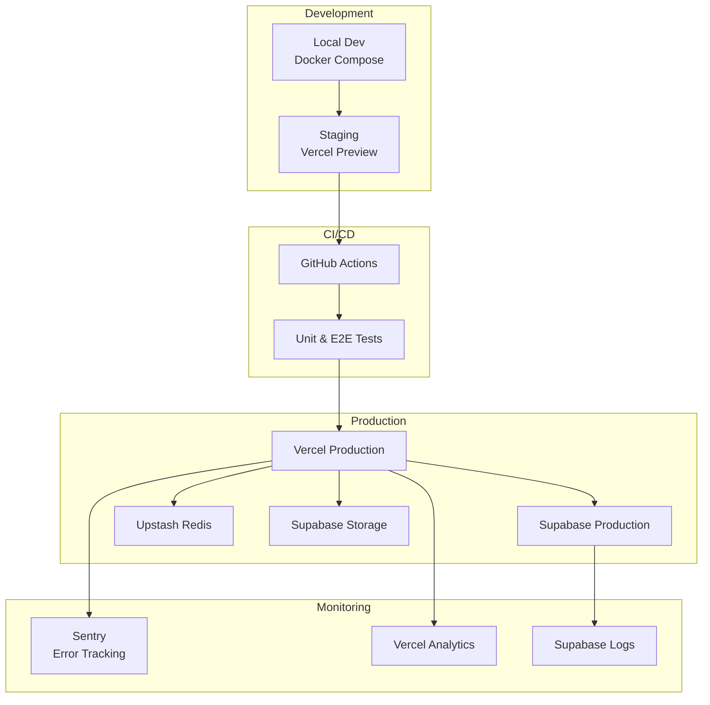

# Overview Completo - Plataforma de Social Selling

## 1. Visão Geral do Sistema

Esta é uma plataforma SaaS de **Social Selling** que permite gerenciar múltiplas contas de redes sociais (Instagram e WhatsApp Business) de clientes. O sistema oferece funcionalidades completas de gerenciamento de postagens, mensagens, analytics e automação.

### Objetivos Principais
- **Centralização**: Gerenciar múltiplas contas de clientes em um único dashboard
- **Automação**: Programar postagens e mensagens, respostas automáticas
- **Analytics**: Métricas detalhadas de engajamento, alcance e performance
- **Comunicação**: Gerenciamento unificado de DMs do Instagram e mensagens do WhatsApp Business

---

## 2. Arquitetura do Sistema

### 2.1 Arquitetura Monorepo com Turborepo



### 2.2 Benefícios do Turborepo

- **Build Cache**: Cache inteligente de builds entre apps e packages
- **Parallel Execution**: Execução paralela de tasks com dependências
- **Remote Caching**: Cache compartilhado entre desenvolvedores
- **Incremental Builds**: Rebuild apenas o que mudou
- **Type Safety**: TypeScript compartilhado entre todos os packages
- **Code Sharing**: Reutilização de código entre web, mobile e workers

---

## 3. Stack Tecnológica Recomendada

### Monorepo
```typescript
// Build System
- Turborepo 2.x
- pnpm (package manager)
- Changesets (versioning)

// Shared Configuration
- TypeScript 5.x
- ESLint + Prettier
- Tailwind CSS (shared config)
```

### Apps

**Web App (Next.js)**
```typescript
// Framework
- Next.js 14+ (App Router)
- React 18+
- TypeScript 5.x

// UI & Styling
- TailwindCSS 3.x
- Shadcn/ui (component library)
- Framer Motion (animations)

// State Management
- Zustand (client state)
- React Query / TanStack Query (server state)

// Real-time
- Supabase Realtime Client
- WebSocket support

// Forms & Validation
- React Hook Form
- Zod (schema validation)

// Charts & Analytics
- Recharts
- Date-fns
```

**Workers App (Node.js)**
```typescript
// Runtime
- Node.js 20+
- TypeScript 5.x

// Background Jobs
- BullMQ (job queue)
- node-cron (scheduling)
- IORedis (Redis client)

// API Clients
- @facebook/graph-api (Instagram)
- whatsapp-cloud-api (WhatsApp Business)
- Axios (HTTP client)
```

**Mobile App (Opcional)**
```typescript
// Framework
- React Native / Expo
- TypeScript 5.x

// Navigation
- React Navigation

// State
- Zustand
- React Query
```

### Packages

**@repo/database**
```typescript
- Prisma ORM 5.x
- Supabase Client
- PostgreSQL types
```

**@repo/ui**
```typescript
- Shared React components
- Shadcn/ui components
- Tailwind CSS
- Storybook (documentation)
```

**@repo/api-client**
```typescript
- Type-safe API client
- OpenAPI/tRPC
- Zod validation
```

**@repo/config**
```typescript
- ESLint config
- TypeScript config
- Tailwind config
- Prettier config
```

**@repo/types**
```typescript
- Shared TypeScript types
- API types
- Database types
```

**@repo/lib**
```typescript
- Utility functions
- Shared business logic
- Constants
- Helpers
```

### Infrastructure
```yaml
Hosting: Vercel (Next.js) + Railway (Workers)
Database: Supabase (PostgreSQL + Real-time)
Cache: Upstash Redis
Storage: Supabase Storage
CDN: Cloudflare (para mídia)
Queue: Upstash Redis + BullMQ
Monitoring: Sentry + Vercel Analytics
CI/CD: GitHub Actions + Turborepo Remote Cache
```

---

## 4. Modelo de Dados



---

## 5. Integrações com APIs

### 5.1 Instagram Graph API



**Endpoints Principais:**
```typescript
// Instagram Graph API v18.0

// 1. Obter perfil do usuário
GET https://graph.facebook.com/v18.0/me
  ?fields=id,username,account_type,media_count
  &access_token={token}

// 2. Criar container de mídia
POST https://graph.facebook.com/v18.0/{ig-user-id}/media
  ?image_url={url}
  &caption={text}
  &access_token={token}

// 3. Publicar mídia
POST https://graph.facebook.com/v18.0/{ig-user-id}/media_publish
  ?creation_id={creation-id}
  &access_token={token}

// 4. Obter métricas
GET https://graph.facebook.com/v18.0/{ig-user-id}/insights
  ?metric=impressions,reach,follower_count
  &period=day
  &access_token={token}

// 5. Gerenciar mensagens
GET https://graph.facebook.com/v18.0/{conversation-id}
  ?fields=messages{message,from,created_time}
  &access_token={token}

// 6. Enviar mensagem
POST https://graph.facebook.com/v18.0/me/messages
  ?recipient={user-id}
  &message={text}
  &access_token={token}
```

**Permissões Necessárias:**
- `instagram_basic`
- `instagram_content_publish`
- `instagram_manage_comments`
- `instagram_manage_messages`
- `pages_read_engagement`
- `pages_manage_metadata`

### 5.2 WhatsApp Business Cloud API



**Endpoints Principais:**
```typescript
// WhatsApp Business Cloud API v18.0

// 1. Enviar mensagem de texto
POST https://graph.facebook.com/v18.0/{phone-number-id}/messages
{
  "messaging_product": "whatsapp",
  "to": "{recipient-number}",
  "type": "text",
  "text": { "body": "Hello!" }
}

// 2. Enviar mensagem com template
POST https://graph.facebook.com/v18.0/{phone-number-id}/messages
{
  "messaging_product": "whatsapp",
  "to": "{recipient-number}",
  "type": "template",
  "template": {
    "name": "hello_world",
    "language": { "code": "en_US" }
  }
}

// 3. Enviar mídia
POST https://graph.facebook.com/v18.0/{phone-number-id}/messages
{
  "messaging_product": "whatsapp",
  "to": "{recipient-number}",
  "type": "image",
  "image": {
    "link": "https://example.com/image.jpg",
    "caption": "Caption here"
  }
}

// 4. Marcar mensagem como lida
POST https://graph.facebook.com/v18.0/{phone-number-id}/messages
{
  "messaging_product": "whatsapp",
  "status": "read",
  "message_id": "{message-id}"
}

// 5. Obter templates
GET https://graph.facebook.com/v18.0/{waba-id}/message_templates

// 6. Analytics
GET https://graph.facebook.com/v18.0/{waba-id}/conversation_analytics
  ?start={timestamp}
  &end={timestamp}
  &granularity=DAILY
```

---

## 6. Funcionalidades Principais

### 6.1 Dashboard Principal



### 6.2 Gerenciamento Instagram

**Postagens:**
- ✅ Criar posts (foto, vídeo, carrossel)
- ✅ Criar stories
- ✅ Agendar publicações
- ✅ Gerenciar rascunhos
- ✅ Preview antes de publicar
- ✅ Biblioteca de mídia

**Engajamento:**
- ✅ Visualizar e responder comentários
- ✅ Moderar comentários (aprovar/deletar/ocultar)
- ✅ Responder DMs
- ✅ Organizar conversas (labels, arquivar)
- ✅ Mensagens rápidas (templates)

**Analytics:**
- ✅ Crescimento de seguidores
- ✅ Taxa de engajamento
- ✅ Alcance e impressões
- ✅ Performance de posts individuais
- ✅ Melhores horários para postar
- ✅ Demografia da audiência
- ✅ Stories insights

### 6.3 Gerenciamento WhatsApp Business

**Mensagens:**
- ✅ Inbox organizado por conversas
- ✅ Responder mensagens
- ✅ Mensagens automáticas
- ✅ Templates de mensagem
- ✅ Broadcast messages
- ✅ Anexar arquivos/mídia

**Automação:**
- ✅ Auto-resposta (horário comercial)
- ✅ Mensagens de ausência
- ✅ Chatbot básico (FAQ)
- ✅ Gatilhos por palavras-chave

**Analytics:**
- ✅ Volume de mensagens
- ✅ Tempo de resposta médio
- ✅ Taxa de resposta
- ✅ Conversas ativas
- ✅ Performance de templates
- ✅ Insights de conversação

---

## 7. Fluxos de Sistema

### 7.1 Fluxo de Postagem Programada



### 7.2 Fluxo de Mensagens em Tempo Real



### 7.3 Fluxo de Coleta de Analytics



---

## 8. Sistema de Autenticação e Autorização



**Row Level Security (RLS) no Supabase:**
```sql
-- Exemplo: Apenas membros do workspace podem ver suas contas
CREATE POLICY "Users can view workspace social accounts"
ON social_accounts FOR SELECT
USING (
  workspace_id IN (
    SELECT workspace_id
    FROM team_members
    WHERE user_id = auth.uid()
  )
);

-- Apenas owners e admins podem deletar posts
CREATE POLICY "Only owners/admins can delete posts"
ON instagram_posts FOR DELETE
USING (
  account_id IN (
    SELECT sa.id FROM social_accounts sa
    JOIN team_members tm ON tm.workspace_id = sa.workspace_id
    WHERE tm.user_id = auth.uid()
    AND tm.role IN ('owner', 'admin')
  )
);
```

---

## 9. Sistema de Webhooks

```typescript
// Configuração de Webhooks

// Instagram Webhooks
const instagramWebhookEvents = [
  'messages',        // Novas mensagens DM
  'messaging_postbacks',
  'message_echoes',
  'comments',        // Novos comentários
  'mentions',        // Menções
  'story_insights'   // Insights de stories
];

// WhatsApp Webhooks
const whatsappWebhookEvents = [
  'messages',        // Mensagens recebidas
  'message_status',  // Status de entrega
  'contacts',        // Informações de contato
];

// Handler Example
export async function POST(req: Request) {
  const signature = req.headers.get('x-hub-signature-256');
  const body = await req.text();

  // Verificar assinatura
  if (!verifySignature(body, signature)) {
    return new Response('Unauthorized', { status: 401 });
  }

  const data = JSON.parse(body);

  // Processar via queue para não bloquear
  await queue.add('process-webhook', {
    platform: 'instagram', // ou 'whatsapp'
    event: data.entry[0].changes[0],
    timestamp: Date.now()
  });

  return new Response('OK', { status: 200 });
}
```

---

## 10. Considerações de Segurança

### 10.1 Proteções Necessárias

```typescript
// 1. Rate Limiting
import { Ratelimit } from '@upstash/ratelimit';
import { kv } from '@vercel/kv';

const ratelimit = new Ratelimit({
  redis: kv,
  limiter: Ratelimit.slidingWindow(10, '10 s'),
});

// 2. Validação de Webhooks
function verifySignature(payload: string, signature: string): boolean {
  const expectedSignature = crypto
    .createHmac('sha256', process.env.APP_SECRET!)
    .update(payload)
    .digest('hex');
  return signature === `sha256=${expectedSignature}`;
}

// 3. Encriptação de Tokens
import { encrypt, decrypt } from '@/lib/encryption';

async function saveCredentials(accountId: string, tokens: any) {
  await db.socialAccounts.update({
    where: { id: accountId },
    data: {
      credentials: encrypt(JSON.stringify(tokens))
    }
  });
}

// 4. Sanitização de Inputs
import DOMPurify from 'isomorphic-dompurify';

function sanitizeCaption(text: string): string {
  return DOMPurify.sanitize(text, {
    ALLOWED_TAGS: [],
    ALLOWED_ATTR: []
  });
}
```

### 10.2 Compliance

- ✅ **LGPD/GDPR**: Consentimento explícito para acesso às contas
- ✅ **Meta Platform Terms**: Respeitar limites de taxa e políticas
- ✅ **Retenção de Dados**: Políticas claras de armazenamento
- ✅ **Audit Logs**: Registrar todas as ações sensíveis

---

## 11. Infraestrutura e DevOps



### Environment Variables

```bash
# .env.local

# Supabase
NEXT_PUBLIC_SUPABASE_URL=
NEXT_PUBLIC_SUPABASE_ANON_KEY=
SUPABASE_SERVICE_ROLE_KEY=

# Meta/Facebook
META_APP_ID=
META_APP_SECRET=
META_WEBHOOK_VERIFY_TOKEN=

# WhatsApp Business
WHATSAPP_PHONE_NUMBER_ID=
WHATSAPP_BUSINESS_ACCOUNT_ID=

# Redis/Queue
UPSTASH_REDIS_URL=
UPSTASH_REDIS_TOKEN=

# Encryption
ENCRYPTION_KEY=

# Monitoring
SENTRY_DSN=
```

---

## 12. Roadmap de Desenvolvimento

### Fase 1: MVP (2-3 meses)
- ✅ Setup infraestrutura (Supabase, Vercel)
- ✅ Autenticação e gestão de usuários
- ✅ Conexão Instagram (OAuth)
- ✅ Publicação de posts básicos
- ✅ Visualização de métricas básicas
- ✅ Inbox Instagram DMs

### Fase 2: WhatsApp Integration (1-2 meses)
- ✅ Conexão WhatsApp Business
- ✅ Envio/recebimento de mensagens
- ✅ Templates de mensagem
- ✅ Auto-resposta básica
- ✅ Analytics WhatsApp

### Fase 3: Automation (1-2 meses)
- ✅ Sistema de agendamento robusto
- ✅ Calendário editorial
- ✅ Biblioteca de conteúdo
- ✅ Chatbot WhatsApp
- ✅ Respostas rápidas

### Fase 4: Advanced Analytics (1 mês)
- ✅ Dashboards personalizáveis
- ✅ Relatórios exportáveis (PDF)
- ✅ Comparativos de performance
- ✅ Sugestões baseadas em AI
- ✅ Melhores horários para postar

### Fase 5: Scale & Polish (Contínuo)
- ✅ Multi-tenancy otimizado
- ✅ Mobile app
- ✅ Integrações adicionais (TikTok, LinkedIn)
- ✅ AI Content Assistant
- ✅ White-label options

---

## 13. Estimativa de Custos Mensais

```typescript
// Estimativa para 100 contas de clientes ativos

Supabase (Pro):           $25/mês
  - Database
  - Auth
  - Realtime
  - Storage (50GB)

Vercel (Pro):             $20/mês
  - Hosting
  - Edge Functions
  - Analytics

Upstash Redis:            $20/mês
  - Queue processing
  - Caching

Meta APIs:                $0
  - Instagram Graph API: Free
  - WhatsApp Business: Free (até 1000 conversas/mês)
  - Após isso: $0.005-0.009 por conversa

Sentry:                   $26/mês
  - Error tracking

CDN (Cloudflare):         $20/mês
  - Média/Imagem delivery

Estimativa Total:         ~$111/mês (inicial)

// Com escala (1000+ contas):
// $300-500/mês dependendo do uso de WhatsApp
```

---

## 14. Estrutura de Diretórios (Turborepo)

```
social-selling-platform/
├── apps/
│   ├── web/                      # Next.js Web Application
│   │   ├── app/
│   │   │   ├── (auth)/
│   │   │   │   ├── login/
│   │   │   │   └── register/
│   │   │   ├── (dashboard)/
│   │   │   │   ├── overview/
│   │   │   │   ├── accounts/
│   │   │   │   ├── posts/
│   │   │   │   ├── inbox/
│   │   │   │   ├── analytics/
│   │   │   │   └── settings/
│   │   │   ├── api/
│   │   │   │   ├── auth/
│   │   │   │   ├── instagram/
│   │   │   │   ├── whatsapp/
│   │   │   │   ├── posts/
│   │   │   │   ├── messages/
│   │   │   │   └── webhooks/
│   │   │   └── layout.tsx
│   │   ├── components/
│   │   │   ├── dashboard/
│   │   │   ├── posts/
│   │   │   ├── inbox/
│   │   │   └── analytics/
│   │   ├── hooks/
│   │   ├── lib/
│   │   ├── public/
│   │   ├── styles/
│   │   ├── next.config.js
│   │   ├── package.json
│   │   ├── tailwind.config.ts
│   │   └── tsconfig.json
│   │
│   ├── workers/                  # Background Workers
│   │   ├── src/
│   │   │   ├── jobs/
│   │   │   │   ├── post-scheduler.ts
│   │   │   │   ├── message-handler.ts
│   │   │   │   ├── analytics-collector.ts
│   │   │   │   └── webhook-processor.ts
│   │   │   ├── services/
│   │   │   │   ├── instagram.service.ts
│   │   │   │   ├── whatsapp.service.ts
│   │   │   │   └── queue.service.ts
│   │   │   ├── queues/
│   │   │   │   ├── posts.queue.ts
│   │   │   │   ├── messages.queue.ts
│   │   │   │   └── analytics.queue.ts
│   │   │   └── index.ts
│   │   ├── package.json
│   │   └── tsconfig.json
│   │
│   └── mobile/                   # React Native App (opcional)
│       ├── src/
│       ├── package.json
│       └── tsconfig.json
│
├── packages/
│   ├── database/                 # Prisma + Database Logic
│   │   ├── prisma/
│   │   │   ├── schema.prisma
│   │   │   ├── migrations/
│   │   │   └── seed.ts
│   │   ├── src/
│   │   │   ├── client.ts
│   │   │   ├── queries/
│   │   │   └── mutations/
│   │   ├── package.json
│   │   └── tsconfig.json
│   │
│   ├── ui/                       # Shared UI Components
│   │   ├── src/
│   │   │   ├── components/
│   │   │   │   ├── ui/           # Shadcn components
│   │   │   │   │   ├── button.tsx
│   │   │   │   │   ├── card.tsx
│   │   │   │   │   ├── input.tsx
│   │   │   │   │   └── ...
│   │   │   │   ├── analytics/
│   │   │   │   ├── charts/
│   │   │   │   └── forms/
│   │   │   └── index.ts
│   │   ├── package.json
│   │   ├── tailwind.config.ts
│   │   └── tsconfig.json
│   │
│   ├── api-client/               # Type-safe API Client
│   │   ├── src/
│   │   │   ├── client.ts
│   │   │   ├── endpoints/
│   │   │   │   ├── instagram.ts
│   │   │   │   ├── whatsapp.ts
│   │   │   │   ├── posts.ts
│   │   │   │   └── analytics.ts
│   │   │   └── index.ts
│   │   ├── package.json
│   │   └── tsconfig.json
│   │
│   ├── types/                    # Shared TypeScript Types
│   │   ├── src/
│   │   │   ├── api/
│   │   │   ├── database/
│   │   │   ├── instagram/
│   │   │   ├── whatsapp/
│   │   │   └── index.ts
│   │   ├── package.json
│   │   └── tsconfig.json
│   │
│   ├── lib/                      # Shared Utilities
│   │   ├── src/
│   │   │   ├── supabase/
│   │   │   ├── encryption/
│   │   │   ├── validation/
│   │   │   ├── queue/
│   │   │   ├── constants/
│   │   │   └── utils/
│   │   ├── package.json
│   │   └── tsconfig.json
│   │
│   └── config/                   # Shared Configurations
│       ├── eslint/
│       │   ├── base.js
│       │   ├── next.js
│       │   └── react.js
│       ├── typescript/
│       │   ├── base.json
│       │   ├── nextjs.json
│       │   └── react.json
│       ├── tailwind/
│       │   └── tailwind.config.ts
│       └── package.json
│
├── .github/
│   └── workflows/
│       ├── ci.yml
│       ├── deploy-web.yml
│       └── deploy-workers.yml
│
├── docs/
│   ├── OVERVIEW.md
│   ├── API.md
│   └── SETUP.md
│
├── turbo.json                    # Turborepo configuration
├── package.json                  # Root package.json
├── pnpm-workspace.yaml          # pnpm workspace config
├── .env.example
├── .gitignore
└── README.md
```

---

## 15. Configuração do Turborepo

### 15.1 turbo.json

```json
{
  "$schema": "https://turbo.build/schema.json",
  "globalDependencies": ["**/.env.*local"],
  "pipeline": {
    "build": {
      "dependsOn": ["^build"],
      "outputs": [".next/**", "!.next/cache/**", "dist/**"]
    },
    "dev": {
      "cache": false,
      "persistent": true
    },
    "lint": {
      "dependsOn": ["^lint"]
    },
    "type-check": {
      "dependsOn": ["^type-check"]
    },
    "test": {
      "dependsOn": ["^build"],
      "outputs": ["coverage/**"],
      "inputs": ["src/**/*.tsx", "src/**/*.ts", "test/**/*.ts"]
    },
    "db:migrate": {
      "cache": false
    },
    "db:push": {
      "cache": false
    },
    "db:seed": {
      "cache": false
    }
  }
}
```

### 15.2 package.json (root)

```json
{
  "name": "social-selling-platform",
  "version": "1.0.0",
  "private": true,
  "workspaces": [
    "apps/*",
    "packages/*"
  ],
  "scripts": {
    "dev": "turbo run dev",
    "build": "turbo run build",
    "lint": "turbo run lint",
    "type-check": "turbo run type-check",
    "test": "turbo run test",
    "clean": "turbo run clean && rm -rf node_modules",
    "format": "prettier --write \"**/*.{ts,tsx,md}\"",
    "db:migrate": "turbo run db:migrate",
    "db:push": "turbo run db:push",
    "db:seed": "turbo run db:seed",
    "web:dev": "turbo run dev --filter=web",
    "workers:dev": "turbo run dev --filter=workers"
  },
  "devDependencies": {
    "turbo": "^2.0.0",
    "prettier": "^3.0.0",
    "@repo/config": "workspace:*"
  },
  "packageManager": "pnpm@8.15.0",
  "engines": {
    "node": ">=20.0.0",
    "pnpm": ">=8.0.0"
  }
}
```

### 15.3 pnpm-workspace.yaml

```yaml
packages:
  - "apps/*"
  - "packages/*"
```

### 15.4 Exemplo de package.json (@repo/ui)

```json
{
  "name": "@repo/ui",
  "version": "0.0.0",
  "private": true,
  "main": "./src/index.ts",
  "types": "./src/index.ts",
  "scripts": {
    "lint": "eslint . --max-warnings 0",
    "type-check": "tsc --noEmit",
    "build": "tsup src/index.ts --format esm,cjs --dts",
    "dev": "tsup src/index.ts --format esm,cjs --dts --watch"
  },
  "peerDependencies": {
    "react": "^18.0.0",
    "react-dom": "^18.0.0"
  },
  "devDependencies": {
    "@repo/config": "workspace:*",
    "@repo/types": "workspace:*",
    "@types/react": "^18.0.0",
    "tsup": "^8.0.0",
    "typescript": "^5.0.0"
  },
  "dependencies": {
    "class-variance-authority": "^0.7.0",
    "clsx": "^2.0.0",
    "tailwind-merge": "^2.0.0"
  }
}
```

### 15.5 Exemplo de package.json (apps/web)

```json
{
  "name": "web",
  "version": "0.1.0",
  "private": true,
  "scripts": {
    "dev": "next dev",
    "build": "next build",
    "start": "next start",
    "lint": "next lint",
    "type-check": "tsc --noEmit"
  },
  "dependencies": {
    "@repo/database": "workspace:*",
    "@repo/ui": "workspace:*",
    "@repo/api-client": "workspace:*",
    "@repo/types": "workspace:*",
    "@repo/lib": "workspace:*",
    "next": "14.2.0",
    "react": "^18.2.0",
    "react-dom": "^18.2.0",
    "@supabase/supabase-js": "^2.39.0",
    "zustand": "^4.5.0",
    "@tanstack/react-query": "^5.0.0"
  },
  "devDependencies": {
    "@repo/config": "workspace:*",
    "@types/node": "^20",
    "@types/react": "^18",
    "typescript": "^5",
    "tailwindcss": "^3.4.0"
  }
}
```

### 15.6 Comandos Úteis do Turborepo

```bash
# Desenvolvimento
pnpm dev                    # Roda dev em todos os apps
pnpm web:dev               # Roda apenas o web app
pnpm workers:dev           # Roda apenas os workers

# Build
pnpm build                 # Build de todos os apps e packages
pnpm build --filter=web    # Build apenas do web app

# Testing e Linting
pnpm lint                  # Lint em todo o monorepo
pnpm type-check            # Type check em todo o monorepo
pnpm test                  # Tests em todo o monorepo

# Database
pnpm db:migrate            # Roda migrations
pnpm db:push               # Push schema para DB
pnpm db:seed               # Seed do database

# Limpeza
pnpm clean                 # Limpa build artifacts e node_modules

# Adicionar dependências
pnpm add <package> --filter=web              # Adiciona ao web app
pnpm add <package> --filter=@repo/ui         # Adiciona ao package ui
pnpm add -w <package>                        # Adiciona ao workspace root
```

### 15.7 Benefícios da Estrutura

**Code Sharing**
- UI components compartilhados entre web e mobile
- Business logic reutilizada entre apps e workers
- Types consistentes em toda a aplicação

**Performance**
- Cache inteligente reduz tempo de build em até 85%
- Builds incrementais - apenas o que mudou é reconstruído
- Execução paralela de tasks

**Developer Experience**
- Hot reload funciona perfeitamente em todos os apps
- Type-safety entre packages
- Fácil de adicionar novos apps ou packages

**Scalability**
- Fácil adicionar novos apps (admin panel, mobile, etc)
- Packages podem ser publicados separadamente se necessário
- Deploy independente de cada app

---

## 16. Recursos e Documentações Importantes

### APIs Oficiais
- [Instagram Graph API](https://developers.facebook.com/docs/instagram-api)
- [WhatsApp Business Cloud API](https://developers.facebook.com/docs/whatsapp/cloud-api)
- [Meta for Developers](https://developers.facebook.com/)

### Frameworks e Ferramentas
- [Turborepo Documentation](https://turbo.build/repo/docs)
- [Next.js Documentation](https://nextjs.org/docs)
- [Supabase Documentation](https://supabase.com/docs)
- [Prisma Documentation](https://www.prisma.io/docs)
- [BullMQ Documentation](https://docs.bullmq.io/)
- [Shadcn/ui](https://ui.shadcn.com/)
- [pnpm Documentation](https://pnpm.io/)

### Compliance e Segurança
- [Meta Platform Terms](https://developers.facebook.com/terms)
- [LGPD](https://www.gov.br/cidadania/pt-br/acesso-a-informacao/lgpd)
- [GDPR](https://gdpr.eu/)

---

## 17. Próximos Passos

Para começar a implementação com Turborepo:

### 1. Setup Inicial do Monorepo
```bash
# Criar diretório do projeto
mkdir social-selling-platform
cd social-selling-platform

# Inicializar git
git init

# Criar estrutura básica
mkdir -p apps packages

# Inicializar pnpm workspace
pnpm init

# Criar pnpm-workspace.yaml
echo "packages:" > pnpm-workspace.yaml
echo "  - 'apps/*'" >> pnpm-workspace.yaml
echo "  - 'packages/*'" >> pnpm-workspace.yaml

# Instalar Turborepo
pnpm add turbo -Dw

# Criar turbo.json
# (copiar configuração da seção 15.1)
```

### 2. Setup dos Packages Shared

```bash
# Criar package de configuração
mkdir -p packages/config
cd packages/config
pnpm init

# Criar package de types
cd ../..
mkdir -p packages/types
cd packages/types
pnpm init

# Criar package database
cd ../..
mkdir -p packages/database
cd packages/database
pnpm init
pnpm add prisma @prisma/client @supabase/supabase-js

# Criar package ui
cd ../..
mkdir -p packages/ui
cd packages/ui
pnpm init
```

### 3. Setup do Web App

```bash
cd ../..
cd apps
pnpm create next-app@latest web --typescript --tailwind --app --src-dir

# Adicionar dependências internas
cd web
pnpm add @repo/database@workspace:* @repo/ui@workspace:* @repo/types@workspace:*
```

### 4. Setup dos Workers

```bash
cd ../..
mkdir -p apps/workers/src
cd apps/workers
pnpm init
pnpm add bullmq ioredis @repo/database@workspace:* @repo/types@workspace:*
pnpm add -D @types/node tsx nodemon typescript
```

### 5. Database Schema

```bash
# No package database
cd ../../packages/database
npx prisma init

# Editar prisma/schema.prisma com o modelo de dados
# Configurar .env com DATABASE_URL do Supabase

# Criar primeira migration
npx prisma migrate dev --name init

# Gerar Prisma Client
npx prisma generate
```

### 6. Configurar Supabase

```bash
# No root do projeto
pnpm add -w @supabase/supabase-js

# Criar conta no Supabase
# Copiar URL e ANON_KEY para .env
```

### 7. Setup CI/CD

```bash
# Criar .github/workflows/ci.yml
mkdir -p .github/workflows

# Configurar GitHub Actions para:
# - Lint
# - Type-check
# - Build
# - Tests
# - Deploy (Vercel para web, Railway para workers)
```

### 8. Desenvolvimento Inicial

**Ordem de implementação:**

1. **Shared Packages** (1-2 semanas)
   - ✅ Setup @repo/config
   - ✅ Setup @repo/types
   - ✅ Setup @repo/database (Prisma schema completo)
   - ✅ Setup @repo/ui (componentes base do Shadcn)
   - ✅ Setup @repo/lib (utils)

2. **Web App - Autenticação** (1 semana)
   - ✅ Implementar Supabase Auth
   - ✅ Criar páginas de login/registro
   - ✅ Setup de middleware de auth
   - ✅ Configurar RLS no Supabase

3. **Web App - Dashboard Base** (1-2 semanas)
   - ✅ Layout principal
   - ✅ Sidebar navigation
   - ✅ Overview page
   - ✅ Settings page

4. **Integrações Meta** (2 semanas)
   - ✅ Criar app no Meta for Developers
   - ✅ Implementar OAuth flow para Instagram
   - ✅ Implementar conexão WhatsApp Business
   - ✅ Configurar webhooks

5. **Workers App** (2 semanas)
   - ✅ Setup BullMQ + Redis
   - ✅ Implementar post scheduler
   - ✅ Implementar message handler
   - ✅ Implementar analytics collector
   - ✅ Implementar webhook processor

6. **Features Instagram** (2-3 semanas)
   - ✅ Publicação de posts
   - ✅ Agendamento
   - ✅ Inbox de DMs
   - ✅ Analytics

7. **Features WhatsApp** (2-3 semanas)
   - ✅ Envio/recebimento de mensagens
   - ✅ Templates
   - ✅ Auto-resposta
   - ✅ Analytics

### Checklist de Setup

- [ ] Turborepo configurado
- [ ] pnpm workspace funcionando
- [ ] Todos os packages criados
- [ ] Web app rodando
- [ ] Workers app rodando
- [ ] Supabase conectado
- [ ] Prisma configurado
- [ ] CI/CD configurado
- [ ] Environment variables documentadas
- [ ] README atualizado

---

**Documento gerado em:** 2025-10-17
**Versão:** 2.0.0 (Turborepo Edition)
