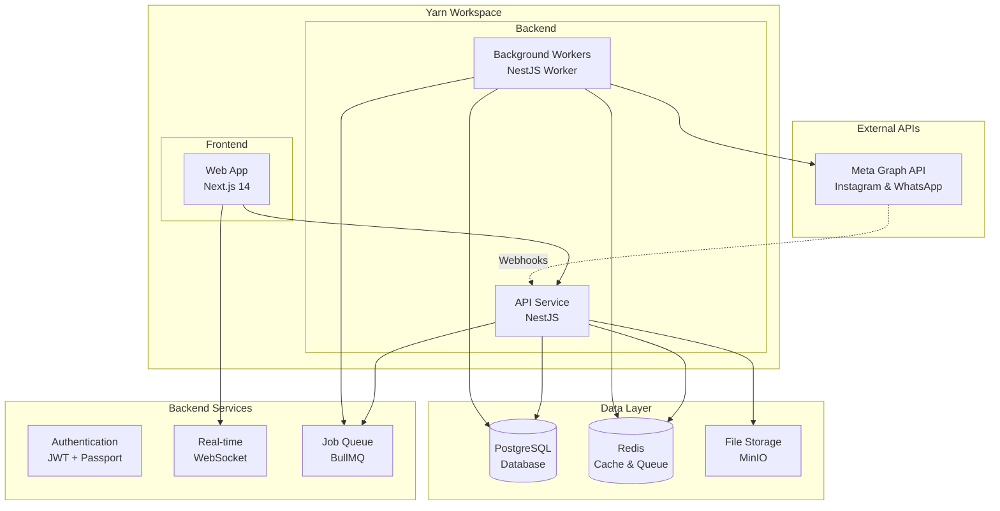
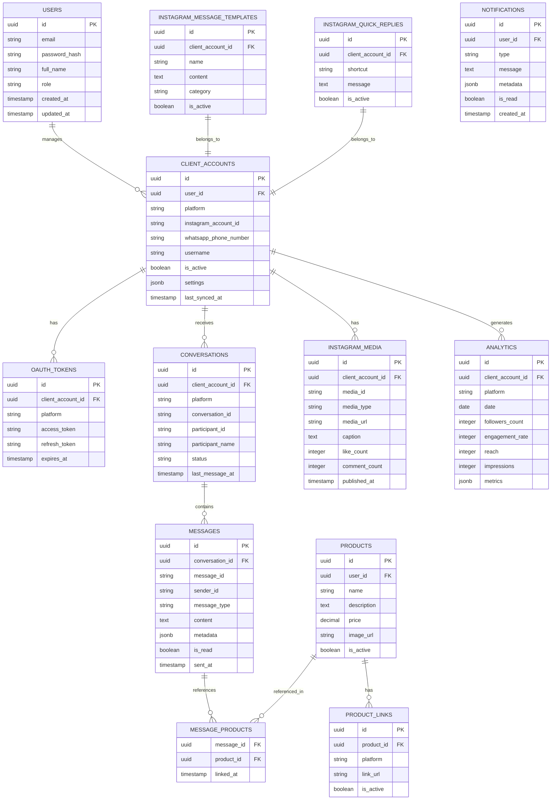
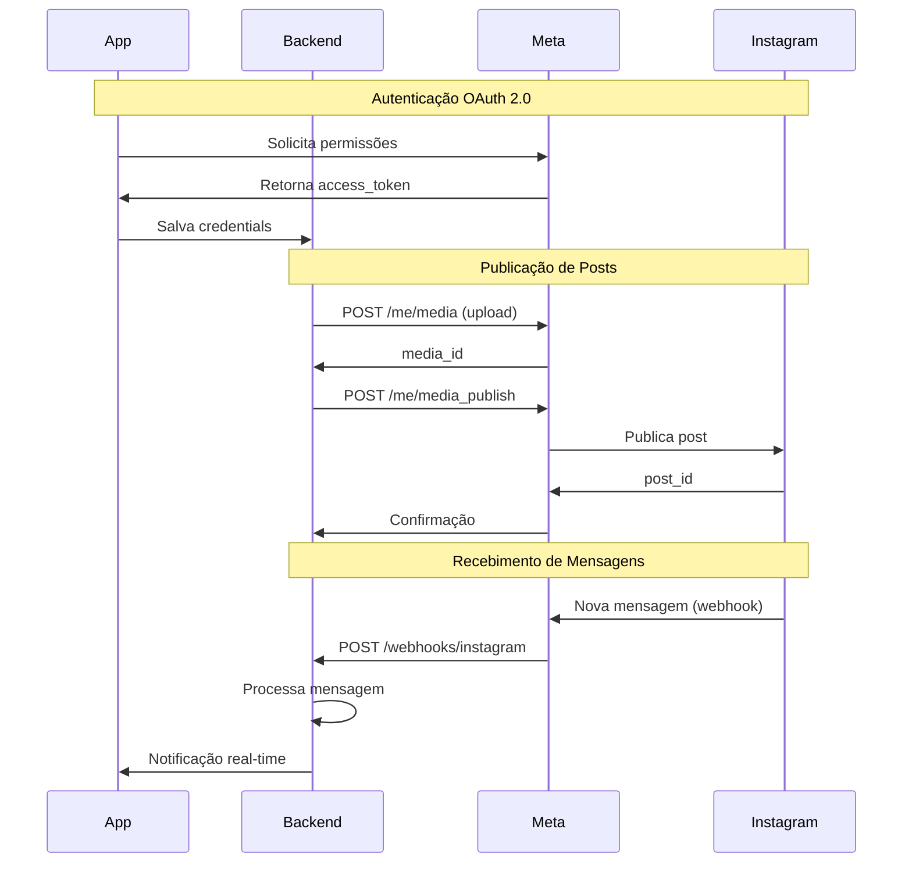
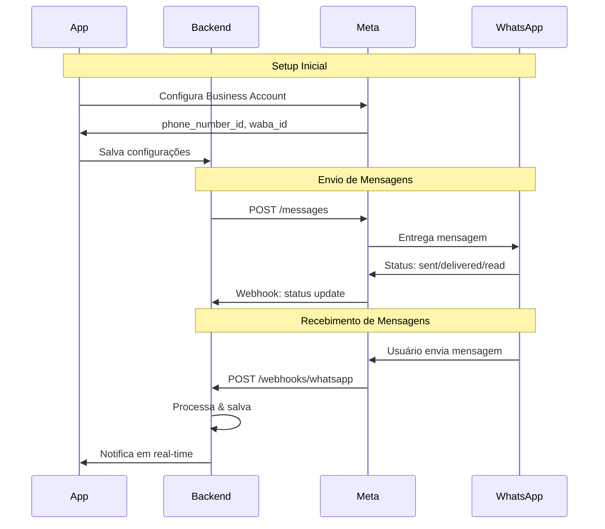
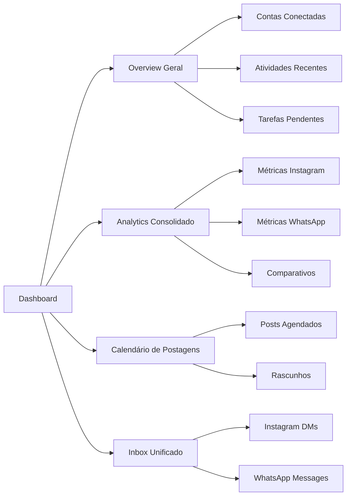
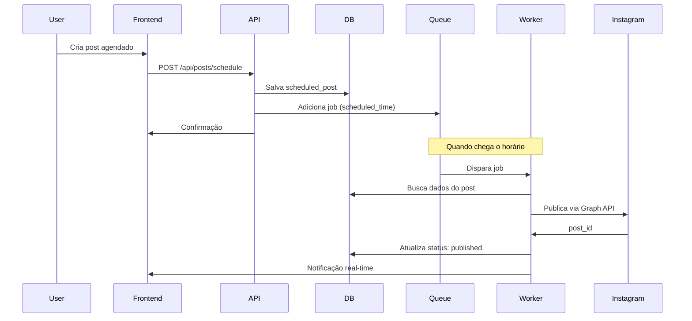
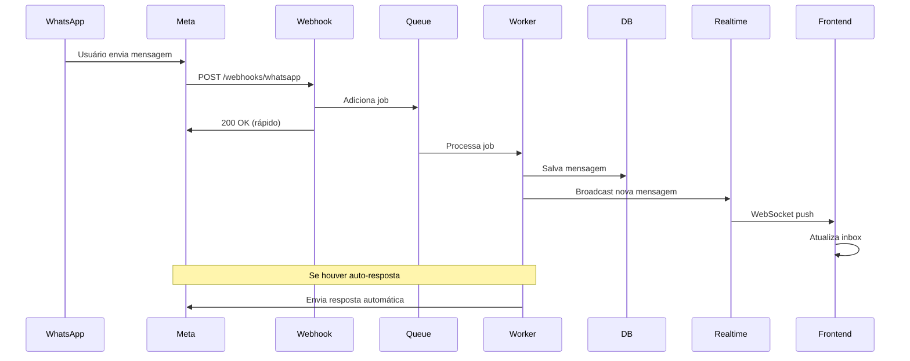
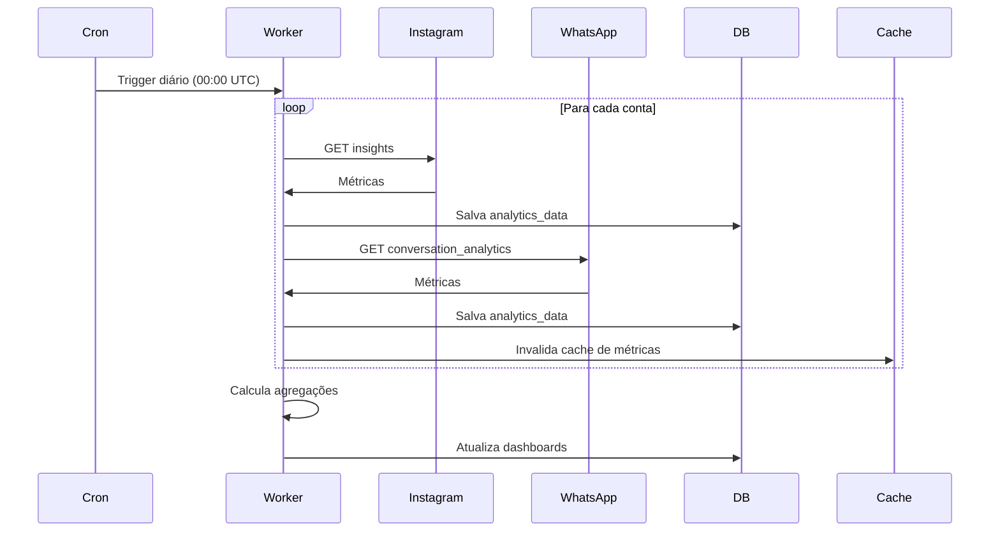
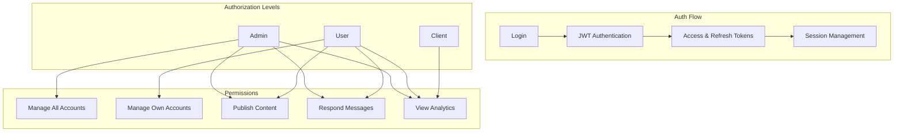
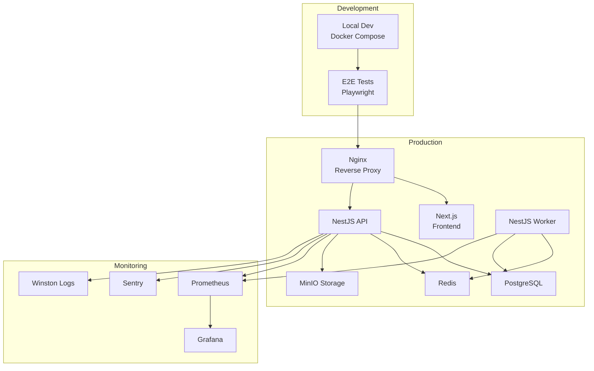

# Overview Completo - Plataforma de Social Selling

## 1. Visão Geral do Sistema

Esta é uma plataforma SaaS de **Social Selling** que permite gerenciar múltiplas contas de redes sociais (Instagram e WhatsApp Business) de clientes. O sistema oferece funcionalidades completas de gerenciamento de postagens, mensagens, analytics e automação.

### Objetivos Principais
- **Centralização**: Gerenciar múltiplas contas de clientes em um único dashboard
- **Automação**: Programar postagens e mensagens, respostas automáticas
- **Analytics**: Métricas detalhadas de engajamento, alcance e performance
- **Comunicação**: Gerenciamento unificado de DMs do Instagram e mensagens do WhatsApp Business

---

## 2. Arquitetura do Sistema

### 2.1 Arquitetura com Yarn Workspaces



### 2.2 Benefícios da Estrutura

- **Code Sharing**: Compartilhamento de código entre frontend e backend via workspace
- **Type Safety**: TypeScript compartilhado para types comuns
- **Simplified Build**: Gerenciamento centralizado de dependências com Yarn
- **Parallel Development**: Frontend e backend podem ser desenvolvidos em paralelo
- **Unified Testing**: Testes E2E com Playwright integrando frontend e backend

---

## 3. Stack Tecnológica

### Frontend (Next.js)
```typescript
// Framework
- Next.js 14 (App Router)
- React 18+
- TypeScript 5.x

// UI & Styling
- TailwindCSS 3.x
- Radix UI (component primitives)
- Lucide React (icons)
- class-variance-authority (variants)

// State Management
- Zustand (client state)
- TanStack Query / React Query (server state)

// Forms & Validation
- React Hook Form
- Zod (schema validation)
- @hookform/resolvers

// Charts & Analytics
- Recharts
- React Big Calendar
- Date-fns & Moment.js

// Additional Features
- React DnD (drag and drop)
- React Dropzone (file uploads)
- React Hot Toast (notifications)
```

### Backend (NestJS)
```typescript
// Framework
- NestJS 11.x
- Node.js 20+
- TypeScript 5.x

// Database & ORM
- PostgreSQL (via pg-promise)
- SQL Migrations

// Background Jobs
- BullMQ (job queue)
- IORedis (Redis client)

// Authentication & Security
- Passport JWT
- bcrypt (password hashing)
- @nestjs/throttler (rate limiting)

// API & Documentation
- Swagger/OpenAPI (@nestjs/swagger)
- Class Validator & Transformer

// File Storage
- MinIO (S3-compatible storage)
- Sharp (image processing)

// Email Services
- SendGrid
- Mailgun.js
- MJML (email templates)
- Handlebars (templating)

// Monitoring & Logging
- Sentry (error tracking)
- Winston (logging)
- Prometheus (metrics)
- @nestjs/terminus (health checks)

// API Clients
- Axios (HTTP client)
- Form Data (multipart)
```

### Infrastructure
```yaml
Frontend: Next.js standalone server
Backend API: NestJS application
Workers: NestJS worker processes
Database: PostgreSQL 13+
Cache/Queue: Redis 7+
Storage: MinIO (S3-compatible)
Monitoring: Prometheus + Grafana + Sentry
Container: Docker + Docker Compose
Proxy: Nginx (reverse proxy & SSL)
CI/CD: GitHub Actions
```

---

## 4. Modelo de Dados



---

## 5. Integrações com APIs

### 5.1 Instagram Graph API



**Endpoints Principais:**
```typescript
// Instagram Graph API v18.0

// 1. Obter perfil do usuário
GET https://graph.facebook.com/v18.0/me
  ?fields=id,username,account_type,media_count
  &access_token={token}

// 2. Criar container de mídia
POST https://graph.facebook.com/v18.0/{ig-user-id}/media
  ?image_url={url}
  &caption={text}
  &access_token={token}

// 3. Publicar mídia
POST https://graph.facebook.com/v18.0/{ig-user-id}/media_publish
  ?creation_id={creation-id}
  &access_token={token}

// 4. Obter métricas
GET https://graph.facebook.com/v18.0/{ig-user-id}/insights
  ?metric=impressions,reach,follower_count
  &period=day
  &access_token={token}

// 5. Gerenciar mensagens
GET https://graph.facebook.com/v18.0/{conversation-id}
  ?fields=messages{message,from,created_time}
  &access_token={token}

// 6. Enviar mensagem
POST https://graph.facebook.com/v18.0/me/messages
  ?recipient={user-id}
  &message={text}
  &access_token={token}
```

**Permissões Necessárias:**
- `instagram_basic`
- `instagram_content_publish`
- `instagram_manage_comments`
- `instagram_manage_messages`
- `pages_read_engagement`
- `pages_manage_metadata`

### 5.2 WhatsApp Business Cloud API



**Endpoints Principais:**
```typescript
// WhatsApp Business Cloud API v18.0

// 1. Enviar mensagem de texto
POST https://graph.facebook.com/v18.0/{phone-number-id}/messages
{
  "messaging_product": "whatsapp",
  "to": "{recipient-number}",
  "type": "text",
  "text": { "body": "Hello!" }
}

// 2. Enviar mensagem com template
POST https://graph.facebook.com/v18.0/{phone-number-id}/messages
{
  "messaging_product": "whatsapp",
  "to": "{recipient-number}",
  "type": "template",
  "template": {
    "name": "hello_world",
    "language": { "code": "en_US" }
  }
}

// 3. Enviar mídia
POST https://graph.facebook.com/v18.0/{phone-number-id}/messages
{
  "messaging_product": "whatsapp",
  "to": "{recipient-number}",
  "type": "image",
  "image": {
    "link": "https://example.com/image.jpg",
    "caption": "Caption here"
  }
}

// 4. Marcar mensagem como lida
POST https://graph.facebook.com/v18.0/{phone-number-id}/messages
{
  "messaging_product": "whatsapp",
  "status": "read",
  "message_id": "{message-id}"
}

// 5. Obter templates
GET https://graph.facebook.com/v18.0/{waba-id}/message_templates

// 6. Analytics
GET https://graph.facebook.com/v18.0/{waba-id}/conversation_analytics
  ?start={timestamp}
  &end={timestamp}
  &granularity=DAILY
```

---

## 6. Funcionalidades Principais

### 6.1 Dashboard Principal



### 6.2 Gerenciamento Instagram

**Postagens:**
- ✅ Criar posts (foto, vídeo, carrossel)
- ✅ Criar stories
- ✅ Agendar publicações
- ✅ Gerenciar rascunhos
- ✅ Preview antes de publicar
- ✅ Biblioteca de mídia

**Engajamento:**
- ✅ Visualizar e responder comentários
- ✅ Moderar comentários (aprovar/deletar/ocultar)
- ✅ Responder DMs
- ✅ Organizar conversas (labels, arquivar)
- ✅ Mensagens rápidas (templates & quick replies)

**Analytics:**
- ✅ Crescimento de seguidores
- ✅ Taxa de engajamento
- ✅ Alcance e impressões
- ✅ Performance de posts individuais
- ✅ Melhores horários para postar
- ✅ Demografia da audiência
- ✅ Stories insights

### 6.3 Gerenciamento WhatsApp Business

**Mensagens:**
- ✅ Inbox organizado por conversas
- ✅ Responder mensagens
- ✅ Mensagens automáticas
- ✅ Templates de mensagem
- ✅ Broadcast messages
- ✅ Anexar arquivos/mídia

**Automação:**
- ✅ Auto-resposta (horário comercial)
- ✅ Mensagens de ausência
- ✅ Chatbot básico (FAQ)
- ✅ Gatilhos por palavras-chave

**Analytics:**
- ✅ Volume de mensagens
- ✅ Tempo de resposta médio
- ✅ Taxa de resposta
- ✅ Conversas ativas
- ✅ Performance de templates
- ✅ Insights de conversação

---

## 7. Fluxos de Sistema

### 7.1 Fluxo de Postagem Programada



### 7.2 Fluxo de Mensagens em Tempo Real



### 7.3 Fluxo de Coleta de Analytics



---

## 8. Sistema de Autenticação e Autorização



**Implementação com Passport JWT:**
```typescript
// JWT Strategy
@Injectable()
export class JwtStrategy extends PassportStrategy(Strategy) {
  constructor(configService: ConfigService) {
    super({
      jwtFromRequest: ExtractJwt.fromAuthHeaderAsBearerToken(),
      ignoreExpiration: false,
      secretOrKey: configService.get('JWT_SECRET'),
    });
  }

  async validate(payload: any) {
    return { userId: payload.sub, email: payload.email, role: payload.role };
  }
}

// Guards
@UseGuards(JwtAuthGuard, RolesGuard)
@Roles('admin', 'user')
export class ProtectedController {}
```

---

## 9. Sistema de Webhooks

```typescript
// Configuração de Webhooks

// Instagram Webhooks
const instagramWebhookEvents = [
  'messages',        // Novas mensagens DM
  'messaging_postbacks',
  'message_echoes',
  'comments',        // Novos comentários
  'mentions',        // Menções
  'story_insights'   // Insights de stories
];

// WhatsApp Webhooks
const whatsappWebhookEvents = [
  'messages',        // Mensagens recebidas
  'message_status',  // Status de entrega
  'contacts',        // Informações de contato
];

// Handler Example
@Controller('webhooks')
export class WebhooksController {
  @Post('instagram')
  async handleInstagramWebhook(@Req() req: Request, @Res() res: Response) {
    const signature = req.headers['x-hub-signature-256'];

    // Verificar assinatura
    if (!this.verifySignature(req.body, signature)) {
      throw new UnauthorizedException();
    }

    // Processar via queue para não bloquear
    await this.queueService.add('process-webhook', {
      platform: 'instagram',
      event: req.body.entry[0].changes[0],
      timestamp: Date.now()
    });

    return res.status(200).send('OK');
  }
}
```

---

## 10. Considerações de Segurança

### 10.1 Proteções Implementadas

```typescript
// 1. Rate Limiting
@UseGuards(ThrottlerGuard)
@Controller('api')
export class ApiController {}

// 2. Validação de Webhooks
verifySignature(payload: string, signature: string): boolean {
  const expectedSignature = crypto
    .createHmac('sha256', process.env.APP_SECRET)
    .update(payload)
    .digest('hex');
  return signature === `sha256=${expectedSignature}`;
}

// 3. Encriptação de Tokens (em desenvolvimento)
// Tokens sensíveis devem ser encriptados antes de salvar no banco

// 4. Sanitização de Inputs
import { IsString, IsNotEmpty, MaxLength } from 'class-validator';

export class CreatePostDto {
  @IsString()
  @IsNotEmpty()
  @MaxLength(2200)
  caption: string;
}

// 5. CORS Configuration
app.enableCors({
  origin: process.env.FRONTEND_URL,
  credentials: true,
});

// 6. Helmet para security headers
app.use(helmet());

// 7. CSRF Protection (cookie-parser)
app.use(cookieParser());
```

### 10.2 Compliance

- ✅ **LGPD/GDPR**: Consentimento explícito para acesso às contas
- ✅ **Meta Platform Terms**: Respeitar limites de taxa e políticas
- ✅ **Retenção de Dados**: Políticas claras de armazenamento
- ✅ **Audit Logs**: Registrar todas as ações sensíveis (em implementação)

---

## 11. Infraestrutura e DevOps



### Environment Variables

```bash
# .env

# Database
DATABASE_HOST=localhost
DATABASE_PORT=5432
DATABASE_NAME=social_selling
DATABASE_USER=postgres
DATABASE_PASSWORD=
DATABASE_SSL=false

# Redis
REDIS_HOST=localhost
REDIS_PORT=6379
REDIS_PASSWORD=

# JWT
JWT_SECRET=
JWT_EXPIRES_IN=1d
JWT_REFRESH_SECRET=
JWT_REFRESH_EXPIRES_IN=7d

# Meta/Facebook
META_APP_ID=
META_APP_SECRET=
META_WEBHOOK_VERIFY_TOKEN=

# WhatsApp Business
WHATSAPP_PHONE_NUMBER_ID=
WHATSAPP_BUSINESS_ACCOUNT_ID=

# MinIO/S3
MINIO_ENDPOINT=localhost
MINIO_PORT=9000
MINIO_ACCESS_KEY=
MINIO_SECRET_KEY=
MINIO_BUCKET_NAME=social-selling

# Email
SENDGRID_API_KEY=
MAILGUN_API_KEY=
MAILGUN_DOMAIN=

# Monitoring
SENTRY_DSN=

# Frontend
NEXT_PUBLIC_API_URL=http://localhost:3001
```

---

## 12. Estrutura de Diretórios

```
social-selling-platform/
├── backend/                     # NestJS Backend
│   ├── src/
│   │   ├── modules/
│   │   │   ├── auth/           # Authentication
│   │   │   ├── users/          # User management
│   │   │   ├── client-accounts/ # Client accounts
│   │   │   ├── instagram/      # Instagram integration
│   │   │   ├── whatsapp/       # WhatsApp integration
│   │   │   ├── conversations/  # Conversations & messages
│   │   │   ├── products/       # Product management
│   │   │   ├── analytics/      # Analytics & insights
│   │   │   ├── notifications/  # Notifications
│   │   │   └── webhooks/       # Webhook handlers
│   │   ├── common/
│   │   │   ├── decorators/
│   │   │   ├── guards/
│   │   │   ├── interceptors/
│   │   │   ├── pipes/
│   │   │   └── filters/
│   │   ├── config/
│   │   ├── database/
│   │   ├── main.ts            # API entry point
│   │   └── worker.ts          # Worker entry point
│   ├── migrations/            # SQL migrations
│   ├── test/
│   └── package.json
│
├── frontend/                   # Next.js Frontend
│   ├── src/
│   │   ├── app/
│   │   │   ├── (auth)/
│   │   │   │   ├── login/
│   │   │   │   └── register/
│   │   │   ├── (dashboard)/
│   │   │   │   ├── overview/
│   │   │   │   ├── accounts/
│   │   │   │   ├── posts/
│   │   │   │   ├── inbox/
│   │   │   │   ├── analytics/
│   │   │   │   ├── products/
│   │   │   │   └── settings/
│   │   │   └── api/          # API routes (optional)
│   │   ├── components/
│   │   │   ├── ui/           # Radix UI components
│   │   │   ├── dashboard/
│   │   │   ├── posts/
│   │   │   ├── inbox/
│   │   │   └── analytics/
│   │   ├── hooks/
│   │   ├── lib/
│   │   │   ├── api.ts        # API client
│   │   │   ├── utils.ts
│   │   │   └── constants.ts
│   │   ├── stores/           # Zustand stores
│   │   ├── types/
│   │   └── styles/
│   ├── public/
│   ├── next.config.js
│   ├── tailwind.config.ts
│   └── package.json
│
├── infrastructure/            # Infrastructure configs
│   ├── nginx/
│   ├── prometheus/
│   ├── grafana/
│   └── docker/
│
├── scripts/                  # Utility scripts
│   ├── start.sh
│   ├── stop.sh
│   ├── logs.sh
│   └── status.sh
│
├── e2e/                      # E2E tests (Playwright)
│   ├── tests/
│   └── fixtures/
│
├── docker-compose.yml
├── docker-compose.unified.yml
├── package.json              # Root workspace config
└── yarn.lock
```

---

## 13. Comandos Úteis

```bash
# Desenvolvimento
yarn dev                    # Roda backend API
yarn dev:frontend          # Roda frontend
yarn dev:workers           # Roda workers

# Build
yarn build                 # Build todos os workspaces

# Testing
yarn test                  # Testes unitários
yarn test:e2e              # Testes E2E
yarn test:e2e:ui           # Testes E2E com UI

# Linting
yarn lint                  # Lint em todos os workspaces

# Database
cd backend
npm run migrate:up         # Roda migrations
npm run migrate:down       # Reverte última migration
npm run migrate:status     # Status das migrations
npm run db:seed            # Seed do database

# Docker
docker-compose up -d       # Inicia todos os serviços
docker-compose down        # Para todos os serviços
docker-compose logs -f     # Vê logs em tempo real

# Scripts personalizados
./start.sh                 # Inicia ambiente completo
./stop.sh                  # Para ambiente
./status.sh                # Verifica status dos serviços
./logs.sh [service]        # Mostra logs de um serviço
```

---

## 14. Roadmap de Desenvolvimento

### Fase 1: MVP ✅ (Concluída)
- ✅ Setup infraestrutura (PostgreSQL, Redis, MinIO)
- ✅ Autenticação JWT e gestão de usuários
- ✅ CRUD de client accounts
- ✅ Conexão Instagram (OAuth)
- ✅ Sistema de conversas e mensagens
- ✅ Inbox básico

### Fase 2: Instagram Features 🚧 (Em Progresso)
- ✅ Message templates
- ✅ Quick replies
- ✅ Enhanced conversations
- ⏳ Publicação de posts
- ⏳ Analytics Instagram
- ⏳ Media library

### Fase 3: WhatsApp Integration ⏳ (Planejada)
- ⏳ Conexão WhatsApp Business
- ⏳ Envio/recebimento de mensagens
- ⏳ Templates de mensagem
- ⏳ Auto-resposta básica
- ⏳ Analytics WhatsApp

### Fase 4: Automation ⏳ (Planejada)
- ⏳ Sistema de agendamento robusto
- ⏳ Calendário editorial
- ⏳ Biblioteca de conteúdo avançada
- ⏳ Chatbot básico
- ⏳ Respostas automáticas inteligentes

### Fase 5: Advanced Analytics ⏳ (Planejada)
- ⏳ Dashboards personalizáveis
- ⏳ Relatórios exportáveis (PDF)
- ⏳ Comparativos de performance
- ⏳ Sugestões baseadas em dados
- ⏳ Melhores horários para postar

### Fase 6: Scale & Polish ⏳ (Futura)
- ⏳ Otimizações de performance
- ⏳ Mobile app (React Native)
- ⏳ Integrações adicionais (TikTok, LinkedIn)
- ⏳ AI Content Assistant
- ⏳ Multi-language support

---

## 15. Estimativa de Custos Mensais

```typescript
// Estimativa para 100 contas de clientes ativos

VPS/Cloud Server (4GB RAM):   $20-40/mês
  - Backend API
  - Workers
  - Database (PostgreSQL)
  - Redis
  - MinIO

Domain & SSL:                  $10/mês
  - Domain registration
  - SSL certificate (Let's Encrypt: Free)

Meta APIs:                     $0
  - Instagram Graph API: Free
  - WhatsApp Business: Free (até 1000 conversas/mês)
  - Após isso: $0.005-0.009 por conversa

Monitoring:                    $0-30/mês
  - Sentry (Free tier available)
  - Prometheus + Grafana (self-hosted)

Email Services:                $0-15/mês
  - SendGrid (Free tier: 100 emails/day)
  - Mailgun (Pay as you go)

Estimativa Total:              ~$30-95/mês (inicial)

// Com escala (1000+ contas):
// $100-300/mês dependendo do uso de WhatsApp e recursos
```

---

## 16. Recursos e Documentações Importantes

### APIs Oficiais
- [Instagram Graph API](https://developers.facebook.com/docs/instagram-api)
- [WhatsApp Business Cloud API](https://developers.facebook.com/docs/whatsapp/cloud-api)
- [Meta for Developers](https://developers.facebook.com/)

### Frameworks e Ferramentas
- [NestJS Documentation](https://docs.nestjs.com/)
- [Next.js Documentation](https://nextjs.org/docs)
- [BullMQ Documentation](https://docs.bullmq.io/)
- [PostgreSQL Documentation](https://www.postgresql.org/docs/)
- [Redis Documentation](https://redis.io/docs/)
- [TanStack Query](https://tanstack.com/query/latest)
- [Radix UI](https://www.radix-ui.com/)
- [Tailwind CSS](https://tailwindcss.com/)

### Compliance e Segurança
- [Meta Platform Terms](https://developers.facebook.com/terms)
- [LGPD](https://www.gov.br/cidadania/pt-br/acesso-a-informacao/lgpd)
- [GDPR](https://gdpr.eu/)

---

## 17. Próximos Passos

Para continuar o desenvolvimento:

### 1. Implementar Publicação de Posts Instagram
```bash
# Criar módulo de posts
cd backend/src/modules
nest g module posts
nest g service posts
nest g controller posts

# Implementar:
- Upload de mídia para MinIO
- Integração com Instagram Graph API
- Sistema de agendamento com BullMQ
- Preview de posts no frontend
```

### 2. Implementar Analytics
```bash
# Criar worker para coleta de métricas
- Cron job diário para buscar insights do Instagram
- Agregação de dados no PostgreSQL
- Cache de métricas no Redis
- Dashboard de visualização no frontend
```

### 3. Melhorar Sistema de Mensagens
```bash
# Implementar features avançadas
- Typing indicators
- Read receipts
- File attachments
- Message reactions
- Conversation search
```

### 4. Implementar WhatsApp Integration
```bash
# Setup WhatsApp Business Cloud API
- Configurar webhooks
- Implementar envio/recebimento de mensagens
- Criar templates de mensagem
- Sistema de auto-resposta
```

### 5. Adicionar Testes
```bash
# Backend
- Unit tests com Jest
- Integration tests
- E2E tests com Supertest

# Frontend
- Component tests
- E2E tests com Playwright (já iniciado)
```

---

**Documento gerado em:** 2025-10-21
**Versão:** 3.0.0 (Yarn Workspace Edition)
**Status:** Em desenvolvimento ativo
